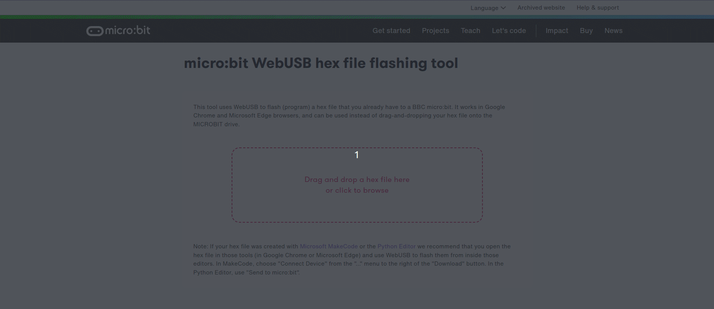
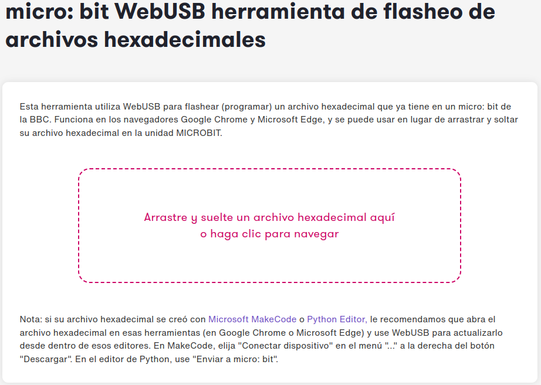

# Experiencia inmediata
Cuando abrimos y conectamos una micro:bit nueva, se ejecuta un programa de demostración grabado en fábrica. Esto es lo que se conoce como "Out of box experience" que se traduce como "experiencia inmediata" y que nos permite comenzar a ver y disfrutar funcionalidades de la placa sin hacer nada mas que conectarla. Si queremos restablecer de fábrica la micro:bit podemos descargarnos el [archivo .hex listo para usar](https://cdn.sanity.io/files/ajwvhvgo/production/89164d8dc63bcd7189b1bed79558c19833ec555a.hex?dl=Out%20of%20box%20experience.hex).

El programa es válido para todas las versiones de micro:bit aunque, lógicamente, si no disponemos de las funcionalidades que nos da la V2 no podremos disfrutarlas.

Una vez descargado el programa lo grabamos en nuestra micro:bit y veremos como la pantalla LED comienza a hacer cosas, nos saluda y a partir de aquí podemos ir desbloqueando varios juegos siguiendo las instrucciones en pantalla y lo que vamos a ver aquí.

Una primera cosa que podemos hacer con la V2 es "dormir a la micro:bit" manteniendo presionado el botón de reset de la parte posterior hasta que se apague el LED de encendido. Para "despertarla" presionamos de nuevo reset.

* **Presionar lo botones**. Median te una flecha nos indica el botón que debemos pulsar para avanzar. Los botones son las entradas más básicas de que dispone micro:bit
* **Agítala (Shake it)**. Cuanto mas agitemos la micro:bit mas LEDs se encederán. Esta funcionalidad está programada con el sensor de movimiento que integra la placa y que se conoce como acelerómetro porque mide fuerzas. Puede medir la fuerza de sacudida o en que dirección se realiza esta.
* **Tilt: chase the dot**. Se trata de atrapar el punto intermitente inclinando la micro:bit.
* **Aplaude (Clap)**. La micro:bit V2 dispone de micrófono y escucha el sonido.
* **Huevo de pascua**. A veces se denominan así los juegos secretos. Cuando veamos en pantalla un corazón debemos pulsar simultaneamente los botones A y B y se desbloquerá el juego de la serpiente.

Podemos reiniciar la microbit en cualquier momento para iniciar de nuevo la demostración.

El código que descargamos está escrito en C++ por lo que **no se cargará en los editores de MakeCode o Python**. Ahora bien, se puede  crear un programa propio para esta 'experiencia lista para usar' tanto en MakeCode como en Python.

Tanto para enviar a la micro:bit este programa como otro archivo hexadecimal podemos utilizar la herramienta online [micro:bit WebUSB hex file flashing tool](https://microbit.org/tools/webusb-hex-flashing/) o micro:bit WebUSB herramienta de flasheo de archivos hexadecimales.

En la animación siguiente vemos esta herramienta en funcionamiento.

  
*Herramienta de flasheo*

En la imagen vemos la ventana de la aplicación traducida.

  
*Herramienta de flasheo traducida*

