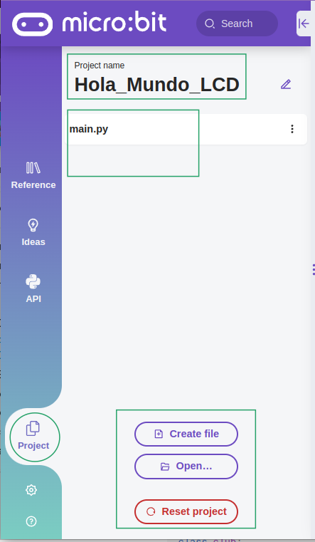
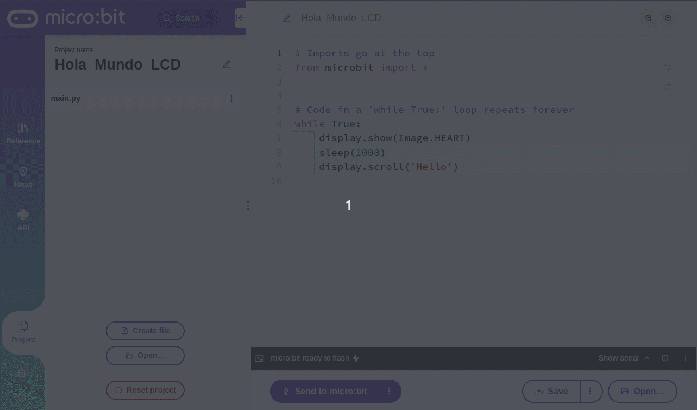
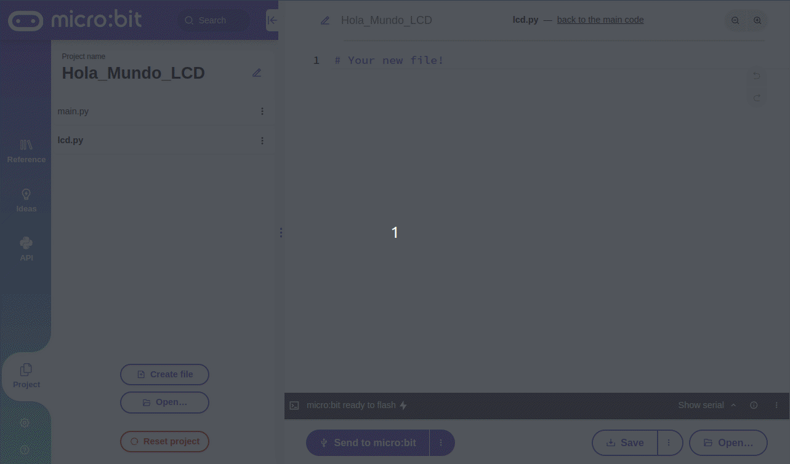
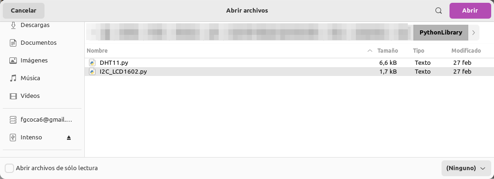
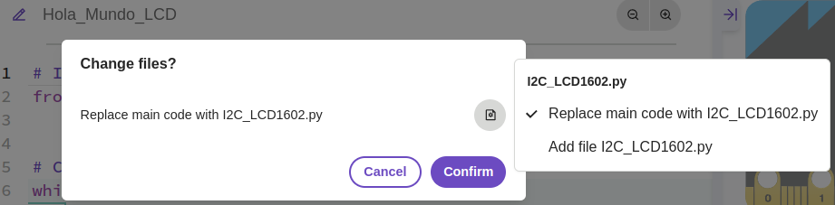
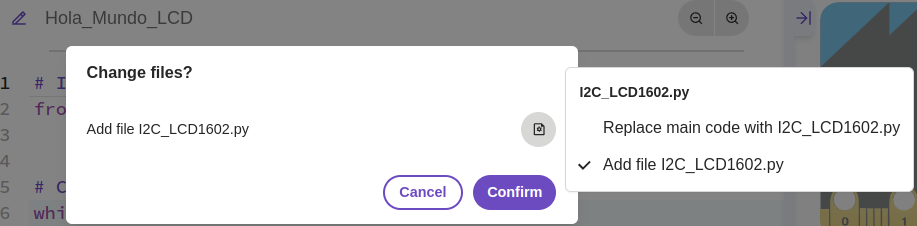
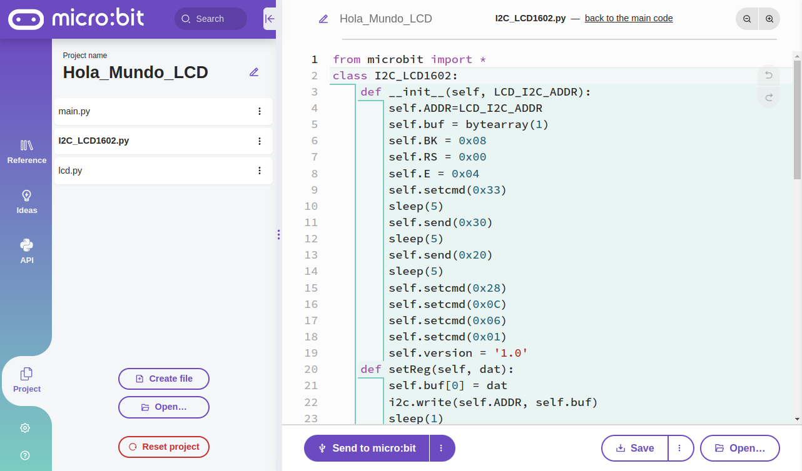
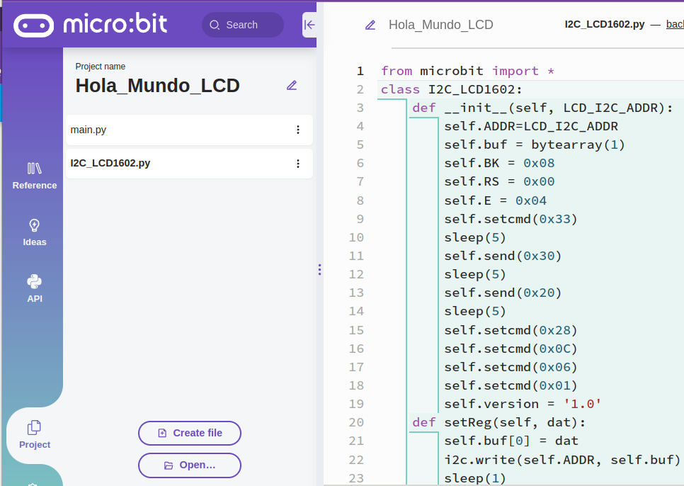
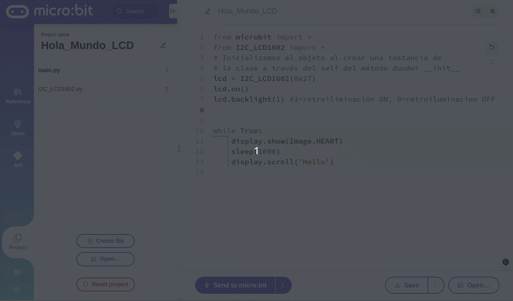

# <FONT COLOR=#8B008B>Programación Orientada a Objetos</font>
Este apartado se crea especificamente por la dificultad que tiene el tema que vamos a explicar a continuación:

>Hay ciertos elementos o dispositivos que van a requerir de una librería externa a Python y estas librerias se hacen utilizando las clases. En el editor online de MicroPython de micro:bit se pueden incluir y utilizar este tipo de liberías. Para centrar un poco el tema vamos a ver:

* Las clases en Python de una forma no muy profunda.
* La utilización del menú Project de python.microbit, necesario para poder incluir librerias
* Ejemplo de trabajo con una libreria para una LCD I2C.

## <FONT COLOR=#007575>**Las clases en Python**</font>
La Programación Orientada a Objetos (POO) es un modelo de programación que proporciona unas guías acerca de cómo trabajar con él y que está basado en el concepto de clases y objetos.

Una clase es una especie de plantilla que define, de forma genérica, como serán los objetos de un determinado tipo. Pongamos por ejemplo que una clase representa a un club, que podemos denominar "club". Esta clase puede tener atributos (propiedades) como nombre, edad, profesion. Se pueden implementar como métodos (funciones) de esas propiedades comportamientos como socio, socia o imparte_taller.

Un ejemplo sencillo de un objeto puede ser un profesor, que puede ser socio por lo que se crea un atributo de profesión y además puede impartir_taller, por lo que se define un nuevo método.

Una clase en Python es una estructura que permite definir los métodos y atributos que definen un objeto. En Python una clase es una plantilla para crear objetos que son instancias de esa clase.

En Python, una clase se define mediante la palabra clave ```class```, seguida del nombre de la clase, dos puntos (:) y el cuerpo de la clase. Este cuerpo contiene definiciones de métodos y atributos, que pueden ser públicos o privados según su acceso.

~~~py
class club:
    def __init__(self, nombre, edad, profesion):
        self.nombre = nombre
        self.edad = edad
        self.profesion = profesion
    def saludo(self)
        print("Hola, me llamo " + self.nombre + "y soy " + self.profesion)
~~~

Las principales ventajas de utilizar clases son:

* **Reutilización**. Una clase la podemos reutilizar en diferentes partes del programa y en distintos programas. Esto puede ahorrar mucho tiempo y evita repeticiones de código.
* **Modulación**. El código de un programa se divide en partes mas pequeñas lo que facilita el mantenimiento y la solución de problemas.
* **Encapsulación**. Consiste en ocultar la complejidad de un objeto para mostrar solamente una interfaz simple fácil de usar para interactuar ese objeto.
* **Polimorfismo**. Se trata de implementar el mismo conjunto de métodos con diferentes comportamientos para distintos objetos. Esto dota de mayor flexibilidad al diseño de programas.

Las principales desventajas de utilizar clases son:

* **Complejidad**. Una clase puede hacer mas dificil de entender y depurar un programa debido al incremento de complejidad.
* **Curva de aprendiza**. Aprender Programación Orientada a Objetos y clases tiene una curva de aprendizaje mas pronunciada, sobre todo cuando se empieza a programar.
* **Abuso**. A veces se abusa inncesariamente de las clases en situaciones en las que una función haría lo mismo incluso de forma mas eficiente.

Las variables que se definen dentro de las clases se denominan **atributos** y sirven para almacenar datos de un objeto de esa clase. Se utilizizan para representar propiedades de un objeto.

Los atributos pueden ser como las variables normales, enteros, reales, cadenas, listas, tuplas, diccionarios, etc. Además pueden tener distintos niveles de visibilidad que se indican mediante modificadores de acceso. En Python los modificadores son públicos por defecto, lo que significa que son accesibles desde cualquier lugar del programa.

Un atributo se define como una variable que se inicializa con el método ```__init__```. Por ejemplo:

~~~py
class club:
    def __init__(self, nombre, edad, profesion):
        self.nombre = nombre
        self.edad = edad
        self.profesion = profesion
~~~

En la clase ```club``` los atributos nombre, edad y profesion, se definen como se ve en el código. En este caso los tres son atributos públicos de la clase ```club```, que se inicializan con los valores que se proporcionen al crear un objeto de la clase. El acceso a los atributos de un objeto de una clase se utiliza el modificador (.) seguido del nombre del atributo, por ejemplo, para acceder al atributo ```nombre``` de un objeto ```socio``` de la clase ```club``` hariamos:

~~~py
socio1 = socio1.nombre
~~~

Los tipos de atributos son:

* **Públicos**. Ya hemos indicado que se puede acceder a ellos desde cualquier parte del programa y desde fuera de la clase y que en Python lo son por defecto, por lo que no requieren ningún modificador de acceso. Se accede a ello con (.).
* **Privados**. Solo son accesibles desde la propia clase y se definen con el prefijo (__) seguido del nombre del atributo.
* **Protegidos**. Solamente son accesibles desde la propia clase o desde sus clases heredadas. Se utiliza el prefijo "" seguido del nombre del atributo para su definición. En Python es simplemente una convención y si es posible acceder desde fuera de la clase.

En Python se utilizan los **métodos**, que son funciones que se definen dentro de una clase y que se utilizan para hacer operaciones en los objetos creados a partir de esa clase. La definición de un método se realiza de la misma forma que la de una función con la diferencia de que en un método siempre tiene como primer parámetro el objeto al que se aplicará el método, que por defecto se llama ```self```.

Para **utilizar un método de una clase lo primero que tenemos que hacer es crear un objeto a partir de la clase** y así poder llamar al método sobre ese objeto.

El objeto ```self``` se utiliza como referencia del objeto que se manipula cuando se llama al método. Al crear una instancia de una clase, necesitamos diferenciar o especificar los atributos de la instancia de los argumentos y otras variables. Y ahí es donde necesitamos la palabra clave ```self``` para especificar que estamos pasando el valor a los atributos de la instancia y no a la variable o argumento local con el mismo nombre.

Existen también otros métodos que se denominan dunder (de double underscore methods) que tienen un doble guión bajo (__) al principio y al final del nombre.

* **__init__**: Inicializar un objeto cuando se crea una instancia de una clase. Se usa para asignar valores a los atributos de una instancia de clase.
* **__str__**: Se utiliza para devolver una cadena de una instancia de una clase. Es el método que se llama cuando usamos la función ```str()``` para convertir un objeto en una cadena de caracteres.
* **__repr__()**: Método especial de Python que se utiliza para devolver una cadena legible de un objeto. Se llama cuando usamos la función repr().

Y bueno, hay mas conceptos y definiciones necesarias para trabajar creando clases, pero como este no es el objetivo, lo vamos a dejar aquí que ya es suficiente para manejarnos un poco con clases ya creadas.

## <FONT COLOR=#007575>**Menú Project**</font>
Aunque ya hemos visto el uso del [editor Python](https://support.microbit.org/support/solutions/articles/19000135210) online de micro:bit vamos a centrarnos en el uso de este menú pues lo vamos a necesitar para tener acceso a librerias externas. La sección de proyectos, que se encuentra en el menú de la izquierda, es especialmente útil si necesitamos añadir archivos Python adicionales al proyecto. Puede ser, por ejemplo, para añadir un módulo para un accesorio o para añadir código proporcionado por un tercero. En el canal Youtube de Micro:bit Educational Foundation está el video [Projects section: micro:bit Python Editor](https://www.youtube.com/watch?v=TJKe16S2RmM) que describe el proceso.

### <FONT COLOR=#AA0000>Uso del menú project</font>
Cuando accedemos la menú Project de la barra lateral izquierda veremos como se muestra el nombre del proyecto, se enumeran todos los archivos del proyecto actual y tres botones.

<center>

  
*Acceso al menú Project*

</center>

Inicialmente solamente está el archivo main.py que incluye el código de inicio. Si queremos añadir un archivo nuevo a nuestro proyecto debemos elegir "Create file" haciendo clic en el botón del mismo nombre. Si llamamos LCD a este archivo la situación será la siguiente:

<center>

  
*Creación de un nuevo archivo*

</center>

En la animación se observa que el nombre tiene que ser en minúsculas y que ademas la extensión la añade el propio programa.

El lápiz a la derecha del nombre del proyecto permite editar el nombre del mismo. Las diéresis a la derecha de los nombres de archivo tienen utilidad para editar el código del archivo, salvar el archivo o borrar el archivo. La opción borrar no está disponible en main.py ya que es un archivo obligatorio y no puede ni eliminarse ni cambiarle el nombre. El nuevo archivo aparecerá en el menú.

<center>

  
*Nuevo archivo creado y opciones*

</center>

Este archivo forma parte de nuestro proyecto. En este momento es cuando podemos abrir un archivo de libreria, en mi caso voy a abrir el archivo que contiene la clase para el manejo de la LCD I2C1602. Para ello hago clic en el botón "Open", localizo el archivo y le doy a abrir o hago doble clic sobre su nombre.

<center>

  
*Localización del archivo a añadir*

</center>

Se muestra entonces una ventana en la que nos pregunta si queremos cambiar archivos reemplazando el código en ```main``` por el del archivo seleccionado. Aquí en lugar de confirmar la acción descrita observamos que hay un pequeño icono en el interior de la ventana que si lo clicamos nos permite cambiar la opción de reemplazar por la de añadir el fichero, y es justo lo que tenemos que hacer.

<center>

  
*Selección de cambiar o añadir el archivo*

</center>

Escogemos la opción de añadir y hacemos clic en confirmar para que el archivo pase a formar parte de nuestro proyecto.

<center>

  
*Selección de cambiar o añadir el archivo*

</center>

El estado final de los archivos del proyecto es el siguiente:

<center>

  
*Archivo libreria añadido al proyecto*

</center>

Con esto ya estamos en condiciones de comenzar a programar nuestro ejemplo "Hola Mundo". El proceso para añadir la librería se puede realizar sin necesidad de crear el archivo ```lcd.py``` pero siempre con la **precaución** de <FONT COLOR=#FF0000>***sustituir la opción de reemplazar por la de añadir***</font>. En caso contrario el contenido del archivo ```main.py``` pasará a ser el del archivo elegido.

Si queremos recuperar el estado original que teniamos al principio para, por ejemplo, empezar un nuevo proyecto basta con hacer clic en el botón rojo "Reset project", pero cuidado porque si no hemos archivado las modificaciones anteriores las perderemos.

Si nos movemos por el archivo de libreria podemos observar que es una clase y en ella aparecen métodos para la LCD como indicar su dirección física, borrarla, etc.

<center>

  
*Contenido del archivo libreria I2C_LCD1602*

</center>

Ahora es cuando nos vendrá bien lo aprendido sobre clases.

### <FONT COLOR=#AA0000>Ejemplo Hola Mundo con LCD</font>
Vamos a ir creando el ejemplo paso a paso explicando lo que hacemos.

**1**.- En primer lugar debemos importar la librería a nuestro archivo principal y lo hacemos exactamente igual que la línea de importación de microbit.

~~~py
from microbit import *
from I2C_LCD1602 import *
...
~~~

Con esto ya tenemos disponible la clase para trabajar con ella y como se ha indicado lo primero que hay que hacer es crear una instancia de la clase para poder acceder a sus miembros. A continuación lo tenemos comentado.

~~~py
from microbit import *
from I2C_LCD1602 import *
# Inicializamos el objeto al crear una instancia de 
# la clase a través del self del método dunder __init__
lcd = I2C_LCD1602(0x27)
...
~~~

Lo siguiente que haremos será encender la LCD, poner la retroiluminación activa y borrar todo contenido de la LCD para comenzar desde una pantalla limpia. Estos son los procesos usuales antes de entrar en el bucle infinito para dejar la pantalla preparada para empezar a mostrar mensajes. En la animación vemos como crear una de las líneas.

<center>

  
*Acceso a miembros desde la instancia creada*

</center>

El programa ya tiene el siguiente contenido modificado en el archivo ```main.py```, es hora de programar en el bucle infinito.

~~~py
from microbit import *
from I2C_LCD1602 import *
# Inicializamos el objeto al crear una instancia de 
# la clase a través del self del método dunder __init__
lcd = I2C_LCD1602(0x27)
lcd.on()
lcd.backlight(1) #1=retroiliminación ON, 0=retroiluminacion OFF
lcd.clear()
...
~~~

Dentro de bucle simplemente vamos a escribir dos mensajes, "Hola Mundo" en la primera fila (0) y simplemente para ver como se hace otro texto en la segunda fila (1). El programa final es este:

~~~py
# Le indicamos a MicroPython que obtenga todo (el *) lo que 
# necesita para trabajar con micro:bit desde el módulo microbit
from microbit import *
# De idéntica forma le decimos que obtenga todo de la clase
# I2C_LCD1602 para trabajar con una LCD 1602 I2C
from I2C_LCD1602 import *
# Inicializamos el objeto al crear una instancia de 
# la clase a través del self del método dunder __init__
lcd = I2C_LCD1602(0x27)
lcd.on()
lcd.backlight(1) #1=retroiliminación ON, 0=retroiluminacion OFF
lcd.clear()

while True:
    # Escribe Hola Mundo desde la columna 0 en la fila 0.
    lcd.puts("Hola Mundo",0,0) 
    # Escribe LCD I2C1602 desde la columna 3 de la fila 1
    lcd.puts("LCD I2C1602",3,1)
~~~

[Descargar la libreria](../programas/upy/PythonLibrary/I2C_LCD1602.py)

[Descargar el programa](../ejemplos/Hola_Mundo_LCD-main.py)
