# BBC micro:bit con MicroPython
Practicamente todas las explicaciones sobre este tema van a estar basadas en [BBC micro:bit MicroPython documentation](https://microbit-micropython.readthedocs.io/en/v2-docs/) que desafortunadamente no está es español.

Uno de los lenguajes que entiende la **micro:bit** es el **Python** y la versión que se ejecuta en **BBC micro:bit** se llama **MicroPython**.

Aunque en principio toda la información se va a referir a la versión V2 de micro:bit casi todo será válido para versiones anteriores, excepto claro lo no implementado en estas.

Fundamentalmente vamos a utilizar, para crear los programas, el [editor de MicroPython](https://python.microbit.org/v/3/reference) para micro:bit que es muy similar MakeCode. También se puede trabajar con el [edit Mu](https://codewith.mu/).

Python en BBC micro:bit está pensado para que estudiantes de 11 a 14 años (o edades superiores), aprendan fundamentos de la programación a través de la codificación basada en texto.

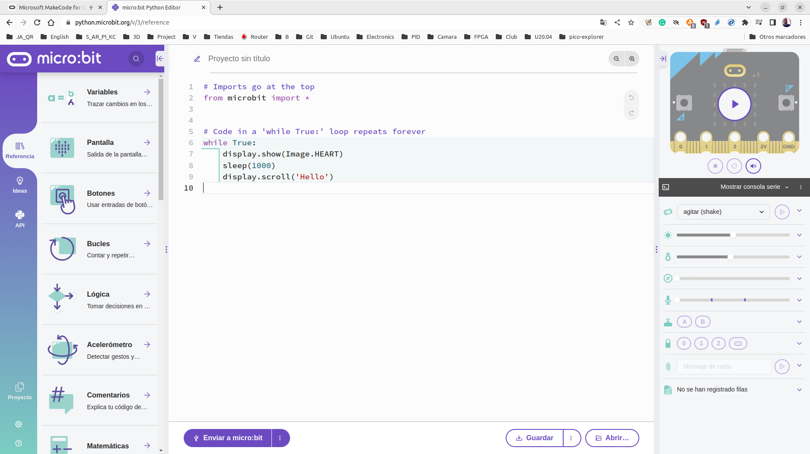  
*Editor de MicroPython*

Conectamos la micro:bit al ordenador mediante un cable USB.

Escribimos el script (programa) en la ventana del editor y hacemos clic en el botón "Enviar a micro:bit" o "Guardar" para después transferirlo al micro:bit.

## **Partes del editor de Python micro:bit**
En la guía de usuario [User guide](https://microbit.org/get-started/user-guide/python-editor/) tenemos la descripción que vamos a resumir aquí de las partes que componen el editor.

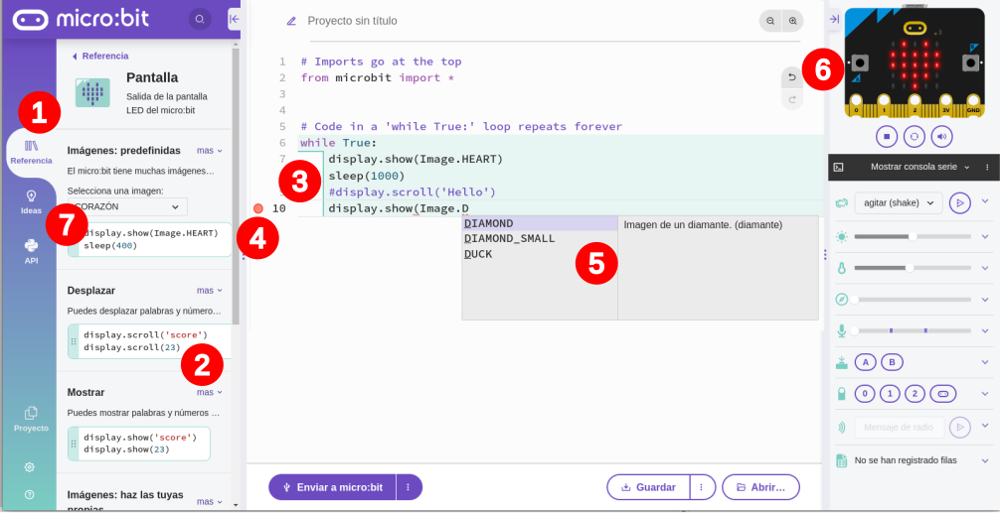  
*Apartados del editor de MicroPython*

### 1. Referencia
La sección facilita descubrir lo que Python y micro:bit pueden hacer, como explorar bloques en MakeCode o Scratch.

Tamibién sirve para ver fácilmente el potencial del hardware que incorpora la micro:bit y que el software de escritura en Python aumenta la creatividad de los alumnos.

### 2. Fragmentos de código
Son fragmentos de código listos para arrastrar y soltar en el área de programa. Estos fragmentos son totalmente funcionales, ahorran tiempo y ayudan a superar barreras de falta de habilidad con el teclado y recordar de forma precisa la sintaxis.

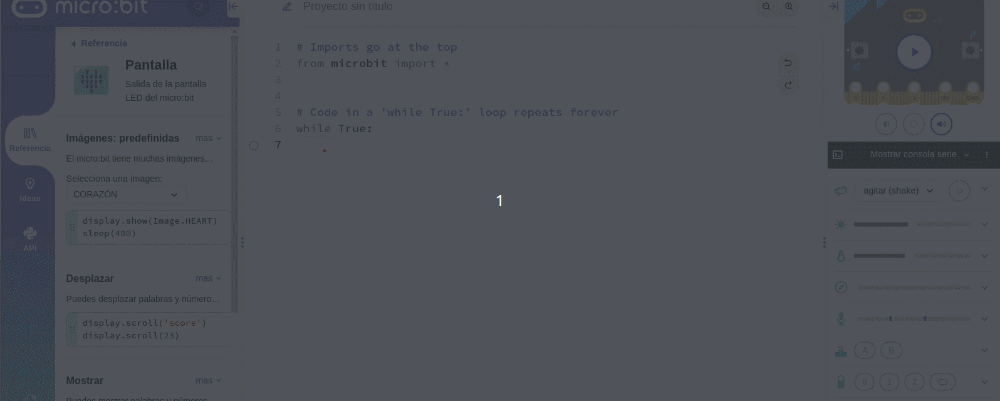  
*Arrastrar y soltar un fragmento de código*

Podemos observar como al arrastrar al área de código la identation (sangria) se realiza de forma automática para respetar la sintaxis de Python.

### 3. Resaltado de la estructura del código
Los distintos colores y la líneas de sangria que se muestran en los programas Python ayudan en las fases de diseño, planificación y prueba de un proyecto. Es fácil seguir y entender el flujo de un programa si se mantiene todo en su lugar.

En la animación siguiente se provocan diversos errores de manera intencionada y se muestra la marca del error y la información que nos ofrece.

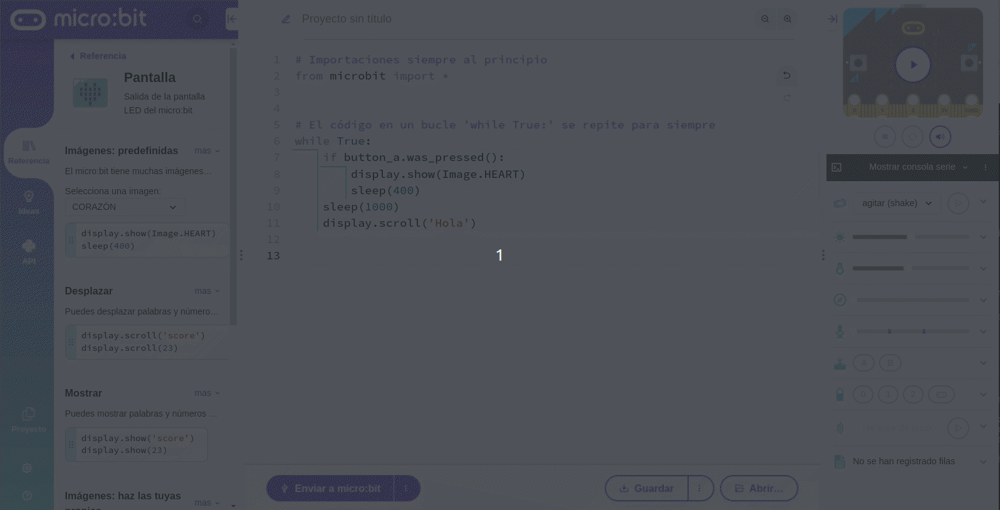  
*Resaltado de la estructura del código*

### 4. Resaltado de errores
Los errores forman parte normal de la codificación. Los símbolos circulares junto al número de línea ayudan a identificar errores y corregirlos antes de enviar el código a la micro:bit. Se puede pasar el cursor sobre el círculo en el margen para que se muestre una explicación del error. Repetimos aquí la animación previa donde hemos visto esto.

  
*Resaltado de errores*

### 5. Autocompletar
El miedo a una pantalla en blanco y no saber qué escribir son dos de las mayores barreras para comenzar la codificación basada en texto.

Para ayudar con esto, a medida que escribe código, el editor nos hace sugerencias que permiten elegir haciendo clic o presionando la tecla Intro. Esto ahorra tiempo, evita errores tipográficos y evita tener que recordar de forma precisa una determinada sintaxis.

También es otra forma de descubrir qué pueden hacer Python y micro:bit, por ejemplo, al ver las opciones disponibles para mostrar imágenes ya definidas. Además, si nos movemos con las flechas del teclado, por las opciones nos irán apareciendo a la derecha las descripciones de cada una de ellas.

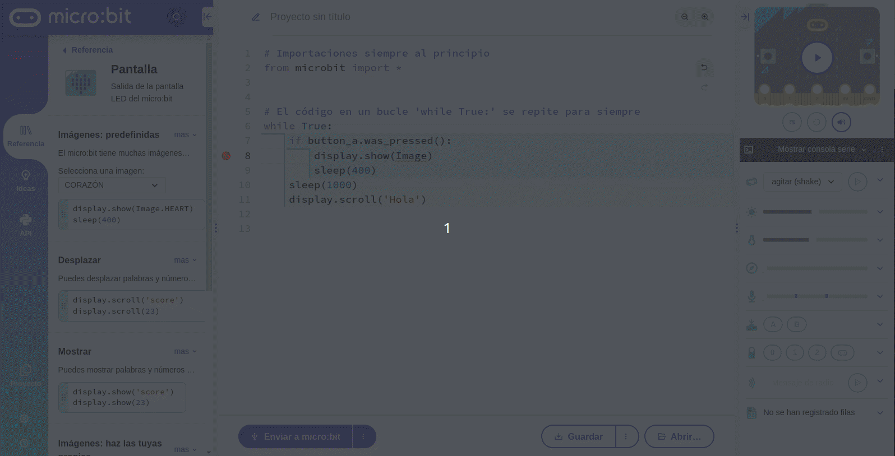  
*Autocompletar*

### 6. Simulador
Permite probar el código antes de grabarlo en la micro:bit real. Esto ayuda a desarrollar, probar, depurar y evaluar el código y permite crear proyectos sin disponer fisicamente de la placa.

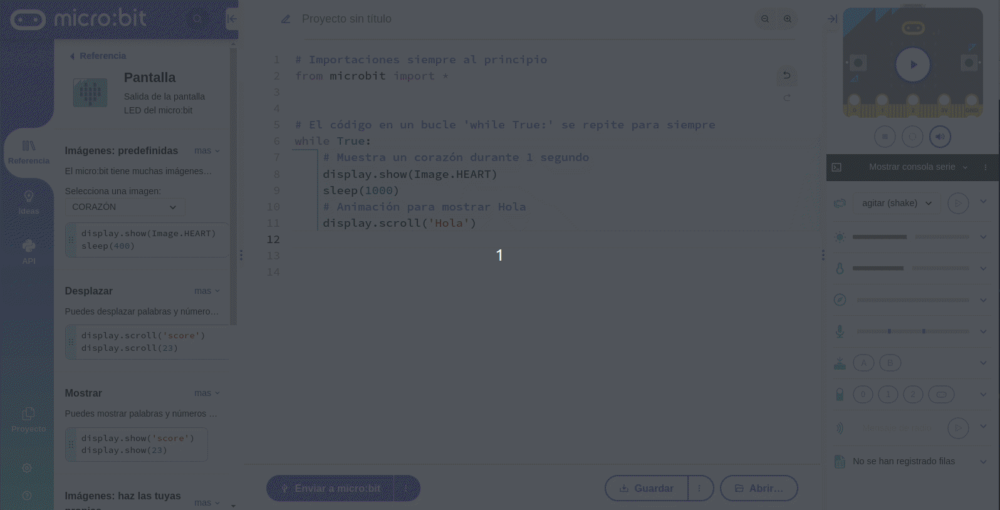  
*Simulador*

### 7. Ideas y API
En la pestaña 'Ideas' hay programas completos listos para usar que se pueden modificar para crear los nuestros propios.

El menú API (abreviatura de "Application Programming Interfaces" o "interfaz de programación de aplicaciones") nos proporciona una descripción general más detallada de los comandos de MicroPython que se pueden usar con micro:bit. Esto puede ser útil cuando deseamos entender mejor lo que estamos haciendo en un trozo de código en particular y qué opciones o argumentos se pueden usar con una función.

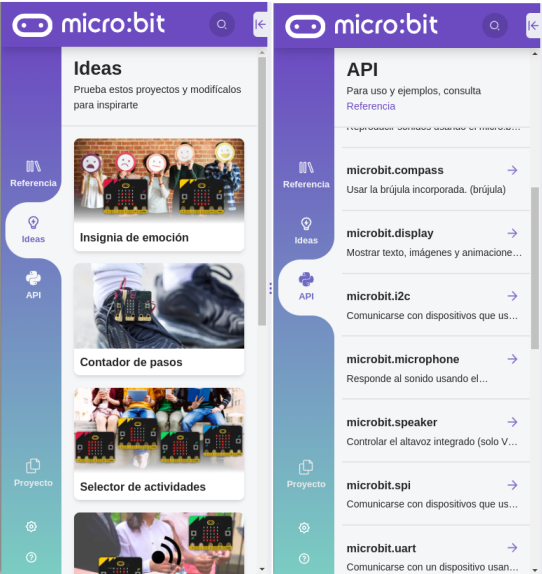  
*Ideas y API*

En la imagen siguiente tenemos un resumen de estos apartados.

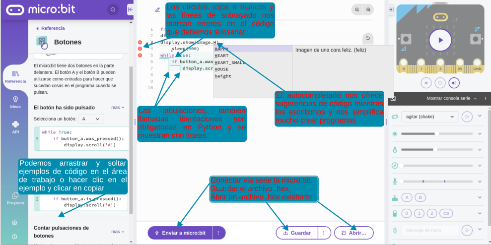  
*Partes del editor explicadas en un gráfico*

### Uso del simulador
La micro:bit que hay en la barra lateral de la derecha es un simulador. Si hacemos clic en reproducir podemos probar nuestro código. Si el código utiliza funciones como el acelerómetro, el sensor de temperatura, el sensor de luz (o cualquier otra función de micro:bit), se pueden simular las condiciones necesarias para probar la micro:bit con los controles encontramos debajo. También podemos usar la consola serie simulada para interactuar con la micro:bit simulada.

En el video [Simulator: micro:bit Python Editor](https://www.youtube.com/watch?v=FysIFdq3ZOE) enlazado de la documentación vemos como se usa el simulador.

### Flasheando la micro:bit
Una vez comprobado el funcionamiento del programa tenemos todo listo para probarlo en la micro:bit real simplemente escogiendo 'Enviar a micro:bit'.

El video [Direct flashing from Python to micro:bit](https://www.youtube.com/watch?v=2zumYE7Mk08) enlazado de la documentación muestra los siguientes pasos si tenemos un navegador compatible con WebUSB.

Si el navegador no soporta webUSB o no conseguimos una configuración adecuada, como es mi caso utilizando Chomium tenemos que utilizar un método alternativo para enviar el programa a la micro:bit.

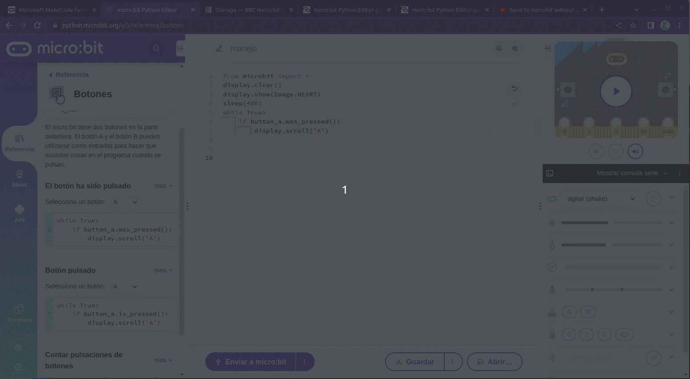  
*Flasheando la micro:bit*

### Abriendo un programa
Para abrir un programa, ya sea porque lo hemos guardado anteriormente o porque es de un tercero, hacemos clic en el botón 'Abrir'. En la ventana de diálogo que se amuestra seleccionamos el archivo '.hex' o '.py' que queremos abrir y luego hacemos clic en abrir. Alternativamente, podemos arrastrar y soltar un archivo '.hex' o un script '.py' en el editor.

  
*Abriendo un programa*

### Proyectos, configuración y ayuda
Las tres pestañas de la parte inferior izquierda nos dan acceso a estas funcionalidades.

* **Proyecto**. La sección de proyectos, que se encuentra en el menú de la izquierda, es particularmente útil si necesitamos agregar archivos de Python adicionales al proyecto. Esto puede ser, por ejemplo, para agregar un módulo para un accesorio o para agregar un código proporcionado por un tercero.

Al hacer clic en el botón se enumeran todos los archivos .py del proyecto. Originalmente, solo habrá un archivo con el nombre main.py que incluye el código inicial que hemos tecleado en la parte central del editor.

Si necesitamos un segundo archivo en el proyecto, podemos elegir 'Crear archivo' y ponerle un nombre, por ejemplo, lo podemos llamar 'ampliar' y se creará un nuevo archivo Python dentro del proyecto.

Si por el contrario lo que queremos es abrir un archivo, procedente de un proveedor de accesorios o un tercero, hacemos clic el botón 'Abrir', localizamos el archivo en nuestro ordenador y lo abrimos. Se nos mostrará una ventana '¿Cambiar archivos? con una frase que empieza por "Sustituir código principal por ..." y que finaliza con el nombre del archivo seleccionado. A la derecha de esta frase hay un icono que si lo clicamos nos va a permitir escoger entre las opciones de 'Sustituir código' o 'Añadir archivo' para añadirlo como archivo adicional. Este archivo adicional, que está dentro del proyecto, puede ser referenciado en main.py utilizando la función 'import'.

Si, por otro lado, queremos volver al código original en algún momento, por ejemplo porque se ha realizado un cambio en el programa existente y queremos restablecerlo, podemos usar el botón 'Restablecer proyecto' que está en la parte inferior. Pero cuidado porque esto reemplaza todo el código, nos lleva de regreso al código predeterminado y elimina cualquier archivo adicional añadido.

  
*Proyecto*

El directorio donde se almacenan los proyectos es 'Descargas'.

* **Configuración**. Se nos abre un menú donde podemos escoger entre 'Idioma' y 'Configuración' que muestra una ventana con unas cuantas opciones de configuración.

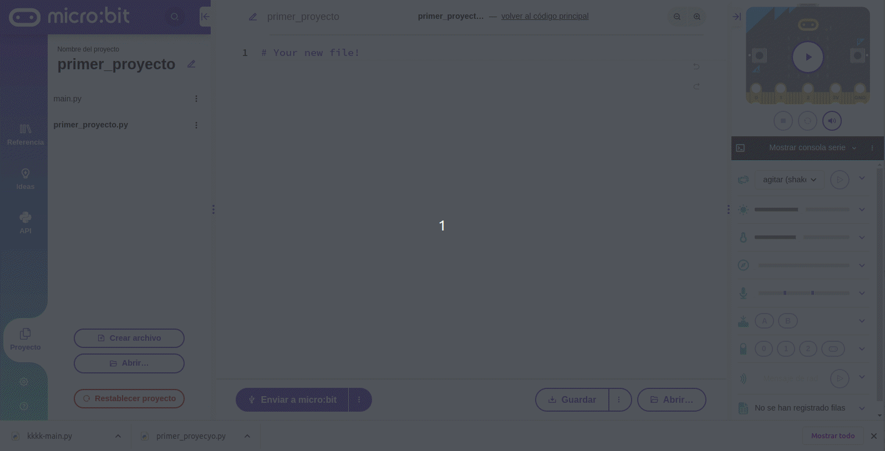  
*Configuración*

* **Ayuda**. En esta pestaña tenemos acceso a diferentes opciones como 'Ayuda y asistencia' que nos abre una web para consultas, 'Documentación de MicroPython' que nos dirige a la wiki de referencia citada al principio del apartado, 'Comentarios' un sitio desde enviar nuestros propios comentarios, 'Términos de uso' que nos dirige a la web donde están definidos y 'Acerca de nosotros' que es el típico Acerca de... que vemos en la ventana siguiente.

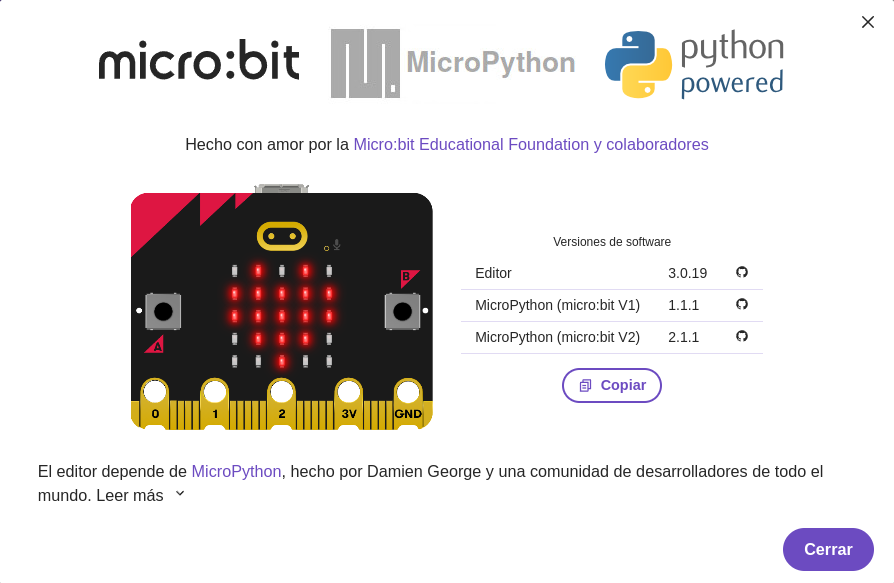  
*Acerca de nosotros*

Es importante leer 'Términos de uso' donde está descrito todo lo que debemos tener en cuenta cuando se utiliza micro:bit y todo lo relacionado con la marca en los términos indicados que además debemos aceptar. Los términos de uso se dan en 18 puntos.

## **Editando código**
Para la creación y edición de nuestros programas utilizaremos la ventana central del editor micro:bit MicroPython.

En esta ventana nos serán de gran utilidad las características de autocompletado, detección de errores y la funcionalidad de los botones deshacer y rehacer que también permiten corregir errores.

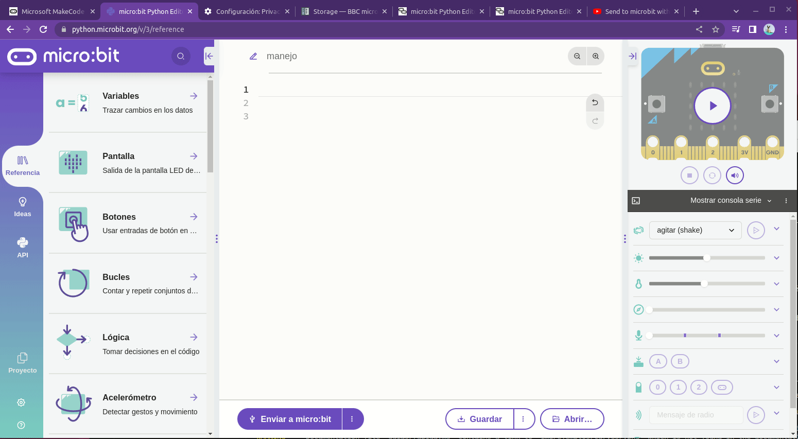  
*Editando código*

En la imagen siguiente tenemos enmarcada con línea verde discontinua la zona de edición de código. Esta zona la podemos ampliar minimizando el menú de la izquierda (1), el menú de la derecha (4) o ajustando su anchura (2). Los iconos de zoom (3) permiten ampliar y reducir el tamaño del texto en la ventana y los controles deshacer/rehacer (5) tienen la funcionalidad habitual y permiten cierto nievel de edición.

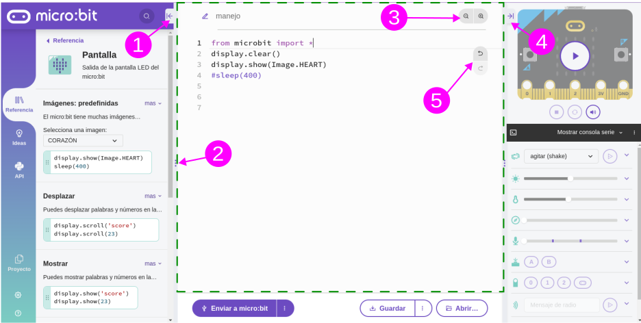  
*Manejo del editor*

## **Primer proyecto**
Para trabajar con Python en micro:bit necesitamos conocer la API de MicroPython que se trata en otro apartado y cuyo original podemos consultar en la webgrafia. Aquí vamos a resumir muy brevemente el significado de las tres líneas de código que compoenen el programa.

Todo lo necesario para poder interactuar con el hardware lo tenemos en el módulo *microbit* y para facilitar su uso se recomienda iniciar todos los scripts con:
~~~python
from microbit import *
~~~
La pantalla de LEDs se controla a partir del objeto *display* y sus métodos, dos de los cuales usamos en el programa y que trabajan de la forma siguiente:
~~~python
display.clear() #Apaga todos los LEDs
display.show(0) #Muestra el número entre paréntesis
~~~
Los números pueden tener mas de una cifra y si queremos mostrarlos como cadena de texto los encerramos entre comillas simples o dobles. Lógicamente en este caso podemos utilizar otros caracteres que no sean números.

El primer proyecto lo tenemos disponible en los enlaces siguientes:

* [Primer proyecto .hex](/docs/programas/upy/Primer-proyecto.hex)
* [Primer proyecto .py](/docs/programas/upy/Primer_proyecto.py)
