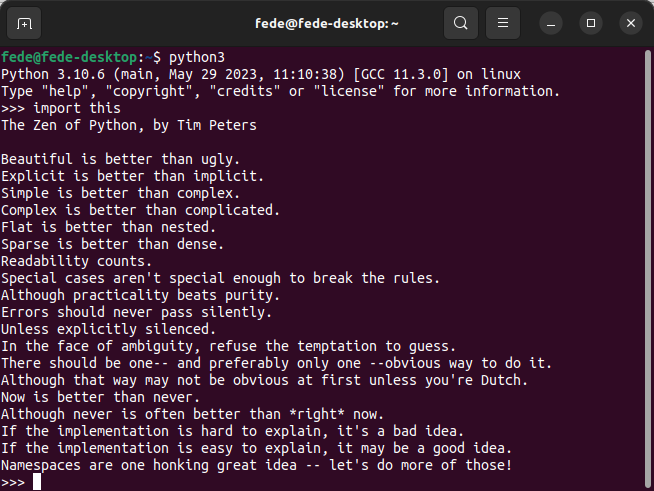

# Referencia rápida
Una breve introducción a cosas útiles de Python y Linux que nos pueden ayudar con la guía de MicroPython.

## **Creador de Python**
Python es un lenguaje de programación interpretado (no hay que compilar los programas) cuya filosofía hace hincapié en una sintaxis que favorezca un código legible.

Python fue creado a finales de los ochenta, por el holandés [Guido van Rossum](https://es.wikipedia.org/wiki/Guido_van_Rossum) en el Centro para las Matemáticas y la Informática (CWI, Centrum Wiskunde & Informatica), en los Países Bajos.

El nombre del lenguaje proviene de la afición de su creador por los humoristas británicos Monty Python y no de la serpiente del mismo nombre. Aunque se suele usar un símbolo con una serpiente pitón para representarlo, de ahí la normal confusión.

Se trata de un lenguaje de programación multiparadigma o que soporta más de un paradigma de programación, representando un paradigma un enfoque particular o filosofía para la construcción del software. Python soporta:

* Orientación a objetos. En la programación orientada a objetos (OOP) los objetos manipulan los datos de entrada para la obtención de datos de salida específicos, donde cada objeto ofrece una funcionalidad especial. Los objetos permiten la agrupación en librerías y usualmente permiten al usuario la creación de sus propias librerías. Se basa en técnicas de herencia, cohesión, abstracción, polimorfismo, acoplamiento y encapsulamiento.
* Programación imperativa. Es la forma natural de programar un ordenador, es el estilo de programación que se utiliza en el ensamblador y el más cercano a la máquina. Sigue la arquitectura arquitectura clásica de Von Newmann con una memoria donde se almacenan los datos y el programa y una unidad de control que ejecuta las instrucciones del programa, conocida cómo contador del programa.
* Programación funcional. Es un estilo de programación cuyo método básico de computación es la aplicación de funciones a sus argumentos.

## **Filosofía Python**
Es muy parecida a la filosofía de Unix. El código que sigue los principios de Python de legibilidad y transparencia se dice que es "**pythonic**". Por el contrario, el código opaco u ofuscado es bautizado como "**unpythonic**". Los puntos que describen su filosofia son:

* Bello es mejor que feo.
* Explícito es mejor que implícito.
* Simple es mejor que complejo.
* Complejo es mejor que complicado.
* Plano es mejor que anidado.
* Disperso es mejor que denso.
* La legibilidad cuenta.
* Los casos especiales no son tan especiales como para quebrantar las reglas.
* Lo práctico gana a lo puro.
* Los errores nunca deberían dejarse pasar silenciosamente.
* A menos que hayan sido silenciados explícitamente.
* Frente a la ambigüedad, rechaza la tentación de adivinar.
* Debería haber una -y preferiblemente sólo una- manera obvia de hacerlo.
* Aunque esa manera puede no ser obvia al principio a menos que usted sea holandés (en clara referencia a su autor).
* Ahora es mejor que nunca.
* Aunque nunca es a menudo mejor que ya mismo.
* Si la implementación es difícil de explicar, es una mala idea.
* Si la implementación es fácil de explicar, puede que sea una buena idea.
* Los espacios de nombres (namespaces) son una gran idea **¡Hagamos más de esas cosas!**

El Zen de Python viene incorporado (en inglés) a partir de la versión 2.1.2 y podemos invocarlo con *import this* abriendo Python en una terminal en un sistema en el que lo tengamos instalado, lógicvamente.

  
*Arrastrar y soltar un fragmento de código*

## **Comentarios**

* Una sola linea: Escribiendo el símbolo almohadilla (#) delante del comentario.

* Multilinea: Escribiendo triple comillas dobles (“””) al principio y al final del comentario.

En los comentarios, pueden incluirse palabras que nos ayuden a identificar además, el subtipo de comentario:

~~~python
# TODO esto es algo por hacer
# FIXME (arreglarme) esto es algo que debe corregirse
# XXX esto también, es algo que debe corregirse
~~~

## **Identation o sangria en Python**
La sangría se refiere a los espacios al comienzo de una línea de código.

Mientras que en otros lenguajes de programación la sangría en el código es solo para facilitar la lectura, la sangría en Python es muy importante ya que se usa para indicar un bloque de código.

~~~python
if 5 > 2:
    print("Cinco es mayor que 2")
~~~

Lo siguiente sería un error de sintaxis.

~~~python
if 5 > 2:
print("Cinco es mayor que 2")
~~~

El número de espacios de la identation puede ser cualquiera siempre que al menos sea un espacio. **Siempre** hay que usar el mismo número de espacios en el mismo bloque de código.

## **Tipos de permisos en Linux**
El comando CHMOD nos da la posibilidad de poder cambiar los permisos de los archivos y directorios combinando entre clases y tipos. Hay cuatro clases:

* Propietario (u). Creador del archivo o la carpeta
* Grupo (g). Usuarios que tendrán acceso al archivo o carpeta
* Otros (o). Todos los usuarios
* Todos (a). Todos los tipos de usuario (propietario, grupo y otros)

Hay tres tipos de permisos:

* Lectura ( r). Permite que el usuario vea el archivo pero no puede realizar cambios en el mismo ni copiarlo o borrarlo.
* Escritura (w). Se permite que los usuarios que acceden al archivo o carpeta puedan realizar sobre el mismo cualquier tipo de edición, copiar, cortar o borrar.
* Ejecutar (x). Al activar esta opción, la cual viene por defecto deshabilitada, podemos ejecutar archivos.

Hay tres modificadores para la tarea:

* +. Concede el permiso
* -. Deniega el permiso
* =. Sobreescribe un permiso con el permiso anterior.

En entornos Unix cada permiso tiene el siguiente valor:

* Lectura: 4
* Escritura: 2
* Ejecución: 1

Jugando con sumas de estos valores establecemos distintos permisos, por ejemplo, si queremos dar un permiso de escritura usaremos el 6 = 4 + 2 (Lectura + Escritura). Si queremos que pueda ejecutar usaremos el 7 = 4 + 2 + 1 (Lectura + Escritura + Ejecución).

En la tabla tenemos todos los valores posibles.

|**Dec.**|**Bin.**|**Permiso**|**read**|**write**|**exe**|
|:-:|:-:|---|:-:|:-:|:-:|
|0|000|Sin permisos|N|N|N|
|1|001|Ejecución|N|N|Y|
|2|010|Escritura|N|Y|N|
|3|011|Lectura y escritura|N|Y|Y|
|4|100|Lectura|Y|N|N|
|5|101|Lectura y ejecución|Y|N|Y|
|6|110|Lectura y escritura|Y|Y|N|
|7|111|Lectura, escritura y ejecución|Y|Y|Y|

El procedimiento para establecer el permiso es muy sencillo. Basta con ir a una terminal y ejecutar la siguiente orden:

~~~
chmod Tipo-permiso Ruta-Archivo
~~~

Ejemplos para modificar permisos en modo terminal:

~~~
chmod o=rwx * → Dar permisos de lectura, escritura y ejecución a los otros usuarios.

chmod go= * → Quitar todos los permisos a grupo y los otros usuarios.

chmod 666 /Documentos/curso-python/Ejercicios/holamundo.py
~~~

En sistemas Linux con letras veremos algo como lo siguiente:

* 0 → ---  → sin acceso
* 1 → --x → ejecución
* 2 → -w- → escritura
* 3 → -wx → escritura y ejecución
* 4 → r-- → lectura
* 5 → r-x → lectura y ejecución
* 6 → rw- → lectura y escritura
* 7 → rwx → lectura, escritura y ejecución

Por ejemplo: *chmod 777*. Le damos a los 3 tipos de usuarios permiso de lectura, ejecución y escritura (hemos sumado4+2+1).  Si queremos dar permisos de lectura y escritura sería 4+2 = 6 y si si lo que queremos es sólo dar lectura sería 4. Si lo que queremos es dar lectura y ejecución sería de sumar 4 + 1 = 5.

Diferentes combinaciones típicas:

* *chmod 755*. Permiso de lectura y ejecución (4+1) a todos los usuarios excepto al propietario que lo tiene completo (lectura, escritura, ejecución 4+2+1).
* *chmod 666*. Permisos de lectura y escritura a todos, excepto ejecución (4+2). Todos pueden acceder al archivo, leer su contenido y modificarlo.
* *chmod 644*. Se suele utilizar para no permitr la escritura a nadie que no sea el propietario. El 755 es similar, lectura y ejecución aunque este es más restrictivo (sólo lectura) y (lectura, escritura para propietario).
