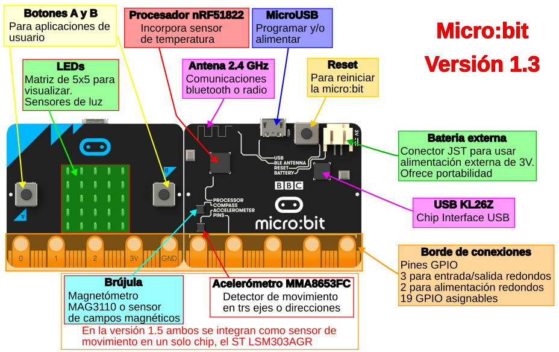
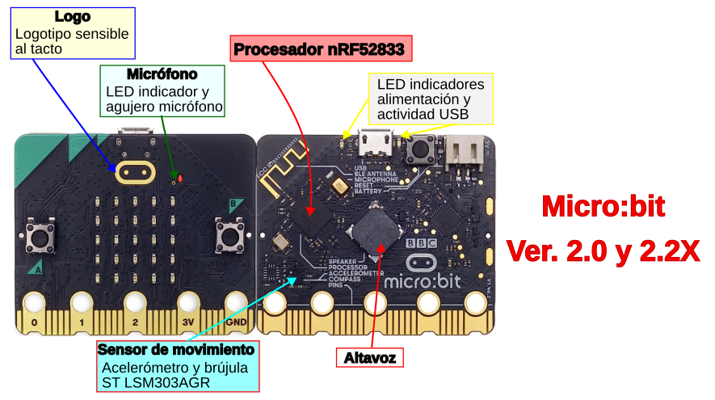
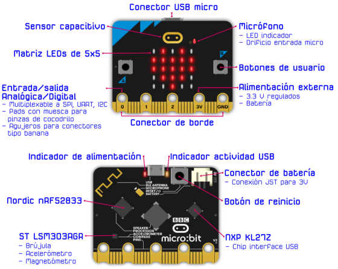
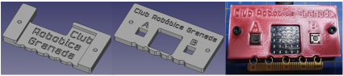
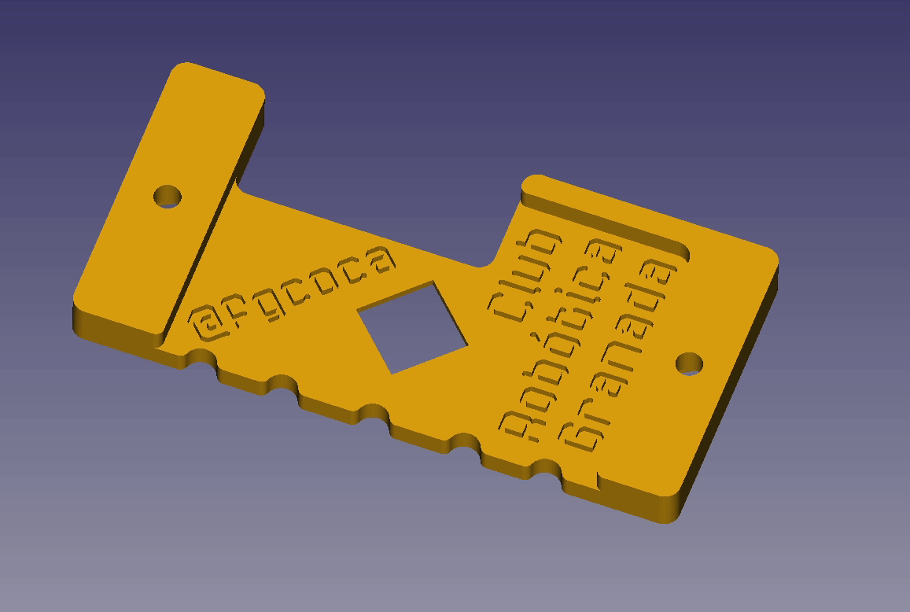
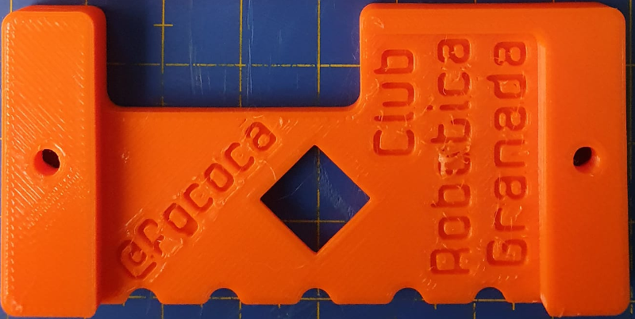
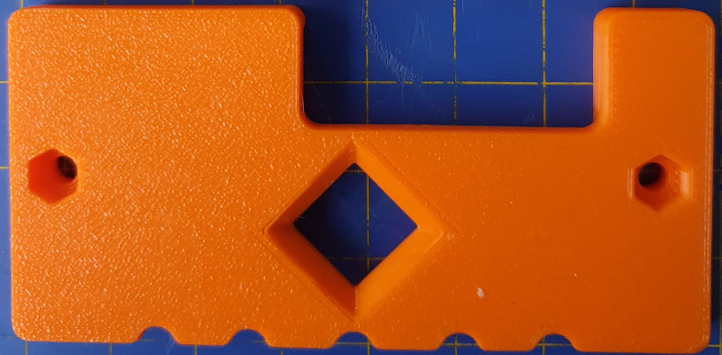
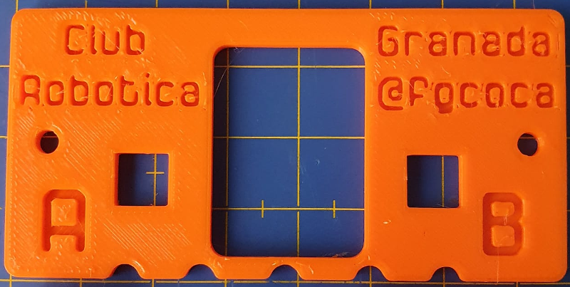
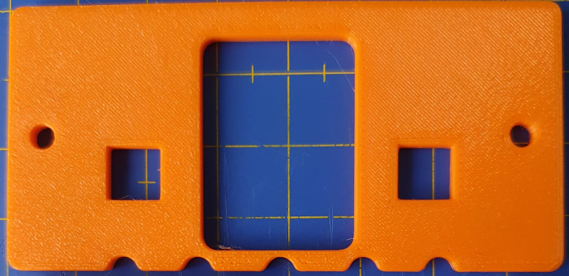
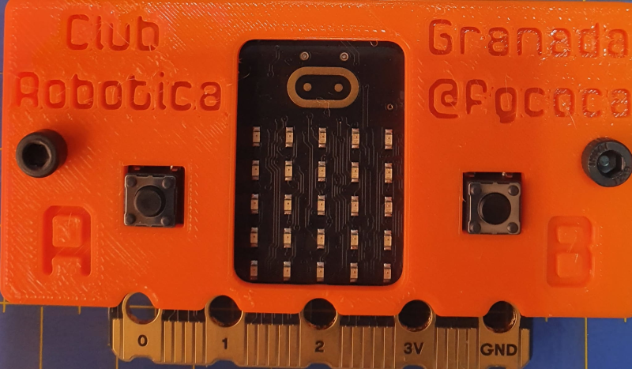

# Introducción
Se pretende crear una guía para trabajar con la tarjeta micro:bit mediante:

* Programación gráfica con: Makecode, Microblocks, Scratch, ...
* Programación con MicroPython

Comienzo por mostrar las versiones de placas micro:bit de una forma breve indicando sus principales diferencias y también introduzco diferenes accesorios y shield interesantes.

Hablaré de la solución cuando tenemos problemas de descarga de los programas por el puerto USB y también de como actualizar o reponer el firmware en la placa micro:bit

## **Descripción gráfica**

En la imagen siguiente vemos la descripción del hardware de la micro:bit 1.3.

  
*Hardware micro:bit 1.3*

En la siguiente imagen tenemos la descripción de hardware para la versión 2 que incluye importantes novedades ya que incorpora un pulsador táctil como sensor en el logo, un micrófono con indicador LED, un altavoz, LED indicador de actividad USB y una LED indicador de alimentación.

  
*Hardware micro:bit 2*

* El conector microUSB nos servirá para programar mediante la técnica de arrastrar y soltar, depurar mediante CMSIS-DAP y ello gracias a que integra webUSB para permitir que podamos conectar nuestra micro:bit a la web mediante el puerto USB
* Los pads con agujero permiten la conexión mediante pinzas de cocodrilo o conectores tipo banana.
* La antena de 2.4 GHz sirve para BLE (Bluetooth Low Energy) y transmisión de radio.

## **Novedades V2 y diferencia con V1**
La novedad mas importante de la nueva tarjeta micro:bit V2 es que incorpora un procesador mas potente que su predecesora. También incorpora indicador de batería,  micrófono, altavoz y un sensor táctil en el logotipo que aumentan sus posibilidades de utilización. En la imagen siguiente se señalan los nuevos elementos.

  
*Novedades micro:bit 2*

Las principales diferencias con micro:bit V1 quedan descritas a continuación:

* **El logo es un botón táctil**. Se trata de un botón táctil capacitivo que nos da la posibilidad de pulsar de cuatro maneras diferentes, botón A, botón B, botón A y botón B a la vez y botón táctil.

* **Micrófono**. Se trata de un micro digital MEMS al que se asocia un indicador LED con el icono de un micrófono. El término MEMS, del inglés MicroElectroMechanical Systems, se refiere a la tecnología electromecánica de dispositivos microscópicos o sistemas microelectromecánicos.

* **Modo ahorro de energía**. Esta nueva función de ahorro o modo de espera detendrá el programa que se esté ejecutando en la micro:bit hasta que se pulse el botón de reinicio.

* **Altavoz**. Permite incorporar sonidos a nuestros proyectos.

La microbit v2 tiene cuatro veces mas posibilidades de procesamiento y ocho veces mas memoria RAM que micro:bit V1, y esto gracias a la incorporación de un procesador nRF52833 ARM Cortex de 64 MHz.

Incorpora 512 KB de memoria Flash y 128 KB de memoria RAM.

## **Hardware micro:bit V2**
En la imagen siguiente tenemos una descripción gráfica de todos los elementos que integra la micro:bit v2 en sus vistas frontal y posterior.

  
*Hardware micro:bit 2*

### Procesador nRF52
Es donde se ejecutan los programas de usuario. El nRF52 proporciona todos los pines GPIO accesibles para el usuario. Hay integrado un periférico de radio de 2.4GHz que se utiliza para proporcionar capacidades de radio y de Bluetooth. En la tabla siguiente vemos sus principales características.

| Item  | Detalles |
|---|---|
| Modelo | [Nordic nRF52833](https://www.nordicsemi.com/Products/Low-power-short-range-wireless/nRF52833) |
| Variante del núcleo | [Procesador Arm Cortex-M4 de 32 bit con FPU](https://developer.arm.com/ip-products/processors/cortex-m/cortex-m4) |
| Memoria Flash ROM | 512 KB |
| Memoria RAM | 128 KB |
| Velocidad | 64 MHz |

### Comunicación inalámbrica Bluetooth
El dispositivo integrado de 2,4 GHz [Nordic S113](https://www.nordicsemi.com/Software-and-Tools/Software/S113) admite comunicaciones Bluetooth a través del dispositivo de bajo consumo (BLE), permitiendo comunicar la micro:bit con dispositivos Bluetooth como teléfonos inteligentes y tabletas.

| Item  | Detalles |
|---|---|
| Pila (stack) | Bluetooth 5.1 con Bluetooth de bajo consumo (BLE) |
| Banda | 2.4GHz ISM (Industrial, Scientific and Medical) 2.4GHz..2.41GHz |
| Canales | 50 de 2MHz. Uitilizados del 0 al 39 |
| Sensibilidad | -93 dBm en modo BLE |
| Potencia de transmisión | -40 dBm a 4 dBm |
| Perfiles | [BBC micro:bit profile](https://lancaster-university.github.io/microbit-docs/ble/profile/) |
| Mas información | [Bluetooth](https://tech.microbit.org/bluetooth) |

### Radiocomunicaciones de bajo nivel
El transceptor integrado de 2,4 GHz soporta una serie de estándares de comunicaciones por radio sobre los que está construido el protocolo de radio micro:bit. Este protocolo proporciona una interfaz de radio sencilla de transmisión de pequeños paquetes con otros dispositivos que lo admiten, como por ejemplo, otras micro:bit.

| Item  | Detalles |
|---|---|
| Protocolo | [Radio micro:bit](https://lancaster-university.github.io/microbit-docs/ubit/radio) |
| Banda de frecuencia | 2.4GHz |
| Velocidad de canal | 1 Mbps o 2 Mbps |
| Encriptación | Ninguna |
| Canales | 80 (0...80) |
| Códigos de grupo | 255 |
| Potencia de transmisión | Ocho valores configurables por el usuario, 0 (-30 dbm) a 7 (+4 dbm) |
| Tamaño de carga | 32 (estándar) o 255 (si se configura) |
| Mas información | [Radio micro:bit](https://lancaster-university.github.io/microbit-docs/ubit/radio) |

### Botones
Los dos botones de la parte frontal y el botón de la parte posterior son botones pulsadores normales. El botón de la parte posterior está conectado al procesador de interfaz KL27 y al procesador NRF52 para reiniciar el sistema. De esta forma se garantiza que la aplicación se reiniciará independientemente de si se alimenta desde USB o desde una batería.

Los botones frontales A y B se pueden programar en la aplicación de usuario con cualquier propósito. Los rebotes de A y B se eliminan por software, y también incluyen pulsación corta, pulsación larga y detección de pulsación simultanea de A y B. Los botones funcionan en modo eléctrico invertido típico, donde una resistencia pull-up asegura un '1' lógico cuando se suelta el botón y un '0' lógico cuando se pulsa el botón. Ambos botones están conectados a pines GPIO que también son accesibles en el conector de borde.

| Item  | Detalles |
|---|---|
| Tipo | Dos pulsadores de usuario y un pulsador de sistema |
| Rebotes | Se eliminan por software con periodos de 54 ms |
| Pullup | Los botones A y B con resistencias externas de 4K7 y el de sistema con 10K |

### Pantalla
La pantalla es una matriz de LED de 5x5. El software en tiempo de ejecución actualiza repetidamente esta matriz a alta velocidad, de modo que está dentro del rango de [persistencia visual](https://es.wikipedia.org/wiki/Persistencia_de_la_visi%C3%B3n) del usuario y no se detecta parpadeo. Esta matriz de LED también se utiliza para detectar luz ambiental.

| Item  | Detalles |
|---|---|
| Tipo | LED rojo miniatura de montaje |
| Estructura física | Matriz de 5x5 |
| Estructura eléctrica | 5x5 |
| Control de intensidad | Control de hasta 255 pasos por software |
| Sensibilidad | Estimación de luz ambiente por algoritmo de software |
| Rango de sensibilidad | 10 niveles, de apagado a luminosidad total |
| Sensibilidad de color | centro del rojo (700 nm) |

### Sensor de movimiento
La micro:bit dispone de un chip que combina acelerómetro y magnetómetro proporcionando así detección de movimiento en 3 ejes y de campo magnético. Incluye detección de gestos en el hardware (como por ejemplo de caídas) y detección adicional de gestos (por ejemplo, logotipo arriba, logotipo abajo, agitación) a través de software. Un algoritmo de software en tiempo de ejecución utiliza el acelerómetro integrado para convertir las lecturas en una brújula independiente de la orientación de la placa. La brújula debe calibrarse antes de su uso, y el software en tiempo de ejecución inicia automáticamente el proceso de calibración. Este dispositivo está conectado al procesador a través del bus I2C.

| Item  | Detalles |
|---|---|
| Modelo | [LSM303AGR](https://www.st.com/en/mems-and-sensors/lsm303agr.html) |
| Características | 3 campos magnéticos y aceleración en e ejes. Rangos 2/4/8/16g |
| Resolución | 8/10/12 bits |
| Gestos "on board" | Caída libre |
| Otros gestos | Se implementan por software en tiempo de ejecución |

### Detección de temperatura
El procesador NRF52 tiene un sensor de temperatura integrado. Este se expone por software en tiempo de ejecución y proporciona una estimación de la temperatura ambiente.

| Item  | Detalles |
|---|---|
| Rango de sensibilidad | -40 ºC ... 105 ºC |
| Resolución | Pasos de 0.25 ºC |
| Precisión | +/- 5 ºC (sin calibrar) |
| Mas información | [Termómetro DAL](https://lancaster-university.github.io/microbit-docs/ubit/thermometer/) |

### Altavoz
Además de poder emitir sonido vía PWM por los pines, la micro:bit v2 incorpora un altavoz ya montado en la placa donde se puede reproducir sonido.

| Item  | Detalles |
|---|---|
| Tipo | JIANGSU HUANENG MLT-8530 |
| SPL (Sound Pressure Level) | 80dB @ 5V, 10cm |
| Frecuencia de resonancia propia | 2700Hz |
| Mas información | [Datasheet](https://datasheet.lcsc.com/szlcsc/1811151451_Jiangsu-Huaneng-Elec-MLT-8530_C94599.pdf) |

### Micrófono
Un micrófono MEMS (Micro -o nano- Electrical-Mechanical System) incorporado proporciona una entrada de sonido a la micro:bit y un indicador LED integrado en la parte frontal de la placa muestra al usuario cuando está encendido.

| Item  | Detalles |
|---|---|
| Tipo | Knowles SPU0410LR5H-QB-7 MEMS |
| Sensibilidad | -38dB ±3dB @ 94dB SPL |
| Relación señal ruido (SNR) | 63dB |
| Máxima ganancia digital (AOP) | 118dB SPL |
| Rango de frecuencia | 100Hz ... 80kHz |
| Patrón polar | Omnidireccional |
| Mas información | [Datasheet](https://www.knowles.com/docs/default-source/model-downloads/spu0410lr5h-qb-revh32421a731dff6ddbb37cff0000940c19.pdf?Status=Master&sfvrsn=cebd77b1_4) |

### Pines GPIO
Son pines de propósito general de entrada/salida (General Purpose Input/Output). En el conector de borde están muchos de los circuitos GPIO del procesador. Algunos de estos circuitos se comparten con otras funciones de la micro:bit, pero muchos pueden reasignarse para uso de propósito general si se desactivan algunas funciones del software.

| Item  | Detalles |
|---|---|
| Anillos | 3 de entrada/salida y 2 de alimentación compatibles con banana de 4mm y pinza de cocodrilo |
| Funciones GPIO | 19 pines asignables GPIO  2 para interfaz I2C externa   6 para la pantalla o detección de luz   2 para detectar los botones de la placa   1 reservado para interfaz de accesibilidad   Los 19 se pueden asignar como entrada o salida digital   Los 19 pueden asignarse para hasta 3 canales PWM simultáneos   Los 19 se pueden asignar para transmisión serie y un canal de recepción serie   6 pueden asignarse como entrada analógica   3 pueden asignarse para comunicación SPI   3 se pueden asignar para hasta 3 entradas de detección táctil  |
| Resolución conversor A/D | 10 bits (0...1023). 2¹⁰=1024 |
| Distancia entre pines | 1.27mm, 80 vias a doble cara |

### Alimentación
La alimentación de la micro:bit puede ser a través de los 5V del conector USB o mediante una batería de 3V enchufada al conector JST. También es posible alimentar a la micro:bit desde los anillos 3V/GND en el conector de borde. Los anillos 3V/GND se pueden usar para suministrar energía a circuitos externos. La placa utiliza un regulador de baja caída o LDO especificado hasta 300 mA con corte térmico para protección contra cortocircuitos.

| Item  | Detalles |
|---|---|
| Rango de operación | 1.8V ... 3.6V |
| Consumo de corriente | 300mA máximo |
| Asignado a periféerico "on board" | 90mA |
| Conector de batería | JST X2B-PH-SM4-TB |
| Máxima corriente prevista para el conector de borde | 190mA |
| Mas información | [Power Supply](https://tech.microbit.org/hardware/powersupply) |

### Interface
El chip de interfaz maneja la conexión USB y se usa para actualizar el código nuevo en la micro:bit, enviar y recibir datos en serie de forma bidireccional.

| Item  | Detalles |
|---|---|
| Modelo | [MKL27Z256VFM4](https://www.nxp.com/part/MKL27Z256VFM4#/) |
| Núcleo | [Arm Cortex-M0+](https://www.arm.com/products/processors/cortex-m/cortex-m0plus.php) |
| Flash ROM | 256KB (128KB reservados para uso como almacenamiento) |
| RAM | 16KB |
| Velocidad | 48MHz |
| Depuración | SWD |
| Mas información | [DAPLink](https://tech.microbit.org/software/daplink-interface/) [Manual del KL27](https://www.nxp.com/docs/en/reference-manual/KL27P64M48SF6RM.pdf)   [datasheet KL27](https://www.nxp.com/docs/en/data-sheet/KL27P64M48SF6.pdf)  |

### Comunicaciones USB
La placa micro:bit tiene una pila de comunicaciones USB incorporada integrada en el firmware del chip de interface. Esta pila brinda la capacidad de arrastrar y soltar archivos en la unidad MICROBIT para cargar código en el procesador. También permite que los datos en serie se transmitan desde y hacia el procesador de micro:bit a través de USB a un ordenador externo, y es compatible con el protocolo CMSIS-DAP para la depuración de programas de aplicación en el host.

| Item  | Detalles |
|---|---|
| Conector | USB micro, MCR-B-S-RA-SMT-CS5-TR |
| Versión USB | Dispositivo a velocidad completa 2.0 |
| Velocidad | 12Mbit/s |
| Clases USB soportadas | [Clase de almacenamiento masivo (MSC)](https://en.wikipedia.org/wiki/USB_mass_storage_device_class)  [Clase dispositivo de comunicaciones (CDC)](https://en.wikipedia.org/wiki/USB_communications_device_class)  |
| Mas información | [DAPLink](https://tech.microbit.org/software/daplink-interface/) |

### Depuración
El procesador de interface se puede utilizar con herramientas de host especiales para depurar el código que se ejecuta en el procesador de la aplicación. Se conecta al procesador de aplicaciones a través de 4 cables de señal. El código del procesador de la interfaz KL27 también se puede depurar a través de su interfaz de depuración del software SWD integral, por ejemplo, para cargar el código del cargador de arranque inicial en este procesador en el momento de la fabricación, o para recuperarlo si se ha perdido.

| Item  | Detalles |
|---|---|
| Protocolo | CMSIS-DAP |
| Opciones | JLink/OB (via different firmware) |
| Mas información | [Mbed debugging micro:bit](https://os.mbed.com/docs/mbed-os/v6.16/introduction/index.html) |

### Mecánicos
Hay disponibles algunos [dibujos CAD 2D y 3D y modelos de la micro:bit](https://github.com/microbit-foundation/microbit-reference-design) que incluyen todas las dimensiones importantes. Estos modelos se pueden utilizar como base para generar imágenes de proyecto y marketing de micro:bit, pero también como base para la fabricación precisa de accesorios, por ejemplo, mediante impresión 3D.

| Item  | Dimensiones |
|---|---|
| Ancho | 51,60 mm |
| Alto | 42,00 mm |
| Profundidad | 11,65 mm |
| Altura del botón a la placa| 4,55 mm |
| Altura del altavoz | 3 mm |
| Conector JST | 5,50 mm |

## **Conector de borde**
Hay 25 pistas/patillas que incluyen 5 agujeros para usar con clavijas tipo banana de 4 mm o pinzas de cocodrilo. Tres de estos anillos son para entrada y salida de propósito general (GPIO) y también sirven para detección analógica, PWM y táctil, y dos están conectados a la alimentación de la micro:bit.

Las pistas mas finas están separadas 1,27 mm, algunas son utilizadas por micro:bit y otras están disponibles para su uso mediante cualquiera de los conectores externos existentes.

Solamente tienen conexión las pistas frontales, las posteriores están sin conexión y los anillos posteriores están conectados a los delanteros.

En la imagen siguiente tenemos la descripción de pines de la micro:bit v2 a la izquierda y de la v1 a la derecha para poder comparar y establecer las diferencias de una forma sencilla.

  
*Pinout micro:bit V2 y V1*

En [microbit.pinout.xyz](https://microbit.pinout.xyz/) tenemos un fantástico recurso para obtener más información sobre los pines de la micro:bit y de cómo los utilizan algunos accesorios.

En en enlace tenemos una [guia de accesorios para micro:bit](https://cdn.sanity.io/files/ajwvhvgo/production/c6f0a76cbe149f91fb998fba3f76e4816187e575.pdf?dl=AccessoryGuide.pdf)

## **Protectores**
Existen en el mercado protectores para las micro:bit realizados en metacrilato transparente, silicona de distintos colores y formas y otros materiales. Estos elementos son fáciles de encontrar en las tiendas que comercializan la placa.

Aquí daremos toda la información necesaria para personalizar e imprimir en 3D nuestros propios protectores.

### micro:bit V1
Carcasa de protección para la versión 1 de la tarjeta micro:bit basada en un diseño de [tatan](https://www.thingiverse.com/tatan/designs).

La base tiene el siguiente aspecto en fase de diseño y montada:

  
*Protector micro:bit V1*

A continuación se da el listado de ficheros de diseño y de impresión 3D listos para descargar.

| Descripción | Archivo | Enlace |
|---|:-:|:-:|
| Archivo de diseño |proteccionV1.FCStd|[Fuente](./3D/V1/src/proteccionV1.FCStd)|
| Base en STL |base.stl|[Base](./3D/V1/stl/baseV1.stl)|
| Tapa en STL |tapa.stl|[Tapa](./3D/V1/stl/tapaV1.stl)|
| Base STEP |base.step|[Base](./3D/V1/step/baseV1.step)|
| Tapa STEP |tapa.step|[Tapa](./3D/V1/step/tapaV1.step)|

### micro:bit V2
El modelo se inspira en el diseño para microbit v1 de [crozes gaëtan (tatan)](https://www.thingiverse.com/thing:3465781) y tiene el aspecto final que vemos en la animación siguiente:

  
*Partes del modelo 3D*

En las imágenes siguientes vemos el aspecto que tiene la base por sus dos caras.

| Parte delantera de la base | Parte trasera de la base |
|:-:|:-:|
| | |

En las imágenes siguientes vemos el aspecto que tiene la tapa por sus dos caras.

| Parte delantera de la tapa | Parte trasera de la tapa |
|:-:|:-:|
| | |

En la tabla siguiente tenemos los archivos del proyecto listos para descargar.

| Descripción | STL | AMF | STEP |
|---|:-:|:-:|:-:|
| Base | [baseV2.stl](./3D/V2/stl/baseV2.stl) | [baseV2.amf](./3D/V2/amf/baseV2.amf) | [baseV2.step](./3D/V2/step/baseV2.step) |
| Tapa | [tapaV2.stl](./3D/V2/stl/tapaV2.stl) | [tapaV2.amf](./3D/V2/amf/tapaV2.amf) | [tapaV2.step](./3D/V2/step/tapaV2.step) |

Este es el enlace al archivo de [diseño en FreeCAD](./3D/V2/src/proteccionV2.FCStd) y este a la [TTF utilizada](./3D/V2/src/Sircuito-Regular-Bold.ttf) para crear los letreros.

El aspecto del protector una vez montado lo tenemos en la imagen siguiente.

  
*Partes del modelo 3D*

## **Enlaces**
Antes de poner un listado de enlaces interesantes diremos que **BBC micro:bit** es una placa programable de 4x5 cm de código abierto que permite aprender a programar de una forma fácil y divertida que está al alcance de todos.

Dado que incorpora muchos sensores es posible realizar una cantidad importante de proyectos disponiendo solamente de la placa.

BBC micro:bit se puede programar de muchas formas,

* De forma visual o por bloques mediante:
    - MakeCode de Microsoft, un editor gráfico online gratuito.
    - MicroBlocks, un lenguaje de programación por bloques para aprender computación física.
    - Scratch (añadiendo una extensión).
    - Open Roberta Lab, un entorno de programación en línea para robots con el lenguaje de programación gráfico NEPO.
* Mediante código:
    - JavaScript, un lenguaje de programación o de secuencias de comandos que permite implementar funciones complejas en páginas web dinámicas.
    - MicroPython, un pequeño pero eficiente interprete del lenguaje de programación Python, optimizado para funcionar en microcontroladores.
    - Python, lenguaje de programación de alto nivel que no se compila, sino que se interpreta.

El código interpretado necesita de un interprete, que se define como la capa lógica de software que se pone entre el código y el hardware, es decir, el interprete es el encargado de procesar el código de programa y hacer posible que el hardware lo ejecute.

Aquí vamos a usar principalmente MakeCode, MicroBlocks y MicroPython, aunque se darán pinceladas con otros entornos. También abordaremos en su momento el tema IoT utiliando la placa micro:bit.

Enlaces muy importantes son:

* [Web en inglés](https://microbit.org/)
* [Web en español](https://microbit.org/es-es/)
* [Comunidad micro:bit en español](http://www.microes.org/)
* [Github de microbit](https://github.com/bbcmicrobit)
* [Comunidad de desarrollo de micro:bit](https://tech.microbit.org/). Wiki de la comunidad con información técnica de micro:bit.
* [Editor gráfico Makecode estable](https://makecode.microbit.org/#editor).
* [Web de MicroBlocks](https://microblocks.fun/)
* [Editor online de MicroBlocks](https://microblocks.fun/run/microblocks.html)
* [Editor Python de micro:bit](https://python.microbit.org/v/3). Sencillo editor de código basado en navegador.
* [Mu](https://codewith.mu/). Sencillo editor de código sin conexión.
* [uFlash](https://uflash.readthedocs.io/en/latest/). Herramienta de línea de comandos para mostrar secuencias de comandos de Python sin procesar en un micro:bit.
* [IDLE](https://docs.python.org/3/library/idle.html). Un IDE de código abierto multiplataforma que se instala por defecto con Python.
* [BBC Micro:bit MicroPython documentation](https://microbit-micropython.readthedocs.io/en/latest/index.html#).
* [Instalación de Mu-editor en Linux, OSX y Window](https://codewith.mu/en/howto/1.0/install_with_python).
* [Bot de programación Open Roberta Lab](https://lab.open-roberta.org/).
* [Thonny](https://thonny.org/). Sencillo IDE para Python.
