# Solución de problemas
Hay veces que surgen problemas con la descarga webUSB porque no se consigue emparejar la micro:bit y también pueden surgir problemas cuando intentamos hacerer drag & drop (arrastrar y soltar) el archivo .hex en la unidad MICROBIT montada, o incluso puede que no se monte dicha unidad.

Cuando el intento de conexión nos devuelve un error en el rango 500-599, normalmente se puede corregir reintentsando el envio del .hex nuevamente o borrar enviando el archivo hexadecimal de nuevo, o enviando el software original ["Out of box experience"](https://microbit.org/get-started/user-guide/out-of-box-experience/), traducido literalmente como "Fuera de la caja" pero que se traduce como [Experiencia inmediata](./guias/outofthebox.md). Al final de este también se da información sobre la [herramienta de flasheo online](https://microbit.org/tools/webusb-hex-flashing/) que tenemos disponible.

Después de cualquier error de transferencia siempre es buena idea desconectar el cable USB y la alimentación desde batería, para volver a conectar el USB y volver a intentarlo.

Todas las indicaciones van a estar basadas siempre en Ubuntu 22.04.2 LTS, navegador [Google Chrome](https://www.google.com/search?client=ubuntu-chr&hs=h3i&sxsrf=AB5stBgb5apIrk3hADIsMMgjT5PoVBwGtg%3A1690617337806&q=google%20chrome%20descargar&ved=2ahUKEwjOxvuuuLOAAxWZaqQEHXvaDJUQmoICKAB6BAgMEBA) o [Chromium](https://www.chromium.org/chromium-projects/) que es la versión open-source de Chrome y que **tiene que estar instalado** desde la tienda Snap.

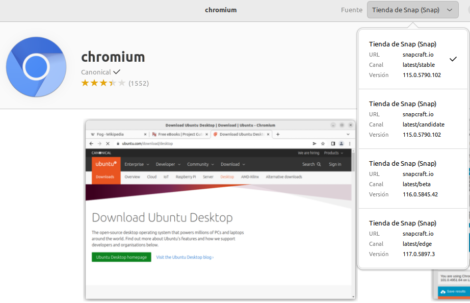  
*Chromium instalado desde tienda Snap*

La información va a estar basada, además de las web citadas en webgrafia, fundamentalmente en los siguientes enlaces:

* [WebUSB Troubleshooting](https://support.microbit.org/support/solutions/articles/19000105428-webusb-troubleshooting) de micro:bit Help & Support.
* [Ticket #64940 error: The transfer timed out. type: transient, user error 504](https://support.microbit.org/support/tickets/64940) de micro:bit Help & Support.

## **Paso a paso inicial**

### Paso 1: Comprobar el cable
Conectamos la placa micro:bit a un puerto USB mediante un cable microUSB. Debemos ver que se monta un dispositivo de nombrre MICROBIT y que está activo, como en la imagen siguiente:

  
*Unidad MICROBIT montada*

La forma de ver la unidad montada dependerá de nuestro sistema operativo.

Si podemos ver la unidad MICROBIT montada podemos pasar al paso 2 y si no procedemos a:

* Asegurarnos que el cable no está dañado. Podemos probarlo en otro ordenador o utilizar un cable diferente. Hay que tener presente que algunos cables comerciales solo conectan alimentación y no tienen realizadas las conexiones de transmisión de datos.
* Probar en otro puerto USB del ordenador.

Si podemos asegurar que el cable está bien pero no aparece la unidad MICROBIT, es posible que tengamos un problema con la micro:bit. Hay que probar los pasos adicionales descritos en la [página de búsqueda de fallos en microbit.org](https://support.microbit.org/support/solutions/articles/19000024000-fault-finding-with-a-micro-bit). Si esto tampoco nos ayuda, podemos crear un [New support ticket](https://support.microbit.org/support/tickets/new) para notificar el problema a la Fundación Micro:bit y esperar obtener una respuesta. Si estamos en este caso hay que omitir el resto de pasos hasta obtener la respuesta.

### Paso 2: Verificar la versión de firmware
Es posible que el firmware de la micro:bit necesite una actualización. Vamos a comprobarlo:

* Accedemos a la unidad MICROBIT montada.
* Abrimos con un editor de texto el archivo de solo lectura **DETAILS.TXT**.
* Comprobamos el número que pone junto a Interface Version.

  
*Comprobación de la versión de firmware*

Si la versión 0234, 0241 o 0243 es necesario actualizar el fimware de esa micro:.bit siguiendo el proceso que vamos a indicar en el paso 3. En la imagen anterior observamos que la versión del firmware es **Interface Version: 0249**.

Si tenemos la versión 0249, 0250 o mayor trabajamos con el firmaware correcto y podemos saltar al paso 4.

### Paso 3: Actualizar firmware
Si se requiere una actualización del firmware para acceder a nuevas características o para solucionar algún problema, debemos proceder así:

* Desconectar la micro:bit de cualquier tipo de alimentación, ya sea por USB o por bateria.
* Con el pulsador de reset de la parte posterior accionado conectamos la micro:bit a un puerto USB y esperamos a que se monte una unidad llamada **MAINTENANCE** (en lugar de MICROBIT) como observamos en la figura siguiente.

  
*Micro:bit en modo MAINTENANCE*

La forma de ver la unidad montada dependerá de nuestro sistema operativo.

* Descargamos el archivo .hex apropiado para nuestra versión de micro:bit. El número de versión está impreso en la parte inferior derecha de la cara trasera del dispositivo. Existen unas cuantas [formas de distinguir](https://support.microbit.org/support/solutions/articles/19000119162-how-to-identify-the-version-number-of-your-micro-bit-) que versión de placa tenemos.

#### Identificar el número de versión
Actualmente hay dos versiones oficiales de BBC micro:bit, la V1 y la V2.

Ambas versiones trabajan de la misma forma por lo que podemos continuar utilizando las versiones previas de la forma habitual.

La primera forma de saber el número de versión (V2.20, V2, V1.5, V1.3B) es mirar en la esquina inferior derecha de la cara posterior (figura siguiente). Si no podemos ver el número es muy probable que tengamos una micro:bit 1.3 en la que el número de versión serigrafiado se quedaba debajo de la pintura negra.

  
*Número de versión serigrafiado*

Como segunda forma, si en la parte posterior del dispositivo en versiones V2, veremos una etiquetara identifica **MICROPHONE** (MICRÓFONO) y otra otra para el **SPEAKER** (ALTAVOZ), y además la **ANTENA BLE** es de color dorado.

  
*Número de versión según la antena*

Para la tercer forma nos fijaremos en si el conector de borde tiene muescas que serán útiles para facilitar el uso de pinzas de cocodrilo o no dispone de dichas muescas. En la figura siguiente vemos la diferencia.

  
*Número de versión según el conector de borde*

y la cuarta forma es el logototipo de micro:bit en la parte frontal del dispositivo, que en la versión V2 es dorado como el conector de borde y además es un pulsador táctil que se puede usar como un pin de entrada. En la figura vemos las diferencias.

  
*Número de versión según el logotipo de micro:bit*

#### Micro:bit V1
Si tenemos una micro:bit V1 (sin altavoz ni micrófono), todas las placas usan el mismo firmware.

[Firmware para V1](https://tech.microbit.org/docs/software/assets/DAPLink-factory-release/0249_kl26z_microbit_0x8000.hex)

#### Micro:bit V2
Si tenemos una micro:bit V2 (con altavoz y micrófono), existen dos posibles versiones de firmware; la V2.00 y la V2.20/2.21. Debemos seleccionar el firmware apropiado para nuestra placa.

[Firmware para V2.00](https://tech.microbit.org/docs/software/assets/DAPLink-factory-release/0255_kl27z_microbit_0x8000.hex) --- [Firmware para V2.20/2.21](https://tech.microbit.org/docs/software/assets/DAPLink-factory-release/0257_nrf52820_microbit_if_crc_c782a5ba90_gcc.hex)

* Arrastramos y soltamos el fichero .hex que hemos descargado en la unidad montada como **MAINTENANCE** y esperamos a que el LED amarillo de la cara posterior deje de parpadear. Cuando la actualización se ha completado la micro:bit se reseteará, se expulsará del ordenador y volverá a aparecer en modo **MICROBIT**.
* Finalmente debemos comprobar el archivo **DETAILS.TXT** para asegurarnos que la versión de firmware descargada se ha flsheado en el chip de interface.
* Si tenemos cualquier problema con el proceso de actualización del firmware debemos contactar con [micro:bit support](https://support.microbit.org/) que es la página de soporte en inglés.
* Todas las versiones de firmware, actuales, anteriores y beta están disponibles en [previous firmware versions](https://tech.microbit.org/software/daplink-interface/#daplink-software).

### Paso 4: Comprobar la versión del navegador
WebUSB es una característica muy actual y puede requerir que el navegador esté actualizado. Verifiquemos que el navegador coincida con los descritos [navegadores soportados](https://makecode.microbit.org/browsers). Están soportados diferentes navegadores como Microsoft Edge, Google Chrome o Chromium, Mozilla Firefox y Safari para los distintos sistemas operativos y versiones.

### Paso 5: Emparejar dispositivo
Una vez que hemos actualizado el firmware, abrimos nuestro navegador compatible, vamos al editor que estemos utilizando para programar y procedemos a Emparejar dispositivo. Ya estamos preparados para comenzar a trabajar siguiendo los pasos iniciales que se describen en [Configurar nuestra micro:bit](configura.md).

## **Flasheo directo**
Vamos a ver que necesitamos para poder grabar firmware en la micro:bit desde la página web del editor que estemos utilizando mediante webUSB para posteriormente atajar los posibles problemas. Comenzamos por un resumen de las condiciones en las que se documenta esto, que son:

* Sistema operativo Ubuntu 22.04.2 LTS de 64 bits.
* Inicialmente el navegador utilizado ha sido Chromium Versión 114.0.5735.198 (Build oficial) snap (64 bits). También se realizan pruebas con el navegador Google Chrome Versión 115.0.5790.110 (Build oficial) (64 bits).
* El flasheo directo solamente funciona en los navegadores Chrome o Edge que soportan webUSB.
* Recordemos que también es necesario tener actualizado el firmware de la micro:bit.

La micro:bit nos debe aparecer en el navegador como **BBC micro:bit CMSIS-DAP** aunque es posible que la primera vez nos aparezca como *LPC1768*.

Si nos estamos cambiando entre editores, por ejemplo MakeCode y Python, seguramente la actualización de programas mediante webUSB requiere mas tiempo del habitual ya que la micro:bit contiene un programa creado con un editor diferente.

Si tenemos problemas cuando tenemos conectada alimentación externa, procedemos a desconectar esta alimentación y el cable microUSB garantizando asi el total apagado de la placa. Conectamos solamente el cable microUSB tanto a la micro:bit como al ordenador e intentamos de nuevo el flasheo. Es indiferente para esto conectar la bateria tras conectar el cable microUSB o hacerlo en otro momento.

Si estamos en un sistema Linux y se ha instalado Chromium desde snap store, que es la tienda oficial de software de Ubuntu, no podremos acceder a dispositivos webUSB. En distribuciones como Ubuntu suele solucionar el problema declarar una regla [udev](https://es.wikipedia.org/wiki/Udev). A continuación se indica como hacerlo.

Cuando trabajamos con distribuciones Linux en general o Ubuntu en particular hay que declarar una regla '***udev***' y para hacerlo debemos seguir una serie de pasos que describimos a continuación:

* Cerramos el navegador Chrome o Chromium.
* Abrimos una terminal de comandos
* Comprobamos si existe un grupo de usuaraios llamado *'plugdev'* utilizando el comando *'getent'*, que nos devuelve las entradas de la base de datos administrativa del sistema. Se puede solicitar de '*passwd, group, hosts, services, protocols, o networks*'. En nuestro caso nos interesa de '*gropu*', por lo que hacemos:

~~~bash
getent group
~~~

En el resultado debemos buscar el grupo y si existe aparecerá listado. En caso de que no exista lo creamos con:

~~~bash
getent group plugdev >/dev/null || sudo groupadd -r plugdev
~~~

Si resulta necesario porque el grupo lo creó un usuario distinto a nosotros, deberemos agregar nuestro usuario al grupo '*plugdev*' según vemos a continuación. Debemos reemplazar <tu-nombre-de-usuario> con el nombre real de nuestro usuario.

~~~bash
sudo usermod -a -G plugdev <tu-nombre-de-usuario>
~~~

* Creamos un archivo en el directorio *'/etc/udev/rules.d'* que llamaremos *'50-microbit.rules'* haciendo:

~~~bash
sudo nano/etc/udev/rules.d/50-microbit.rules
~~~

En el editor escribimos:

'*SUBSYSTEM=="usb", ATTR{idVendor}=="0d28", MODE="0664", GROUP="plugdev"*'

y ya podemos guardar el archivo en el directorio indicado y con el nombre citado.

Salimos del editor y podemos continuar. El siguiente comando nos ayuda a mostrar si hemos creado bien la regla ya que nos muestra el contenido del archivo creado.

~~~bash
cat /etc/udev/rules.d/50-microbit.rules
~~~

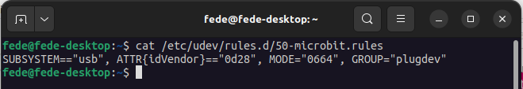  
*Comando Cat*

El comando '*Cat*' toma su nombre de concatenar y permite crear, unir y **consultar** el contenido del archivo que le indiquemos.

Es **IMPORTANTE** saber que el archivo de reglas de estar creado por un usuario root, o incluso el propio root del sistema. No voy a entrar en detalles sobre el tema del superusuario en Linux debido a los peligros que conlleva trabajar con este nivel de permisos sin ser un experto. Algunas de sentencias que hemos puesto van precedidas de '*sudo*', que indica que lo que se va a hacer se hará como usuario con privilegios de root, pero este no es exactamente el superusuario. En la entrada [Tipos de permisos en Linux](./guias/intro.md) de la introducción a Python hay mas información sobre el tema. Se advierte que trabajar con estos temas sin ser experto puede crear daños irreversibles en el sistema. Para asegurar estos cambios, si se han realizado, es conveniente reiniciar siempre el sistema.

* Cerramos o reiniciamos el ordenador.
* Abrimos el navegador.
* Comprobamos si se ha establecido la conexión mediante los comandos siguientes:

~~~bash
snap connections  | grep -v ".*-$
mount | grep MICROBIT
~~~

El comando '*snap*' permite instalar, configurar, actualizar y eliminar paquetes y mediante '*grep*' buscamos si dentro del fichero connections el navegador ha establecido la conexión y si la misma está realizada. Si todo es correcto devolverá Plug = chromium:raw-usb y connector = raw-usb. El segundo nos ayuda a montar la unidad "MICROBIT" si no se monta al conectar una placa micro:bit. En la figura siguiente vemos un posible resultado.

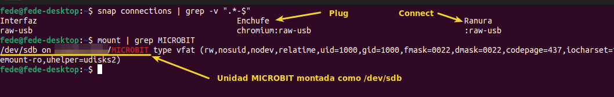  
*Comandos snap connections y mount*

En el [bug de Chromium](https://support.microbit.org/support/solutions/articles/19000105428-webusb-troubleshooting) citado en la parte de Linux indica, antes de entrar en la creación de reglas lo siguiente:

* Si Chromium se ha instalado desde la tienda snap no se podrá acceder a los dispositivos WebUSB. En este caso, WebUSB se puede habilitar utilizando la interfaz '*raw-usb*', que permite el acceso a todos los dispositivos USB conectados a través de una interfaz sin formato que no tiene una conexión automática. Se habilita desde la línea de comandos así:

~~~bash
 snap connect chromium:raw-usb
~~~

que debería servir para versiones de Chromium posteriores a julio de 2020.

* Si en algún momento dudamos si se está aplicando la nueva regla tras algún cambio realizado podemos reiniciar las mismas haciendo:

~~~bash
sudo udevadm control --reload-rules
~~~

Si al hacer clic en los tres puntos para realizar la conexión se genera un error como el que vemos en la imagen siguiente es evidente que no vamos a poder flashear el firmware en esas condiciones.

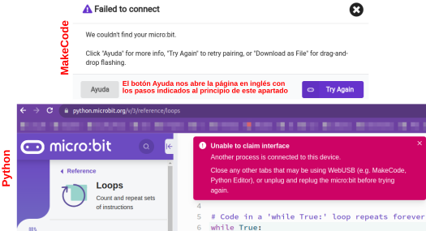  
*Errores de conexión en MakeCode y Python*

Si hemos dado todos los pasos anteriores y no funciona puede deberse a diversas causas y una muy probable es que los permisos dados en el navegador para el dispositivo estén emparejados para otra aplicación o dispositivo y esto no permite continuar. A la izquierda en la barra de navegación podemos ver un pequeño candado que es un botón que nos da información del sitio y que permite borrar los emparejamientos. En la imagen vemos la situación.

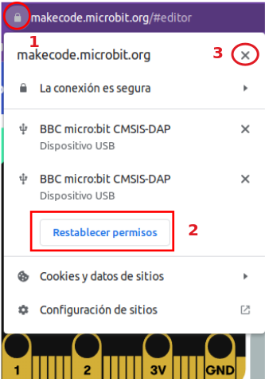  
*Borrar emparejamiento*

Si seguimos el orden numérico indicado, tras borrar el emparejamiento debemos cerrar la ventana abierta al clicar el candado y veremos la siguiente situación:

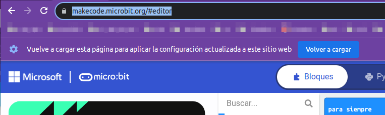  
*Recargar la página*

Esta acción restablece el estado del navegador. Si esto no nos funciona a la primera debemos probar a repetirlo un par de veces mas dado que a veces webUSB se desincroniza. También es conveniente combinarlo con desconectar y conectar el USB.

## **Pruebas finales**
Para comprobar que todos los cambios propuestos anteriormente se han realizado correctamente vamos a ejecutar desde una terminal los comandos siguientes:

~~~
groups
cat /etc/udev/rules.d/50-microbit.rules
ls -l /etc/udev/rules.d
~~~

Como vemos en la imagen siguiente, el primer comando nos indica que el usuario está en el grupo requerido, el segundo nos muestra la sintaxis de la regla creada y con el tercero simplemente comprobamos que el fichero creado efectivamente está y además en el directorio correspondiente.

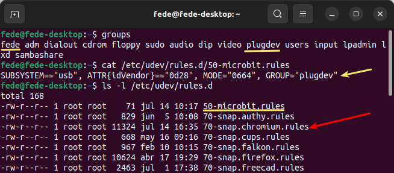
*Creación regla udev*

En la imagen se ha indicado la existencia del archivo de reglas udev creado con la instalación del navegador Chromium, pero en este no existe ninguna regla para micro:bit y personalmente no he querido tocar el mismo.

### MakeCode
Iniciamos el navegador Chromium o Google Chrome, este último preferiblemente desde un perfil sin cuenta o con una cuenta que tenga poca actividad.

Conectamos nuestra micro:bit a un puerto USB y procedemos a emparejarla con el navegador. Si nos da algún tipo de error debemos probar a desconectar y volver a conectar la micro:bit del USB y repetir la operación.

Para el caso de Chromium será algo similar a lo siguiente:

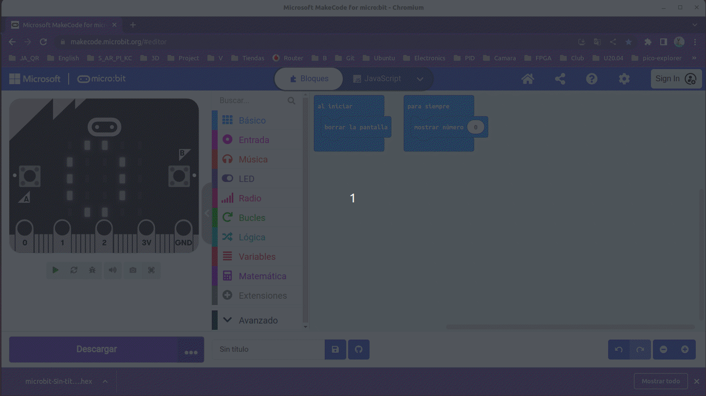
*Flasheo directo en Chromium*

Para el caso de Chrome será algo similar a lo siguiente:

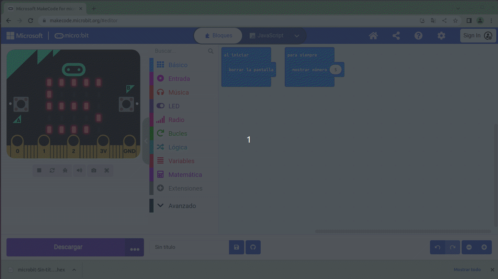
*Flasheo directo en Chrome*

### Python
Para el caso de Chromium será algo similar a lo siguiente:

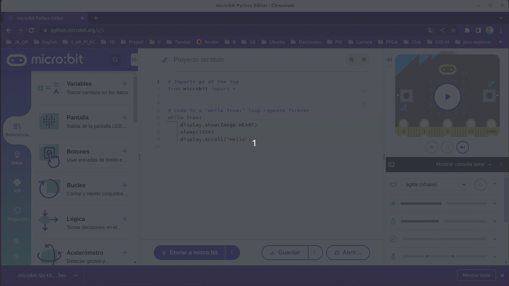
*Flasheo directo en Chromium*

Para el caso de Chrome será algo similar a lo siguiente:

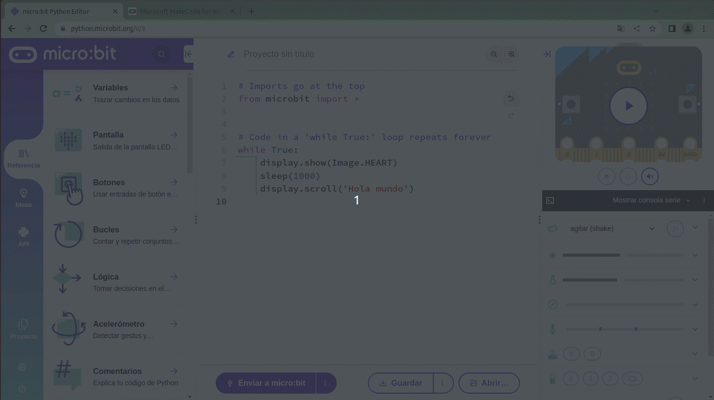
*Flasheo directo en Chrome*

Tenemos que recordar siempre archivar nuestro trabajo.

## **Mas reglas udev**
Vamos a instalar en el sistema una nueva regla propuesta por Martin Williams en el ticket [Ticket #64940 error: The transfer timed out. type: transient, user error 504](https://support.microbit.org/support/tickets/64940).
En este caso enfocado al sistema de grabación de firmware drag & drop. Si seguimos viendo el error 504, vamos a trabajar con otra regla udev que podemos eliminar si nos ocasiona problemas secundarios.

Sería conveniente tener un historial de pruebsas anterior a la instalación de la nueva regla para poder comparalas con las que hagamos después de instalarla. Con una micro:bit conectada ejecutamos el comando:

~~~bash
mount | grep MICROBIT
~~~

En mi caso devuelve lo siguiente:

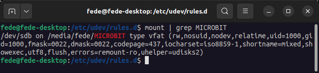
*Antes de la nueva regla udev*

Para los siguientes pasos desconectamos la micro:bit del ordenador y reiniciamos las reglas udev.

Nos descargamos el archivo [99-microbit-udisks.zip](./programas/99-microbit-udisks.zip) y lo descomprimimos en un directorio aparte. Hacemos una copia del archivo descomprimido en el directorio de reglas '*/etc/udev/rules.d*'. Para ello hacemos:

~~~bash
sudo cp 99-microbit-udisks.rules /etc/udev/rules.d
~~~

Hacemos la comprobación de quien es el propietario, los permisos y el grupo al que pertenece el nuevo archivo. Esto lo podemos hacer con el comando:

~~~bash
ls -l /etc/udev/rules.d
~~~

Reiniciamos udev:

~~~bash
sudo udevadm control --reload-rules
sudo udevadm trigger
~~~

Volvemos a conectar la micro:bit y comprobamos de nuevo con:

~~~bash
mount | grep MICROBIT
~~~

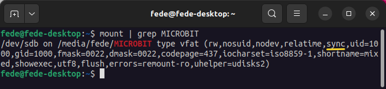
*Después de la nueva regla udev*

La única diferencia debería ser que se ha añadido "sync".

## **Sistema de prueba**
Mediante el hilo indicado en la webgrafia y utilizando la información obtenida de [WebUSB Troubleshooting](https://support.microbit.org/support/solutions/articles/19000105428-webusb-troubleshooting) ha quedado resuelto el tema de utilizar [webUSB con Chromium](directo.md) y se propone un método de prueba de errores que a mi entender nos puede resultar bastante útil en un momento determinado.

Cuando estamos teniendo problemas para grabar firmware mediante la técnica de arrastrar y soltar (drag & drop) y/o flasheando desde la web del editor, nos resultará útil disponer de una colección de archivos que permitan ir realizando pruebas al tiempo que llevamos la cuenta de las pruebas realizadas.

Es **Martin Williams** de **Micro:bit Educational Foundation** quien propone el sistema y el procedimiento a seguir.

* Siempre que tengamos un error tenemos que desconectar y volver a conectar el USB antes de probar de nuevo con el mismo archivo.
* Crear un script de Python en el que podamos ir cambiando el número de intento cuando el programa se flashea o graba correctamente.

El script de Python propuesto lo he modificado y queda así:

~~~python
# Las importaciones al principio
"""En Python, se utiliza la palabra clave import 
para hacer que el código de un módulo esté 
disponible en otro."""
from microbit import *

display.show(Image.HEART)
sleep(1000)

# El código en'while True:' se repite indefinidamente
while True:
    display.show(0) #Contamos cambiando el valor aquí
    sleep(1000)
~~~

En el fichero [10_archivos_hex_python.zip](../programas/upy/coleccion_errores/10_archivos_hex_python.zip) tenemos los 10 archivos hexadecimal generados y probados. El primero de los cuales (python0-main.py) también lo tenemos en formato texto.

Probamos arrastrando cada archivo de manera sucesiva. Si se produce algún fallo volvemos a desconectar y conectar el USB y probamos de nuevo el mismo archivo. Podemos ir anotando el número de fallos que se producen al transferir los 10 archivos.

También probamos a cargar el archivo '0' en el Editor Python, y lo flasheamos directamente desde el editor a la unidad micro:bit y hacemos el procerso de reconectar si es necesario. Vamos cambiando el número cuando tenemos éxito, hasta que he lleguemos al número 9. Cambiando el número se comprueba que el archivo se está transfiriendo realmente, ¡y ayuda a no perder la cuenta!
