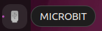
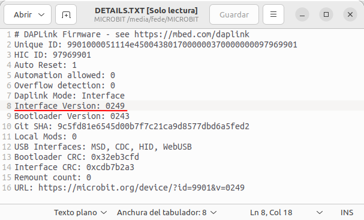
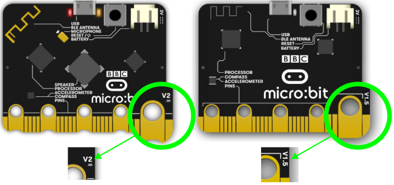
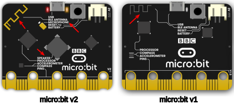
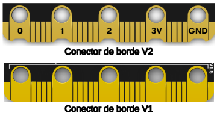

# Solución de problemas con descargas webUSB
Si estamos teniendo problemas para emparejar la micro:bit con WebUSB vamos a intentar averiguar por qué.

Las indicaciones van a estar basadas siempre en Ubuntu 22.04.2 LTS.

## **Paso 1: Comprobar el cable**
Conectamos la placa micro:bit a un puerto USB mediante un cable microUSB. Debemos ver que se monta un dispositivo de nombrre MICROBIT y que está activo, como en la imagen siguiente:

  
*Unidad MICROBIT montada*

La forma de ver la unidad montada dependerá de nuestro sistema operativo.

Si podemos ver la unidad MICROBIT montada podemos pasar al paso 2 y si no procedemos a:

* Asegurarnos que el cable no está dañado. Podemos probarlo en otro ordenador o utilizar un cable diferente. Hay que tener presente que algunos cables comerciales solo conectan alimentación y no tienen realizadas las conexiones de transmisión de datos.
* Probar en otro puerto USB del ordenador.

Si podemos asegurar que el cable está bien pero no aparece la unidad MICROBIT, es posible que tengamos un problema con la micro:bit. Hay que probar los pasos adicionales descritos en la [página de búsqueda de fallos en microbit.org](https://support.microbit.org/support/solutions/articles/19000024000-fault-finding-with-a-micro-bit). Si esto tampoco nos ayuda, podemos crear un [New support ticket](https://support.microbit.org/support/tickets/new) para notificar el problema a la Fundación Micro:bit y esperar obtener una respuesta. Si estamos en este caso hay que omitir el resto de pasos hasta obtener la respuesta.

## **Paso 2: Verificar la versión de firmware**
Es posible que el firmware de la micro:bit necesite una actualización. Vamos a comprobarlo:

* Accedemos a la unidad MICROBIT montada.
* Abrimos con un editor de texto el archivo de solo lectura **DETAILS.TXT**.
* Comprobamos el número que pone junto a Interface Version.

  
*Comprobación de la versión de firmware*

Si la versión 0234, 0241 o 0243 es necesario actualizar el fimware de esa micro:.bit siguiendo el proceso que vamos a indicar en el paso 3. En la imagen anterior observamos que la versión del firmware es **Interface Version: 0249**.

Si tenemos la versión 0249, 0250 o mayor trabajamos con el firmaware correcto y podemos saltar al paso 4.

## **Paso 3: Actualizar firmware**
Si se requiere una actualización del firmware para acceder a nuevas características o para solucionar algún problema, debemos proceder así:

* Desconectar la micro:bit de cualquier tipo de alimentación, ya sea por USB o por baterias.
* Con el pulsador de reset de la parte posterior accionado conectamos la micro:bit a un puerto USB y esperamos a que se monte una unidad llamada **MAINTENANCE** (en lugar de MICROBIT) como observamos en la figura siguiente.

  
*Micro:bit en modo MAINTENANCE*

La forma de ver la unidad montada dependerá de nuestro sistema operativo.

* Descargamos el archivo .hex apropiado para nuestra versión de micro:bit. El número de versión está impreso en la parte inferior derecha de la cara trasera del dispositivo. Existen unas cuantas [formas de distinguir](https://support.microbit.org/support/solutions/articles/19000119162-how-to-identify-the-version-number-of-your-micro-bit-) que versión de placa tenemos.

### Identificar el número de versión
Actualmente hay dos versiones oficiales de BBC micro:bit, la V1 y la V2.

Ambas versiones trabajan de la misma forma por lo que podemos continuar utilizando las versiones previas de la forma habitual.

La primera forma de saber el número de versión (V2.20, V2, V1.5, V1.3B) es mirar en la esquina inferior derecha de la cara posterior (figura siguiente). Si no podemos ver el número es muy probable que tengamos una micro:bit 1.3 en la que el número de versión serigrafiado se quedaba debajo de la pintura negra.

  
*Número de versión serigrafiado*

Como segunda forma, si en la parte posterior del dispositivo en versiones V2, veremos una etiquetara identifica **MICROPHONE** (MICRÓFONO) y otra otra para el **SPEAKER** (ALTAVOZ), y además la **ANTENA BLE** es de color dorado.

  
*Número de versión según la antena*

Para la tercer forma nos fijaremos en si el conector de borde tiene muescas que serán útiles para facilitar el uso de pinzas de cocodrilo o no dispone de dichas muescas. En la figura siguiente vemos la diferencia.

  
*Número de versión según el conector de borde*

y la cuarta forma es el logototipo de micro:bit en la parte frontal del dispositivo, que en la versión V2 es dorado como el conector de borde y además es un pulsador táctil que se puede usar como un pin de entrada. En la figura vemos las diferencias.

  
*Número de versión según el logotipo de micro:bit*

### Micro:bit V1
Si tenemos una micro:bit V1 (sin altavoz ni micrófono), todas las placas usan el mismo firmware.

[Firmware para V1](https://tech.microbit.org/docs/software/assets/DAPLink-factory-release/0249_kl26z_microbit_0x8000.hex)

### Micro:bit V2
Si tenemos una micro:bit V2 (con altavoz y micrófono), existen dos posibles versiones de firmware; la V2.00 y la V2.20/2.21. Debemos seleccionar el firmware apropiado para nuestra placa.

[Firmware para V2.00](https://tech.microbit.org/docs/software/assets/DAPLink-factory-release/0255_kl27z_microbit_0x8000.hex) --- [Firmware para V2.20/2.21](https://tech.microbit.org/docs/software/assets/DAPLink-factory-release/0257_nrf52820_microbit_if_crc_c782a5ba90_gcc.hex)

* Arrastramos y soltamos el fichero .hex que hemos descargado en la unidad montada como **MAINTENANCE** y esperamos a que el LED amarillo de la cara posterior deje de parpadear. Cuando la actualización se ha completado la micro:bit se reseteará, se expulsará del ordenador y volverá a aparecer en modo **MICROBIT**.
* Finalmente debemos comprobar el archivo **DETAILS.TXT** para asegurarnos que la versión de firmware descargada se ha flsheado en el chip de interface.
* Si tenemos cualquier problema con el proceso de actualización del firmware debemos contactar con [micro:bit support](https://support.microbit.org/) que es la página de soporte en inglés.
* Todas las versiones de firmware, actuales, anteriores y beta están disponibles en [previous firmware versions](https://tech.microbit.org/software/daplink-interface/#daplink-software).

## **Paso 4: Comprobar la versión del navegador**
WebUSB es una característica muy actual y puede requerir que el navegador esté actualizado. Verifiquemos que el navegador coincida con los descritos [navegadores soportados](https://makecode.microbit.org/browsers). Están soportados diferentes navegadores como Microsoft Edge, Google Chrome o Chromium, Mozilla Firefox y Safari para los distintos sistemas operativos y versiones.

## **Paso 5: Emparejar dispositivo**
Una vez que hemos actualizado el firmware, abrimos nuestro navegador compatible, vamos al editor que estemos utilizando para programar y procedemos a Emparejar dispositivo. Ya estamos preparados para comenzar a trabajar siguiendo los pasos iniciales que se describen en [Configurar nuestra micro:bit](configura.md).
