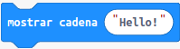
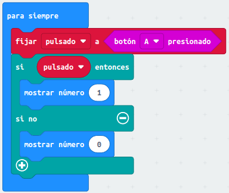
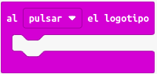
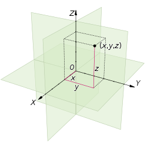

# <FONT COLOR=#8B008B>MakeCode</font>
De manera muy resumida lo que haremos en esta sección es:

* Describir los bloques y conceptos relacionados.
* Incluiremos esquemas si resultan necesarios.

Se explican los bloques utilizados de los menús de bloques. Referencia a **micro:bit reference** [The micro:bit APIs](https://makecode.microbit.org/reference).

## <FONT COLOR=#007575>**Comentarios**</font>
Todo lenguaje de programación contempla la posibilidad de realizar comentarios en el código para que sirvan de aclaración de para que sirve cada bloque en el programa, en especial en alguna parte que transcurrido un tiempo nos resulte complicada de entender.

En MakeCode la forma de hacer comentarios es siempre sobre un bloque, así que si Si necesitamos añadir un comentario a un bloque desplegamos las opciones del bloque pinchando con el botón derecho y añadimos un comentario pinchando en la entrada 'añadir comentario'. Esto hará que aparezca, en la esquina superior izquierda del bloque, un pequeño icono con forma de hoja escrita. Si pulsamos sobre este icono se despliega un pequeño editor, dimensionable y movible, donde podemos escribir nuestro comentario. En este editor hay un símbolo de papelera que elimina el comentario actual. Esta opción está disponible también en el menú contextual, lógicamente si se ha creado un comentario. En la animación siguiente vemos el funcionamiento.

<center>

  
*Comentarios*

</center>

## <FONT COLOR=#007575>**Básico**</font>
En este grupo tenemos acceso a la funcionalidad básica de la micro:bit.

* **al iniciar**. Se trata del bloque de la imagen y es un bloque que se ejecuta una sola vez cuando se inicia la micro:bit. Es uno de los dos bloques que aparecen al principio cuando escogemos *Restablecer* o creamos un nuevo proyecto desde *Mis proyectos*.

<center>

  
*Bloque 'al iniciar'*

</center>

* **para siempre**. Se trata del bloque de la imagen y es un bloque que se ejecuta de manera infinita. Es el otro de los dos bloques que aparecen al principio cuando escogemos *Restablecer* o creamos un nuevo proyecto desde *Mis proyectos*.

<center>

  
*Bloque 'para siempre'*

</center>

* **mostrar cadena**. Muestra la cadena de texto en la pantalla caracter a caracter. En la imagen la palabra es **Hello**.

<center>

  
*Bloque 'mostrar cadena'*

</center>

* **mostrar icono**. Dibuja el icono seleccionado en la pantalla.

<center>

  
*Bloque 'mostrar icono'*

</center>

* **borrar la pantalla**. Apaga todos los LEDs.

<center>

  
*Bloque 'borrar la pantalla'*

</center>

* **pausa (ms)**. Detiene la ejecución del programa el tiempo establecido en milisegundos.

<center>

  
*Bloque 'pausa (ms)'*

</center>

## <FONT COLOR=#007575>**Pantalla LED**</font>
Control de la pantalla LED.

* **ajustar brillo**. Configura el brillo de la pantalla desde 0 (apagada) a 255 (máximo brillo). Los bloques de pantalla posteriores a este tendrán el brillo establecido hasta que no se cambien el valor a otro distinto.

<center>

  
*Bloque 'ajustar brillo'*

</center>

* **graficar x,y,brillo**. Enciende el LED indicado en la coordenada x,y con el brillo especificado. La coordenadas x es la horizontal y la y es la vertical. La coordenada 0,0 es la esquina superior ezquierda, la 0,4 es la derecha, la 4,0 es la inferior izquierda y la 4,4 la inferior derecha.

<center>

  
*Bloque 'graficar x,y,brillo'*

</center>

## <FONT COLOR=#007575>**Arrays o arreglos**</font>
Se van a utilizar para agregar, eliminar y sustituir elementos en listas. En MakeCode las listas se nombran indistintamente como array, matriz o lista y tienen su propio menú de bloques que es visible cuando desplegamos 'Avanzado'. Los bloques existentes están clasificados en los siguientes grupos:

<a name="item0"></a>

[**Create**](#item1)
<br> [**Leer**](#item2)</br>
<br> [**Modificar**](#item3)</br>
<br> [**Operaciones**](#item4)</br>

Describiremos estos grupos de forma somera porque esta es suficiente para entender lo que hace el bloque. No obstante, algunos se describen de manera mas explicita.

<a name="item1"></a>

<FONT COLOR=#AA0000>Create</font>

* **fijar 'nn' a**. Le da a la variable el valor de la entrada, para valores numéricos.
* **fijar 'tt' a**. Le da a la variable el valor de la entrada, para texto.
* **matriz vacia**. Crea una lista con los elementos que introduzcamos con el '+'.

[Volver](#item0) 

<a name="item2"></a>

<FONT COLOR=#AA0000>Leer</font>

* **longitud del arreglo**. Devuelve el número de elementos de una lista.
* **obtener el valor en 'x'**. Obtiene el valor del elemento 'x'.
* **eliminar el valor en 'x'**. Elimina el elemento 'x' de la lista.
* **obtener y eliminar el último valor de (```pop```)**. Elimina y devuelve el último elemento de una matriz. Se elimina el último elemento de la matriz, por lo que la matriz se reduce en un elemento.
* **obtener y eliminar el primer valor de (```shift```)**. Elimina y devuelve el primer elemento de una matriz. Se elimina el primer elemento de la matriz, por lo que la matriz se reduce en un elemento.
* **obtener valor aleatorio**. Devuelve un valor al azar de la matriz.

[Volver](#item0)
<a name="item3"></a>

<FONT COLOR=#AA0000>Modificar</font>

* **establecer el valor en 'x' a 'nn'**. Estable el valor del elemento 'x' al valor indicado en 'nn'.
* **añadir valor 'nn' al final (```push```)**. Añade un nuevo elemento al final de una matriz.
* **eliminar el último valor de**. Elimina el último elemento de la matriz y lo devuelve.
* **eliminar el primer valor de**. Elimina el primer elemento de la matriz y lo devuelve.
* **insertar 'nn' al principio (```unshift```)**. Añadir un elemento al principio de una matriz y devolver la nueva longitud de la matriz.
* **insertar en 'x' valor 'nn' (```insertAt```)**. Inserta el valor 'nn' en la posición espeífica indicada por 'x' aumentando la longitud del array en uno. El elemento se agrega a la matriz en la posición que indiquemos. Si ya hay un elemento en esa posición, entonces él y todos los elementos posteriores se desplazan a la posición superior siguiente.
* **eliminar valor en 'x' (```removeAt```)**. Elimina el elemento que hay en la posición 'x'. El tamaño de la matriz se reduce en uno. El elemento se elimina de la matriz en la posición que indiquemos. Todos los demás elementos posteriores se desplazan hacia abajo a la posición inferior siguiente.

[Volver](#item0)
<a name="item4"></a>

<FONT COLOR=#AA0000>Operaciones</font>

* **bloque encontrar indice de (```IndexOf```)**. Devuelve la posición o índice de la primera aparición de un valor en una matriz. Devuelve un número, que es la posición en la matriz del elemento. El resultado es -1 si no se encuentra ninguna coincidencia.
* **invertir (```reverse```)**. Invertir los elementos de una matriz.

## <FONT COLOR=#007575>**Variables**</font>
Cuando vamos a utilizar bucles, estos siempre llevan asociada una variable, y por eso debemos aprender a gestionar el tema de las variables en MakeCode. Las variables tienen su propio menú y es relativamente sencillo de usar. Como ya se ha dicho, una variable es un espacio en la memoria donde el programa puede almacenar valores. El sistema nos permite asignarles un nombre simbólico como por ejemplo “temperatura”, “velocidad”, ”estado”,… para facilitar su uso.

Cuando accedemos al menú 'Variables' por primera vez y si no hemos pues ningún bloque en el área de programa, el aspecto del menú es el siguiente:

<center>

  
*Variables en MakeCode*

</center>

Veamos como funciona la creación de una variable, cambiarle el nombre, eliminarla y demás tareas que podemos hacer con ellas. En la animación siguiente vemos el proceso de crear y poner nombre a una variable. Vemos que al hacer clic en el botón se abre una ventana de diálogo donde nos pide el nombre, que tecleamos según las reglas establecidas, y que al hacer clic en 'Aceptar' se nos crean tres bloques, dos para trabajar con la variable creada y uno que es la propia variable, todos ellos con el nombre que hemos puesto a esa variable.

<center>

  
*Creación de una variable en MakeCode*

</center>

El bloque 'fijar' sirve para inicializar la variable al valor especificado, el bloque 'cambiar' es el equivalente al operador '+=' con el incremento que establezcamos en 'por' y el último bloque es el valor de la variable.

Al final de la animación también vemos que al hacer clic en la flechita de cualquiera de los bloques se despliega un menú en el que aparece la variable, la opción de crear otra nueva, renombrarla o borrar la variable que está seleccionada en ese momento. En la animación siguiente vemos estos aspectos en funcionamiento.

<center>

  
*Trabajo con el menú desplegable en una variable en MakeCode*

</center>

Cuando pasamos por el menú de bloques vemos que 'fijar' y 'cambiar' no se vuelven a crear cuando creamos nuevas variables ya que están todas en el desplegable y lo único que tenemos que hacer es seleccionarlas. Si se crea, en cambio, un bloque para el contenido de cada variable. También vemos que si eliminamos una variable que está en uso en varios sitios se elimina, preva advertencia, de todos ellos.

Ahora bien, la variables como tal se eliminan de la zona de programa pero no del menú 'Variables, donde siguen estando disponibles hasta que las eliminemos, tarea que solamente es posible hacer desde alguno de los bloques situado en la zona de programa.

## <FONT COLOR=#007575>**Bucles**</font>

<a name="item0B"></a>

[Bloque for](#item1B)
<br> [Bloque while](#item2B)</br><br>
[Bloque cada 'nn' ms](#item3B)</br><br>
[Bloques salir y continuar](#item4B)</br>

<a name="item1B"></a>
<FONT COLOR=#AA0000>Bloque for</font>
Son bloques que repiten el código asociado un número determinado de veces, Lo pueden hacer utilizando una variable como índice o estableciendo el número exacto de veces.

El aspecto del bloque para recorrer con una variable lo vemos en la imagen siguiente:

<center>

  
*Bloque for en MakeCode*

</center>

Cuando llevamos el bloque a la zona de programa se creará una variable index, salvo que esta ya exista. Un bloque como el siguiente creará un contador con la variable i desde 0 hasta 4 y mostrará los números 0 al 9 uno tras otro en la pantalla LED.

<center>

  
*Contador de 0 a 9*

</center>

Una variedad de este bloque la tenemos en el bloque 'repetir' para el número de veces que indiquemos, que tiene el aspecto que vemos en la figura siguiente.

<center>

  
*Bloque repetir nn veces*

</center>

En el ejemplo siguiente, cuando se inicia el dispositivo, se producen tres efectos de latido de un corazón.

<center>

  
*Ejemplo de uso del bloque repetir nn veces*

</center>

Otro bloque que utiliza el bucle for es el que vemos en la imagen siguiente, un bloque pensado para repetir el código para cada valor de los contenidos en una lista.

<center>

  
*Bucle for para elementos de una lista*

</center>

En la imagen siguiente vemos un programa que utiliza este bloque. Hemos creado una lista aleatoria de valores y el programa lo que hace es encontrar y mostrar el mayor de ellos. El funcionamiento del programa lo leemos asi: se crea una variable ```mayor``` para guardar el valor del elemento de la lista de mayor valor, la matriz le hemos dejado el nombre ```lista``` y para recorrerla se utiliza la variable ```valor```. El condicional (los veremos en una actividad posterior) va comprobando si ```valor > mayor``` y mientras sea cierto se guarda en ```mayor``` el ```valor``` leido y si no es cierto se continúa con el siguiente elemento de la lista. Una vez finalizado el condicional se mestra la cadena con la variable ```mayor```.

<center>

  
*Ejemplo de bucle for para elementos de una lista*

</center>

[Volver](#item0B)
<a name="item2B"></a>

<FONT COLOR=#AA0000>Bloque while</font>

Se trata de un bloque que repite su bloque de código mientras la condición sea cierta (```True```). Su aspecto lo vemos en la imagen siguiente.

<center>

  
*Bucle while*

</center>

El bucle while tiene una condición que se evalúa con un valor ```booleano```. La condición se comprueba antes de que se ejecute ningún código. Lo que significa que si la condición es falsa la primera vez que se evalúa, el código dentro del bucle no se ejecuta núnca.

Con el bloque tal cual es solamente podemos establecer la condición como ```True``` o ```False```, lo que es muy poca cosa. Es evidente que podrá tener mucha mas potencia si recurrimos a condiciones mas complejas y utilizamos los operadores. Este apartado no lo vamos a estudiar en este momento, pero si diremos que estos bloques están en el menú 'Lógica' y su funcionamiento es el mismo que en visto en [Python -> Introducción](../guias/intro.md).

Como ejemplo vamos a ver como dibujar una línea diagonal en los LEDs [(0,0) - (1,1) - (2,2) - (3,3) - (4,4) y (5,5)] de la pantalla. En la imagen vemos el programa final, donde observamos que la condición va a ser cierta hasta que index alcance el valor 4, por lo que se va a ir encendiendo cada LED a intervalos de un segundo. Esto solamente va a ocurrir cuando se inicia el disposiivo, aunque en este ejemplo concreto esto no tiene importancia.

<center>

  
*Programa bucle while*

</center>

[Volver](#item0B)
<a name="item3B"></a>

<FONT COLOR=#AA0000>Bloque cada 'nn' ms</font>
Repite el código en segundo plano de forma contnuada en el intervalo de tiempo que se indique. Establecemos la cantidad de tiempo que el bucle espera antes de que el código en su interior se ejecute de nuevo. Esto es similar a un bucle "forever" (por siempre), en el sentido de que se ejecuta continuamente, excepto que hay un intervalo de tiempo establecido para esperar antes de que el bucle se ejecute la próxima vez. El bloque es muy útil si, por ejemplo, queremos estar comprobando cada cierto tiempo si ocurre un evento, como pulsar una tecla, escuchar un sonido, etc.

En la imagen siguiente vemos el aspecto que tiene el bloque.

<center>

  
*Bloque cada 'nn' ms*

</center>

[Volver](#item0B)
<a name="item4B"></a>

<FONT COLOR=#AA0000>Bloques salir y continuar </font>
Son los bloques equivalentes a las sentencias ```break``` y ```continue``` en MicroPython y funcionan exactamente igual, es decir, el bloque 'salir' permite salir de un bucle de forma inmediata y el bloque 'continuar' sirve para saltarse la iteración actual del bucle.

Los bloques tienen el aspecto que vemos en la imagen.

<center>

  
*```break``` y ```continue```*

</center>

## <FONT COLOR=#007575>**Operadores de comparación y booleanos**</font>
Como sabemos un valor booleano solamente puede tomar uno de dos valores posibles: ```True (verdadero)``` o ```False (falso)```. Estos bloques los encontramos en la entrada 'Lógica' y son:

<center>

  
*Valores booleanos*

</center>

Los dos bloques existen de forma separada, pero cada uno de ellos puede adoptar el valor contrario al que muestra por defecto seleccionandolo con la flechita.

Los operadores booleanos u operadores lógicos son AND, OR y NOT y son operadores que a partir de valores de entrada booleanos crean otro valor también booleano. Estos bloques también los encontramos en la entrada 'Lógica' y son:

<center>

  
*Operadores booleanos*

</center>

A continuación vemos una serie de bloques con operadores que satisfacen la condición.

<center>

  
*Operadores booleanos*

</center>

Tanto los valores booleanos como los operadores se usan con instrucciones ```if``` o ```while``` para determinar qué código se ejecutará a continuación. Por ejemplo:

<center>

  
*Bucle ```while``` con una condición*

</center>

En el siguiente ejemplo se utilizan operadores booleanos en el bucle.

<center>

  
*Bucle ```while``` con una condición y operadores booleanos*

</center>

## <FONT COLOR=#007575>**Sentencia condicional ```if...elif...else```**</font>

* **```if```**. Ejecuta código dependiendo de si una condición booleana es verdadera o falsa. El código dentro del bloque ```if``` sólo se ejecuta cuando el bloque ```condición``` es verdadero.

<center>

  
*Condicional ```if```*

</center>

Se pueden comparar variables con valores o variables con variables, para una condición verdadera o falsa.

* **```else```**. Si necesitamos que se ejecute algún otro código cuando la condición del ```if``` no sea verdadera, lo ponemos en un área de bloque adicional llamada ```else``` (si no).

<center>

  
*Condicional ```if...else```*

</center>

Un condicional como el siguiente se podría leer como: "``si`` tengo dinero por encima de una cantidad, ```entonces``` estoy feliz y ```si no``` estoy triste.

<center>

  
*Condicional ```if...else```*

</center>

Cambiando el valor asignado a dinero vemos el funcionamiento.

La clausula ```else``` se añade al condicional ```if``` haciendo clic en el signo '+'.

* **```if...else if```**. Condición ```if``` que si resulta falsa se evalua una nueva condición puesta en ```elif```. Otra acción condicional es añadir un ```if``` a un ```else``` para obtener un ```else if```. Funciona así

<center>

  
*Condicional ```if...else if```*

</center>

Hacemos clic en el símbolo más '+' para añadir secciones ```else``` o ```else if``` al bloque ```if``` actual.

## <FONT COLOR=#007575>**Texto**</font>
Si expandimos el menú 'Avanzado' nos encontraremos con una entrada 'Texto' que vamos a describir en esta actividad.

*  Una letra, palabra o línea de texto que puede contener letras, números y caracteres.
*  Devuelve el número de caracteres de la cadena de texto.
*  Añade una cadena de texto a otra para crear una cadena mas larga. Se pueden añadir mas cadenas.
*  Convierte un texto que sólo tiene caracteres numéricos en un valor numérico de coma flotante. Se puede convertir una cadena de texto con caracteres numéricos en un valor real de coma flotante. El texto debe tener sólo caracteres numéricos. Aunque también puede incluir los símbolos '-' y '.'. Si el texto tiene otros caracteres, como "-5.8g5u7", sólo se devuelve -5.8 ya que es el mejor intento de conversión a un número. Por lo tanto, hay que no mezclar caracteres numéricos con letras u otros símbolos.

**Potencias de 10**. Si la cadena de texto tiene la letra 'e' después de los caracteres numéricos y luego algunos caracteres numéricos más como "2e4", entonces los caracteres numéricos después de la 'e' son un exponente de 10. Esto significa que una cadena con "7.5e2" se convierte en el valor de 750 cuando se convierte a un número de coma flotante. Esto se debe a que el 2 después de la 'e' indica 10², lo que equivale a ```10 * 10 =  100```. El valor resultante es entonces 7.5 * 100 que es igual a 750. En el siguiente ejemplo se toman los primeros dígitos de PI de la frase "pi vale 3.141592" y los convierte en un número.

<center>

  
*Extraer PI de una cadena*

</center>

[Descargar el programa](../ejemplos/microbit-PI.hex)

*  Divide una cadena en cadenas más pequeñas utilizando un caracter (una cadena) de separación para dividir la cadena más grande.
*  Determina si una cadena contiene los caracteres de una cadena especificada.
*  Obtiene la posición (índice) de la primera aparición de un valor especificado en una cadena.
*  Determina si una cadena de texto contiene caracteres o no. TODO
*  Toma una parte de la cadena "this" para hacer una cadena más pequeña (subcadena). * Si una cadena tiene una parte que está copiada de otra cadena, se llama subcadena. Se puede crear una nueva cadena que sólo contenga la palabra "aquí" a partir de una cadena mayor que diga "¡Hola, estamos aquí!". Para ello, la subcadena se copia desde la posición de carácter 15 en la primera cadena y se copian 4 caracteres. Se hace así: . En el ejemplo se copian los sustantivos de la frase en dos cadenas más pequeñas.

<center>

  
*Extraer de cadena a subcadenas*

</center>

[Descargar el programa](../ejemplos/microbit-subcadenas_de_cadena.hex)

*  Se comparan dos cadenas de texto en función de los caracteres que aparecen en primer lugar. Dos cadenas se comparan en función del orden de sus caracteres. Si la cadena "A" vale "111" será menor que una cadena con "512". Una cadena con "Everything (Todo)" es menor que "Nothing (Nada)" porque la 'N' viene después de la 'E' en el alfabeto. La cadena "abcdefg" es mayor que "abcdefa". Son casi iguales, pero la última letra de la segunda cadena es menor que la última letra de la primera. Esto hace que toda la segunda cadena se compare como menor. En bloques, la comparación de estas cadenas tiene el siguiente aspecto:

<center>

  
*Comparar cadenas*

</center>

*  Obtiene un carácter (letra, número o símbolo) de un lugar de la cadena de texto. Podemos averiguar qué carácter se encuentra en cualquier lugar de un texto. Puedes tener un texto que diga "Hello there!". El carácter en la posición 6 es 't'. La palabra "Hello" más el espacio tienen las posiciones 0 - 5, así que, 't' está en la posición 6. Para obtener el carácter en esta posición, la letra 't', se podría usar un bloque como este:

<center>

  
*Extraer caracter de una cadena*

</center>

*  Convierte el valor de cualquier tipo de dato a una cadena de texto. El siguiente ejemplo convierte un valor booleano y un valor numérico en cadenas y las une en una cadena o frase.

<center>

  
*Convertir valores booleanos y numéricos en cadena*

</center>

[Descargar el programa](../ejemplos/microbit-convertir_a_cadena.hex)

*  Hacer que una cadena de un caracter sea representada a partir del código numérico que le asignemos. Al igual que el código ASCII es un juego de caracteres que asigna un valor a cada uno de ellos, nosotros podemos crear nuestro propio código asignándole un código con este bloque. Por ejemplo, hacer que la letra B sea: 

## <FONT COLOR=#007575>**Bloques de 'Entrada' para los botones**</font>
Cuando presionamos los botones A y/o B ocurre un evento (se ha presionado un botón). Este tipo de acción se considera una entrada a la microbit y tenemos bloques para manejarlo.

* **al presionar el botón**

Presionar un botón inicia un manejador de eventos, que es una parte del programa que se ejecutará cuando ocurra algo, como por ejemplo,  cuando se pulsa un botón. Este manejador funciona cuando se pulsa el botón A o B, o A y B al mismo tiempo.Cuando estemos utilizando esta función en un navegador, pulsaremos los botones de la pantalla en lugar de los del micro:bit.

* Para el botón **A** o **B**: Este manejador de evento funciona cuando el botón se pulsa y se suelta en menos de un segundo.
* Para **A** y **B** juntos: Este manejador funciona cuando A y B son presionados simultanemente. Disponemos de un segundo y medio desde que pulsamos el primer botón hasta que pulsamos el segúndo para que se consideren ambos pulsados a la vez.

<center>

  
*Bloque 'Al presionar el botón...'*

</center>

En el siguiente ejemplo se cuenta cuántas veces se pulsa el botón A. Cada vez que se pulsa el botón, la pantalla LED muestra la variable de recuento que cada vez será mayor.

<center>


*Contar pulsaciones de A*

</center>

[Descargar el programa](../ejemplos/microbit-cuenta_puls_A.hex)

En el ejemplo siguiente se simula un dado mostrando un número del 1 al 6 cuando pulsamos el botón B. En el programa se utiliza el bloque de generación de número aleatorios entre dos valores dados que podemos encontrar en el menú 'Matemáticas'.

<center>


*Dado*

</center>

[Descargar el programa](../ejemplos/microbit-dado_B.hex)

* **botón A o B presionado**

El bloque siguiente comprueba si se está pulsando un botón en ese momento.

<center>


*Se ha presionado el botón*

</center>

Un sencillo ejemplo nos aclara como funciona el bloque.

<center>



*Botón A presionado*

</center>

[Descargar el programa](../ejemplos/microbit-pulsado_A.hex)

* **al pulsar el logotipo <font color=#FF0000> (solo en versiones V2)</font color>**

El logo de **micro:bit V2** actúa como un botón táctil, por lo que es un actuador de entrada que cuando lo pulsamos (tocamos) se ejecuta su código y cuando lo soltamos (no lo tocamos) deja de hacerlo.

<center>



*Botón táctil*

</center>

El bloque funciona solamente con micro:bit V2 y si lo usamos con una placa V1 nos generará el código de error **927** en la pantalla.

* **el logotipo está pulsado <font color=#FF0000> (solo en versiones V2)</font color>**

Comprueba si se está pulsando el logotipo de micro:bit. Utilizamos el valor booleano del estado de la pulsación del logo para tomar una decisión lógica en el programa.

El ejemplo muestra una u otra imagen en función de si se ha pulsado el logo o no.

<center>


*Logo presionado*

</center>

[Descargar el programa](../ejemplos/microbit-pulsado_logo.hex)

## <FONT COLOR=#007575>**Pines**</font>
MakeCode dispone de bloques para controlar la corriente en los pines tanto para señales analógicas como digitales, servos, dispositivos i2c,...

* . Lee el valor de una señal digital (0 o 1) desde el pin de la placa micro:bit. Los pines disponibles para el bloque son:

<center>


*Pines para lectura digital*

</center>

* . Escribe el valor de una señal digital (0 o 1) en un pin de la placa micro:bit. Los pines disponibles para escritura digital son los mismos que para lectura digital.
* . Lee una señal analógica (0 a 1023) desde el pin indicado. Los pines disponibles son:

<center>


*Pines para escritura digital*

</center>

* . Escribe una señal analógica (0 a 1023) en el pin indicado. Los pines disponibles son los indicados para la lectura analógica.
* . Configura el periodo de la modulación por anchura de pulso o PWM de la salida analógica en microsegundos. Antes de llamar a esta función debemos configurar el pin indicado como analógico. Tenemos los mismo pines disponibles que para la lectura y escritura.
* El bloque siguiente es un bloque de lo que se conoce como mapeo. El mapeo consiste en reasignar un valor especificado dentro de un rango a otro rango diferente. Es com si hacemos un cambio de escala de los valores. La función no limita los valores de los rangos, porque los valores fuera de rango a veces están previstos y son útiles. Si necesitamos limitar un rango, podemos utilizar la función 'restringir' de 'Matemáticas'.

<center>


</center>

Por ejemplo, el programa siguiente cambia los valores analógicos recibidos en el pin P0 de absolutos a porcentaje.

<center>


*Mapeo de valores*

</center>

* El bloque siguiente configura el pin indicado como una entrada digital y genera un evento cuando el pin es tocado, tanto alto como bajo. Este bloque no se puede simular y requiere hardware real para probarlo.

<center>


</center>

A continuación vemos los pines que se pueden configurar en el bloque.

<center>


*Pines para el bloque cuando el pin nn es pulsado*

</center>

* . Obtiene la duración del pulso en microsegundos.
* . Devuelve la duración de un pulso en microsegundos.
* . Configura el pull del pin indicado. Hay muchos pines que se pueden configurar con pull-up. Por ejemplo, podemos establecer el valor de tensión de un pin a 3.3V o un "1" lógico.
* . Emite una señal PWM al pin actual.
* . Establece el pin que se utiliza para un tono musical analógico.

## <FONT COLOR=#007575>**Programar Neopixels**</font>
Los diodos LED RGB WS2812, o NeoPixel en el lenguaje de Adafruit, integran en un solo chip los diodos LEDs rojo, verde y azul junto con un chip controlador en un único encapsulado y son controlados a través de un único cable. Pueden utilizarse individualmente, encadenados en cadenas más largas o ensamblados en otros formatos.

Existen multitud de formatos basados en Neopixels, algunos son: cosibles (weareables en genral), tiras, matrices, anillos, joyas, etc.

<a name="item0Neo"></a>

[Añadir extensión NeoPixel](#item1Neo)
<br> [Programar Neopixels](#item2Neo)</br><br>
[Arcoiris](#item3Neo)</br><br>
[Rotar LEDs](#item4Neo)</br><br>
[Encender específico o aleatorio](#item5Neo)</br><br>
[Trazar diagrama de barras](#item6Neo)</br><br>
[Dentro de un rango](#item7Neo)</br><br>
[Cambio sentido desplazamiento por posición](#item8Neo)</br>
<br>
[Personalizar colores RGB](#item9Neo)</br>

<a name="item1Neo"></a>
<FONT COLOR=#AA0000>Añadir extensión NeoPixel</font>

Estando situados en https://makecode.microbit.org/ hacemos clic en Extensiones y se nos mostrará en el navegador un listado de extensiones recomendadas con una barra de búsqueda y otras opciones para ver extensiones por temas. En cada una de ellas nos encontraremos con un enlace 'Learn More' para aprender mas sobre la extensión y acceder a ejemplos que la utilizan.

<center>

  
*Extensiones para MakeCode*

</center>

Si aparece en la pantalla (es mi caso) simplemente hacemos clic sobre la extensión y si no la escribimos en la barra de búsqueda y una vez localizada hacemos clic sobre la misma.

Ahora deberíamos tener un nuevo conjunto de bloques NeoPixel en la caja de herramientas de MakeCode. Estos bloques se guardan con el proyecto actual, pero hay que añadirlos de nuevo para otros proyectos.

<center>

  
*Extensión Neopixels añadida*

</center>

Ya estamos listos para comenzar a programar con los bloques de la extensión.

[Volver](#item0Neo)
<a name="item2Neo"></a>

<FONT COLOR=#AA0000>Programar Neopixels</font>

Una vez instalada la extensión NeoPixel, podemos empezar a programar con los bloques específicamente diseñados para controlar los LEDs. Lo primero que hay que hacer es informar a MakeCode sobre el NeoPixel conectado. Esto es lo que se conoce como inicializar o configurar el entorno de programación y hay muchos componentes que lo requieren, los Neopixel son uno de ellos. Esta configuración hay que hacerla en un bloque 'al iniciar'. Hay que indicar:

* Número de LEDs.
* El pin al que tenemos conectados los NeoPixels.
* Salvo que estemos usando LEDs blancos el formato será RGB.

El bloque de configuración inicial es:

<center>

  
*Bloque de configuración inicial*

</center>

Con este bloque configurado, MakeCode inicializará el dispositivo NeoPixel cada vez que se ejecute el programa. Si conectamos más de un NeoPixel, MakeCode generará automáticamente bloques de conjuntos como el anterior, y los nombrará strip2, strip3, etc... Lógicamente podemos renombrar las tiras como queramos.

Vamos a describir brevemente unos bloques mínimos para comenzar a trabajar.

* . Establece el color indicado para la tira seleccionada. Por defecto el bloque está configurado con otro bloque que permite escoger entre una gama básica de colores.

<center>

  
*Colores básicos en el bloque 'color'*

</center>

* . Bloque color con la gama básica de colores para seleccionar.
* . Bloque para configurar el color en formato [HLS](../conceptos/avanzados.md).
* . Establecer la luminosidad de los LEDs.
* . Mostrar la información programada en los Neopixels conectados.

Veamos un primer ejemplo sencillo que nos aclare estos conceptos. Se trata de configuar y poner un anillo de 8 LEDs en diferentes colores a intervalos de 1s. El anillo se alimenta a 5V por lo que escogemos el esquema de montaje de baja potencia y dispositivo con alimentación a 5V.

<center>

  
*Conexionado para dispositivo 5V y bajo consumo*

</center>

El programa puede ser similar al siguiente:

<center>

  
*Ejemplo básico con cambio entre varios colores*

</center>

Podemos observar como directamente el simulador se ha configurado y conectado según la definición realizada. Se conecta a una tira de 8 LEDs simulados. En la animación observamos al simulador en funcionamiento según el programa anterior. Observamos que el color negro se representa en gris a efectos de la simulación, en la realidad corresponde a todos los LEDs apagados.

[Descargar el programa](../ejemplos/microbit-ej_camb_var_colores.hex)

<center>

  
*Funcionamiento del ejemplo básico con cambio entre varios colores*

</center>

En el programa se observa el bloque de configuración de la luminosidad como se establece al principio. Se insta al lector a realizar modificaciones del parámetro para ver su efecto en un circuito real.

Vamos a ver otro ejemplo en el que vamos a ir cambiando los colores según el formato HSL, en concreto vamos a recorrer la rueda de colores según el matiz para una saturación del 100% y una luminosidad del 50%. El programa es el siguiente.

[Descargar el programa](../ejemplos/microbit-ej_rueda_S100_L50.hex)

<center>

  
*Ejemplo básico con cambio entre varios colores*

</center>

[Volver](#item0Neo)
<a name="item3Neo"></a>

<FONT COLOR=#AA0000>Arcoiris</font>

* . Muestra los 7 colores del arcoiris recorriendo la rueda de color entre 1 y 360. Si cambiamos el rango restringimos la gama de colores.
* . Desplaza LEDs que se muestran en la cantidad indicada. Si la cantidad se hace negativa el desplazamiento se realiza en sentido contrario.

Veamos un ejemplo en el que se muestran los colores del arcoiris y desaparece uno de ellos cada segundo.

[Descargar el programa](../ejemplos/microbit-arco_1.hex)

El programa es:

<center>

  
*Arcoiris básico*

</center>

Se recomienda probar con el desplazamiento negativo y con valores diferentes de la unidad.

[Volver](#item0Neo)
<a name="item4Neo"></a>

<FONT COLOR=#AA0000>Rotar LEDs</font>

* . Va rotando la posición de los LED en la cantidad especificada manteniendo todos los LEDs encendidos.

En el ejemplo anterior vamos a cambiar el bloque desplazar por el de rotar y observar lo que ocurre. Se produce un desplazamiento de los colores de los LEDs según la cantidad indicada. Si esta cantidad se hace negativa el desplazamiento se realiza en sentido contrario.

Muy útil para programar efectos de colores repetitivos.

El programa ahora es:

<center>

  
*Arcoiris rotando*

</center>

[Volver](#item0Neo)
<a name="item5Neo"></a>

<FONT COLOR=#AA0000>Encender específico o aleatorio</font>

* . Este bloque permite especificar el color de un píxel concreto.

Un programa como el siguiente parte de todos los LEDs apagados y los va encendiendo de color amarillo uno a uno con un retardo de medio segundo hasta encender los 8 LEDs.

<center>

  
*Encender específico*

</center>

Vamos a modificar el programa anterior para que cada vez que pulsamos el botón A se encienda un LED aleatorio de un determinado color. El programa es el siguiente:

<center>

  
*Encender aleatorio*

</center>

[Volver](#item0Neo)
<a name="item6Neo"></a>

<FONT COLOR=#AA0000>Trazar diagrama de barras</font>

* . El funcionamiento del bloque es básicamente como el de un vúmetro de sonido escribiendo en los LEDs el valor especificado en el rango.
* . Averigua cuál es el nivel de sonido que escucha el micrófono. Este bloque requiere de una **micro:bit V2**. Si se utiliza con una placa micro:bit v1, aparecerá el código de error 927 en la pantalla.

Un programa como el siguiente registra la lectura del nivel de sonido y en función del valor enciende un número mayor o menor de LEDs.

<center>

  
*Nivel de sonido con trazar diagrama de barras*

</center>

[Volver](#item0Neo)
<a name="item7Neo"></a>

<FONT COLOR=#AA0000>Dentro de un rango</font>

* . Permite establecer como valor de una variable un rango de LEDs de la tira. El objetivo es poder cambiar todo el rango a la vez.

Vamos a crear un programa con dos variables de rango, en una ponemos una configuración de rango de LEDs y en la otra su complementario, es decir, el resto de LEDs. Ahora establecemos un color diferente para ambos rangos cuando pulsamos el botón A y mostramos el resultado. Para el botón B simplemente cambiamos los colores de cada rango. El efecto final es que un grupo de LEDs se encienden de un color y el otro grupo de otro color y al pulsar los botones esos grupos van alternandose.

[Descargar el programa](../ejemplos/microbit-rangos.hex)

El programa es:

<center>

  
*Dentrro de un rango*

</center>

[Volver](#item0Neo)
<a name="item8Neo"></a>

<FONT COLOR=#AA0000>Cambio sentido desplazamiento por posición</font>

* . Obtiene el valor de la aceleración (miligramos-fuerza) en una de las tres dimensiones, o la fuerza combinada en todas las direcciones (x, y, y z). Es capaz de encontrar la aceleración del micro:bit, es decir los rápido que se está acelerando o ralentizando.

La aceleración se mide con el miligramos-g, que equivale a la milésima parte de la aceleración de la gravedad "g". Un "g" es la aceleración que produce la gravedad terrestre.

El bloque permite seleccionar entre los siguientes parámetros:

* **x**: aceleración en dirección izquierda y derecha.
* **y**: aceleración hacia delante y hacia atrás.
* **z**: aceleración hacia arriba y hacia abajo.
* **fuerza**: la fuerza resultante de la aceleración de las tres dimensiones (direcciones).

**Repasemos un poco las fuerzas en el espacio**

Todas las fuerzas que nos afectan se se producen en un espacio tridimensional. Si el movimiento de un objeto no es exactamente en la dirección de un eje, necesitamos una forma de calcular su aceleración a partir de los valores medidos para todos los ejes.

Se pueden realizar cálculos de estas fuerzas en el [Espacio euclídeo](https://es.wikipedia.org/wiki/Espacio_eucl%C3%ADdeo) (también llamado espacio euclidiano) que es un tipo de espacio geométrico donde se satisfacen los axiomas de Euclides de la geometría. En el gráfico vemos como se sitúa un punto en un espacio euclídeo de tres dimensiones.

<center>

  
*Punto en espacio euclídeo 3D*

</center>

Si ponemos la micro:bit en una mesa nivelada y la empujamos diagonalmente, obtendremos una aceleración en dos dimensiones. Se puede calcular la aceleración en esa dirección igual que se calcula la hipotenusa en un triángulo rectángulo, es decir:

<center>
$F_{2D} = \sqrt{a_{x}^{2}+a_{y}^{2}}$
</center>

Si se levanta la micro:bit de la mesa se añade otra dimensión, la Z, de manera que hay que inserta el valor de aceleración para el eje Z en la ecuación:

<center>
$F_{3D} = \sqrt{a_{x}^{2}+a_{y}^{2}+a_{z}^{2}}$
</center>

Este cálculo se denomina norma euclidiana de aceleración.

En el siguiente programa, utilizamos el valor de aceleración (que se encuentra en las herramientas de entrada) para desplazar los píxeles en una dirección o en la contraria cuando la micro:bit se inclina hacia la izquierda o hacia la derecha.

[Descargar el programa](../ejemplos/microbit-acelera_xy.hex)

<center>

  
*Control sentido rotación con la aceleración xy*

</center>

El simulador es capaz de responder a los movimientos de inclinación moviendo el ratón sobre la micro:bit a un lado y al otro.

[Volver](#item0Neo)
<a name="item9Neo"></a>

<FONT COLOR=#AA0000>Personalizar colores RGB</font>

* . Permite establecer los valores RGB para obtener un color determinado.

En el programa siguiente vemos un ejemplo de aplicación de este bloque.

<center>

  
*Control sentido rotación con la aceleración xy*

</center>

[Descargar el programa](../ejemplos/microbit-B_RGB.hex)

## <FONT COLOR=#007575>**Bloques de Música**</font>
Los bloques que vamos a describir a continuación requieren de una micro:bit V2. Si se utilizan con una placa micro:bit V1, se generará el **código de error 927** en la pantalla.

Es posible cambiar el pin de salida utilizando en "Inicializar" el bloque 

* . El bloque permite componer, a partir de las notas básicas y el tempo establecido, melodias sencillas o bien seleccionar las de la galería.
* . Reproduce un tono en el pin0 durante el tiempo indicado. La frecuencia del tono se establece como un número de ciclos por segundo y la duración del tono se establece como un número de milisegundos. Es habitual utilizar una fracción de tiempo para la duración del tono.
* . Reproduce el tono indicado, que se puede seleccionar con el teclado que aparece al pulsar sobre el nombre del tono. Durante el cambio podemos ver un número que es justo el tiempo en milisegundo que dura la nota.
* . Silencio durante el tiempo especificado.
* . Establecde el volumen de salida predeterminado entre 0 y 255.
* . Devuelve el nivel de volumen actual del sintetizador.
* . Detiene la reproducción del sonido actual y de cualquier otro en espera de reproducirse. 
* . Cambia en tempo en la cantidad indicada. Los valores negativos hacen la melodia mas lenta. El número bmp (beats per minute) indica el número de pulsos en un minuto.
* . Establece el tempo a la cantidad indicada. 
* . Devuelve la duración de un pulso en milisegundos.
* . Devuelve el tempo en pbm
* . Reproduce una expresión sonora, que es un conjunto preformateado de tonos que crean un sonido determinado. Hay varios sonidos para elegir.
* . Detiene la melodia musical. Las melodías se reproducen en primer (foreground) o segundo (background) plano. Esto permite que haya más de una melodía activa a la vez. Si una melodía está configurada para reproducirse en segundo plano, puede interrumpirse o pausarse temporalmente mientras se reproduce una melodía configurada en primer plano. Si la melodía en primer plano no está configurada para reproducirse siempre (loop), la melodía en segundo plano se reanudará cuando finalice la melodía en primer plano.
* . Genera eventos para melodías o eventos musicales.
* . Reproduce una expresión de sonido.
* . Es un generador de señales de diferentes formas. Hay muchos ajustes diferentes y se puede reproducir la configuración concreta antes de cerrar la ventana. En la animación vemos brevemente como funciona y a continuación se indican los parámetros que describen al sonido.

<center>


</center>

Los parámetros especifican una forma de onda base, el rango de frecuencia, el volumen del sonido y los efectos. Los datos de sonido se crean como un objeto Sonido y pueden reproducirse en el altavoz, los auriculares o en una clavija de salida.

* **waveShape**: forma primaria de la onda:
    - sinusoidal: forma de onda sinusoidal
    - diente de sierra: forma de onda diente de sierra
    - triángulo: forma de onda triangular
    - square: forma de onda cuadrada
    - ruido: forma de onda generada por ruido aleatorio

* **startFrequency**: un número que es la frecuencia de la forma de onda cuando comienza la expresión sonora.
* **endFrequency**: un número que es la frecuencia de la forma de onda cuando la expresión sonora se detiene.
* **startVolume**: un número que es el volumen inicial de la expresión sonora.
* **endVolume**: un número el volumen final de la expresión sonora.
* **duration**: un número la duración en milisegundos de la expresión sonora.
* **effect**: un efecto para añadir a la forma de onda. Estos efectos son:

    - trémolo: añade ligeros cambios de volumen a la expresión sonora.
    - vibrato: añade ligeros cambios de frecuencia a la expresión sonora.
    - warble: similar al vibrato pero con variaciones más rápidas en los cambios de frecuencia.

* **interpolation**: controla la tasa de cambio de frecuencia en la expresión sonora.

    - linear: el cambio de frecuencia es constante durante toda la duración del sonido.
    - curve: el cambio de frecuencia es más rápido al principio del sonido y se ralentiza hacia el final.
    - logarithmic: el cambio de frecuencia es rápido durante la primera parte del sonido.

* . Crea una cadena que es una expresión sonora.
* . Obtiene el nivel de volumen actual del sintetizador de sonido.
* . Activa/desactiva el altavoz de la micro:bit para reproducir música y sonidos.

## <FONT COLOR=#007575>**Serial**</font>
Su descripción básica y detallada las podemos encontrar en la entrada [Serial](https://makecode.microbit.org/reference/serial) de la documentación de MakeCode, donde además se desarrollan ejemplos de uso.

* Ejemplo de escribir un número como gráfico de barras con nivel de iluminación. Utilizamos el bloque "plot bar graph" del menú LED. El ejemplo sería:

<center>

  
*Gráfico de barras con nivel de iluminación*

</center>

El ejemplo nos va a permitir visualizar datos tanto en el simulador como en la placa utilizando los LEDs de la pantalla para dibujar un gráfico de barras en función del nivel de iluminación que reciben ellos mismos. Pero además nos permite ver el funcionamiento en el simulador e incluso en PuTTY.

<center>

  
*Gráfico de barras con nivel de iluminación*

</center>

* Ejemplo de visualización de varios datos, como la temperatura y el nivel de iluminación. El programa de ejemplo sería:

<center>

  
*Temperatura y nivel de iluminación*

</center>

En la gráfica siguiente vemos graficados y en modo texto los datos simulados y la descripción de los tres iconos destacados. El icono de exportación nos guarda una copia de los datos en formato CSV y el icono raw nos los guarda en formato txt.

<center>

  
*Temperatura y nivel de iluminación*

</center>
