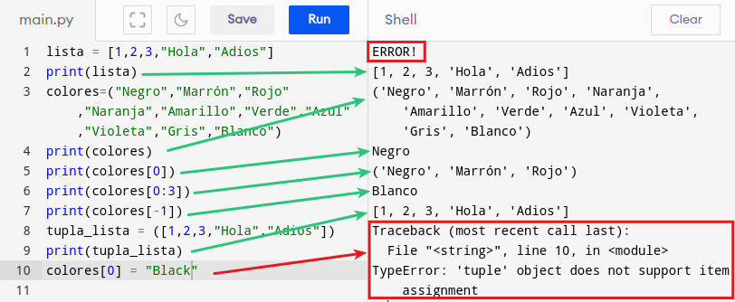
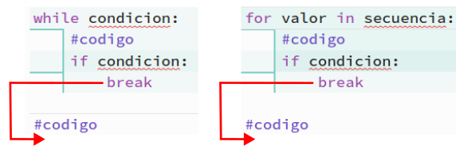
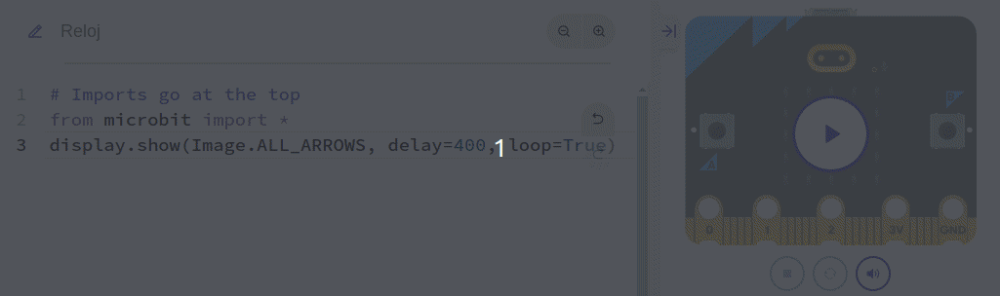
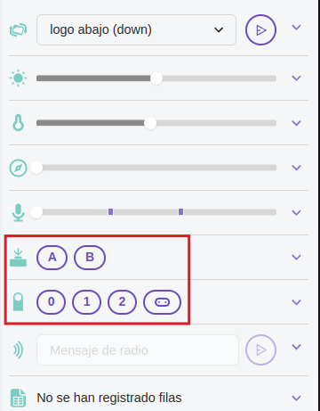

# <FONT COLOR=#8B008B>Python</font>
De manera muy resumida lo que haremos en esta sección es:

* Introducir los conceptos de programación para programar la micro:bit desde BBC micro:bit MicroPython.
* También introduciremos conceptos de micro:bit Micropython API.

## <FONT COLOR=#007575>**API: El módulo microbit**</font>
Todo lo necesario para interactuar con el hardware de la micro:bit está en el módulo *microbit* y se recomienda su uso escribiendo al principio del programa:

<center>
~~~python
from microbit import *
~~~
</center>

Las funciones disponibles directamente son:

~~~python
sleep(ms) #1
running_time() #2
temperature() #3
scale(valor_a_convertir, from_=(min, max), to=(min, max)) #4
panic(error_code) #5
reset() #6
set_volume(valor) #7 (V2)
'''
1 Esperar el número de milisegundos indicado
2 Devuelve el tiempo en ms desde la última vez que se encendió la micro:bit
3 Devuelve la temperatura en Celcius
4 Convierte un número de una escala de valores a otra
5 La micro:bit entra en modo pánico por falta de memoria y se dibuja una
cara triste en la pantalla. El valor de error_code puede ser cualquier entero.
6 Resetea la micro:bit
7 Estable el volumen de salida con un *valor* entre 0 y 255
'''
~~~

## <FONT COLOR=#007575>API: *Display*</font>
Control de la matriz de 5x5 LEDs que en micro:bit se conoce como pantalla. Los métodos de la clase son:

~~~python
display.get_pixel(x, y) #1
display.set_pixel(x, y, val) #2
display.clear() #3
display.show(image, delay=0, wait=True, loop=False, clear=False) #4
display.scroll(string, delay=400) #5
'''
1 Obtiene el brillo [0 (apagado) a 9 (máx))] del pixel (x,y)
2 Establece el brillo [0 (apagado) a 9 (máx))] del pixel (x,y)
3 Borra (apaga) la pantalla
4 Muestra la imagen
5 Desplaza una cadena por la pantalla a la velocidad en ms del *delay*
'''
~~~

En ambos casos de la API existen otras muchas opciones no incluidas. La funcionalidad de autocompletar nos ayudará para no tener que recordar la sintaxis y conocer las que no aparece aquí. En la animación siguiente vemos un ejemplo de ambos casos.

<center>

  
*Autocompletar funciones y métodos*

</center>

## <FONT COLOR=#007575>**Estructuras de datos en Python**</font>

### <FONT COLOR=#AA0000>**Las listas (list)**</font>
Se trata de un tipo de dato que permite almacenar series de datos de cualquier tipo bajo su estructura. Se suelen asociar a las matrices o arrays de otros lenguajes de programación.

En Python las listas son muy versatiles permitiendo almacenar un conjunto arbitrario de datos. Es decir, podemos guardar en ellas lo que sea.

Una lista se crea con ```[]``` y sus elementos se separan por comas. Una gran ventaja es que pueden tener datos de diferentes tipos.

~~~python
lista = [1, "Hola", 3.141592, [1 , 2, 3], Image.HAPPY]
~~~

Las de principales propiedades de las listas:

* Son ordenadas, mantienen el orden en el que han sido definidas
* Pueden ser formadas por tipos arbitrarios de datos
* Pueden ser indexadas con [i]
* Se pueden anidar, es decir, meter una lista dentro de otra
* Son mutables, ya que sus elementos pueden ser modificados
* Son dinámicas, ya que se pueden añadir o eliminar elementos

Hay dos métodos aplicables:

* **```append```**. Permite agregar elementos a la lista.
* **```remove```**. Elimina elementos de la lista.
* **```insert(pos,elem)```**. Inserta el elemento ```elem``` en la posición ```pos``` indicada.

En el ejemplo vemos el funcionamiento.

<center>

  
*Ejemplo de listas y sus métodos*

</center>

Con estos conocimientos tendremos suficiente para hacer lo que pretendemos, que no es otra cosa que animar imágenes.

### <FONT COLOR=#AA0000>**Las tuplas (tuple)**</font>
Son muy similares a las listas con una diferencia principal con las mismas y es que las tuplas no pueden ser modificadas directamente, lo que implica que no dispone de los métodos vistos para listas. Una tupla permite tener agrupados un número inmutable de elementos.

Una tupla se crea con ```()``` y sus elementos se separan por comas.

~~~python
tupla = (1, 2, 3)
~~~

Principales propiedades:

* Se pueden declarar sin usar los paréntesis, pero no se recomienda. No usarlos puede llevarnos a ambigüedades del tipo print(1, 2, 3) y print((1, 2, 3)).
* Si la tupla tiene un solo elemento esta debe finalizar con coma.
* Se pueden anidar tuplas, por ejemplo ```tupla2 = tupla1, 4, 5, 6, 7```.
* Se pueden declarar tuplas vacias, por ejemplo ```tupla3 = ()```.
* Las tuplas son *iterables* por lo que sus elementos pueden ser accesados mediante la notación de índice del elemento entre corchetes. Si se quiere acceder a un rango de indices se separan por ":" ambos índices.
* Es posible convertir listas en tuplas simplemente poniendo la lista dentro de los paréntesis de la tupla, por ejemplo, ```tupla_lista = ([1, "Hola", 3.141592, [1 , 2, 3], Image.HAPPY])```

A continuación vemos un ejemplo.

<center>

  
*Ejemplo de tuplas*

</center>

### <FONT COLOR=#AA0000>**Diccionarios (dict)**</font>
Estas estructuras contienen la colección de elementos con la forma ```clave:valor``` separados por comas y encerrados entre ```{}```. Las claves son objetos inmutables y los valores pueden ser de cualquier tipo. Sus principales características son:

* En lugar de por índice como en listas y tuplas, en diccionarios se acceder al valor por su clave.
* Permiten eliminar cualquier entrada.
* Al igual que las listas, el diccionario permite modificar los valores.
* El método ```dicc.get()``` accede a un valor por la clave del mismo.
* El método ```dicc.items()``` devuelve una lista de tuplas ```clave:valor```.
* El método ```dicc.keys()``` devuelve una lista de las claves.
* El método ```dicc.values()``` devuelve una lista de los valores.
* El método ```dicc.update()``` añade elemento ```clave:valor``` al diccionario.
* El método ```del dicc``` borra el par ```clave:valor```.
* El método ```dicc.pop()``` borra el par ```clave:valor```.

A continuación vemos un ejemplo.

<center>

  
*Ejemplo de diccionario*

</center>

## <FONT COLOR=#007575>**Bucles**</font>
Los **Bucles** son un tipo de estructura de control muy útil cuando queremos repetir un bloque de código varias veces. En Python existen dos tipos de bloques, el bucle ***for*** para contar la cantidad de veces que se ejecuta un bloque de código, y el bucle ***while*** que realiza la acción hasta que la condición especificada no sea cierta.

<a name="item0"></a>

[While](#item1)
<br> [for](#item2)</br><br>
[Bucle for decontando](#item3)</br><br>
[Sentencias break y continue](#item4)</br>

<a name="item2B"></a>
<FONT COLOR=#AA0000>While</font>
La sintaxis de while es la siguiente:

~~~python
while condicion:
    bloque de codigo
~~~

donde "condicion", que se evalúa en cada iteración, puede ser cualquier expresión realizado con operadores condicionales que devuelva como resultado un valor True o False. Mientra que "bloque de codigo" es el conjunto de instrucciones que se estarán ejecutando mientras la condición sea verdadera (True o '1'). Es lo mismo poner ```while true:``` que poner ```while 1:```.

Para recorrer los bucles se utilizan variables que forman parte de la condición, estableciendose en esta lo que deben cumplir.

Un ejemplo sencillo podría ser el siguiente, controlar el riego de una planta en función del valor de la humedad de la tierra en la que está.

~~~py
from microbit import *

while (humedad() < 45):
    display.scroll(Image.SAD)
    sleep(1000)

display.show(Image.HAPPY)
~~~

que hará que si la humedad baja por debajo de 45 se muestre una carita triste indicando que hay que regar y si es mayor mostrará una carita feliz. Evidentemente hay que resolver el tema de como obtener la humedad, pero esa es una historia que veremos mas adelante.

El bucle ```while``` puede tener de manera opcional un bloque ```else``` cuyas sentencias se ejecutan cuando se han realizado todas las iteraciones del bucle. Un ejemplo lo vemos a continuación:

~~~py
cuenta = 0
while cuenta < 5:
    print("Iteración del bucle")
    cuenta = cuenta + 1
else:
    print("bucle finalizado")
~~~

[Volver](#item0)
<a name="item2"></a>

<FONT COLOR=#AA0000>for</font>

Son también bucles pero su acción está dirigida a contar el número de veces que ocurre algo o realizar una acción un determinado número de veces. Es especialmente útil para recorrer los datos de una lista, tupla o diccionario.

La sintaxis de este tipo de bucles en Python es:

~~~py
for variable in secuencia:
    declaracion
~~~

Siendo "variable" la variable que se va a recorrer en el bucle de forma que cuando se alcance el valor establecido se sale del bucle.

La variable puede ser una cadena, un rango de valores que se expresa con ```range(n)```, siendo n el número de valores del rango que se inicia en 0 y que pueden ser iterados con una variable. Mas ampliamente, la sintaxis de ```range()``` es ```range(start, stop, step)``` siendo ```start``` y ```stop``` opcionales.

Veamos un primer ejemplo en el que vamos a utilizar un bucle para encender uno a uno por filas los LEDs de la primera y última columna.

~~~py
from microbit import *
for var in range(5): # var puede tomar 5 valores, del 0 al 4
    display.set_pixel(0, var, 9) # Se ilumina el LED de la fila 0 y el valor de var para columna
    sleep(300)
    display.set_pixel(4, var, 9) # Se ilumina el LED de la fila 4 y el valor de var para columna
    sleep(300)
~~~

Los bucles se pueden anidar, es decir se puede crear un bucle dentro de otro del mismo o diferente tipo, de forma que por cada iteración del bucle mas externo se tienen que producir todas las iteraciones del bucle mas interno. Veamos como ejemplo el de encender todos los LEDs de uno en uno, de izquierda a derecha, utilizando el valor de sus coordenadas x,y. El programa sería:

~~~py
from microbit import *

display.clear()
for y in range(0, 5): # Valor de columna
    for x in range(0, 5): # Valor de fila
        display.set_pixel(x, y, 9) # Encender LED x,y
        sleep(100)
~~~

En la animación siguiente vemos el programa en funcionamiento.

<center>

  
*Uso de bucle for*

</center>

El bucle ```for``` puede tener de manera opcional un bloque ```else``` cuyas sentencias se ejecutan cuando se han realizado todas las iteraciones del bucle. Un ejemplo lo vemos a continuación:

~~~py
for var in range(5):
    print(var)
else:
    print("bucle finalizado")
~~~

[Volver](#item0)
<a name="item3"></a>

<FONT COLOR=#AA0000>Bucle for decontando</font>

Se trata del mismo bucle ```for``` pero ahora la cuenta la realizamos hacia atrás. Hay dos formas sencillas de hacerlo:

* Utilizando la función ```range()```. Si queremos darle un enfoque Pythonic simplemente configuramos los argumentos de la función de manera que se indique el principio, el final y el incremento, que será logicamente negativo.

~~~py
for i in range(20, 0, -2): #imprimere 20, 18, 16, ... 0
~~~

* Utilizando la función ```reversed()```. Es una función incorporada en la que hay que indicar como primer argumento el final de la cuenta, como segundo el principio, teniendo en cuenta que se omite, y como tercero el decremento si es ditintos de 1, pero se especifica en módulo. Se utiliza así:

~~~py
for i in reversed(range(0,21,2)): #imprimere 20, 18, 16, ... 0
~~~

[Volver](#item0)
<a name="item4"></a>

<FONT COLOR=#AA0000>Sentencias ```break``` y ```continue```</font>

La sentencia ```break``` se utiliza para terminar un bucle de forma inmediata al ser encontrada. En la imagen vemos la sintaxis de la sentencia ```break``` y su funcionamiento.

<center>

  
*Sintaxis y funcionamiento de ```break```*

</center>

La sentencia ```continue``` se utiliza para saltar la iteración actual del bucle y el flujo de control del programa pasa a la siguiente iteración. En la imagen vemos la sintaxis de la sentencia ```continue``` y su funcionamiento.

<center>

  
*Sintaxis y funcionamiento de ```continue```*

</center>

En la figura siguiente vemos dos ejemplos de esta sentencia.

<center>

  
*Funcionamiento de ```continue```*

</center>

## <FONT COLOR=#007575>**Imágenes**</font>
<a name="item0img"></a>

[Imágenes DIY](#item1img)
<br> [Animar imágenes](#item2img)</br>

MicroPython nos ofrece muchas imágenes integradas para mostrar por pantalla y podemos crear efectos interesantes. Mediante la característica de autocompletar se nos van a mostrar todas las definidas que están listadas en la documentación oficial. Ya hemos visto como cargar una imagen, lo que puedo aconsejar en este momento es realizar el ejercicio de mostrar cada una de las disponibles para familiarizarnos con ellas.

Es perfectamente posible crar nuestras propias imágenes configurando cada Pixel o LED de la pantalla. También es posible crear animaciones con imágenes.

[Volver](#item0img)
<a name="item1img"></a>

<FONT COLOR=#AA0000>Imágenes DIY</font>

Crear nuestras propias imágenes va a resultar una tarea sencilla cuando conozcamos la información para hacerlo. Cada pixel (LED) de la pantalla se puede configurar con diez valores que pueden tomar un valor entre 0 (cero) y 9 (nueve). Cuando le damos valor 0 (cero) es decirle literalmente que el brillo es nulo y sin embargo cuando le damos el valor 9 (nueve) lo ponemos al máximo de brillo posible. Podemos jugar con todos los valores intermedios para crear niveles de brillo.

La forma mas sencilla de definir una imagen consiste en utilizar la *clase microbit.Image* para crearla a partir de una cadena o string que devuelva el pictograma. Es decir utilizando el comando *Image(string)* teniendo que constar de dígitos con los valores 0 a 9 indicados. Para verlo rapidamente hacemos el ejemplos de dibujar una X en relieve asignándola a una variable.

~~~python
mi_imagen_X = Image("90009:"
                    "06060:"
                    "00300:"
                    "06060:"
                    "90009")
~~~

Los dos puntos indican un salto de línea por lo que se puede usar el ASCII no imprimible "\n" que es precisamente eso, un salto de línea.

~~~python
mi_imagen_X = Image("90009\n"
                    "06060\n"
                    "00300\n"
                    "06060\n"
                    "90009")
~~~

Los valores de brillo dan la sensación de relieve de profundidas a la X.

En cualquier caso esto no se escribe normalmente así, salvo para hacer mas o menos un gráfico del pixelado, sino en una sola línea.

~~~python
mi_imagen_X = Image("90009\n06060\n00300\n06060\n90009")
~~~

Ahora parece mas elegante utilizar los dos puntos como indicador de salto de línea.

~~~python
mi_imagen_X = Image("90009:06060:00300:06060:90009")
~~~

En la imagen vemos el resultado de lo explicado.

<center>

  
*mi imagen de una X en relieve*

</center>

Este es el código creado:

~~~python
from microbit import * 
"""mi_imagen_X = Image("90009\n"
                       "06060\n"
                       "00300\n"
                       "06060\n"
                       "90009")"""
#mi_imagen_X = Image("90009\n06060\n00300\n06060\n90009")
mi_imagen_X = Image("90009:06060:00300:06060:90009")
display.show(mi_imagen_X)
~~~

[Volver](#item0img)
<a name="item2img"></a>

<FONT COLOR=#AA0000>Animar imágenes</font>

En micro:bit Python ya disponemos de un par de listas de imágenes incorporadas que se llaman

~~~python
Image.ALL_Clocks
Image.ALL_ARROWS
~~~

Estas dos ordenes hacen que MicroPython entienda que necesita mostrar cada imagen de la lista, una tras otra.

Cuando queremos mostrar en la pantalla una imagen se nos muestra la siguiente ayuda contextual:

<center>

  
*Ayuda contextual para display.show()*

</center>

donde nos indica claramente qie **image** puede ser una cadena, un número, una imagen o una lista de imágenes. Además aparecen las opciones que podemos configurar.

Con esta información crear un "reloj" que esté continuamente marcando cada hora es bastante sencillo, basta con poner el siguiente código y darle a simular.

~~~python
# Imports go at the top
from microbit import *
display.show(Image.ALL_CLOCKS, delay=400, loop=True)
~~~

En la animación vemos el funcionamiento de este "reloj".

<center>

  
*"Reloj" creado con display.show() y mostrar una lista*

</center>

Si cambiamos el reloj por las flechas veremos como van rotando flechas en ángulos de 45 grados.

<center>

  
*Flechas creado con display.show() y mostrar una lista*

</center>

Para animar nuestras propias imágenes tendremos que crear cada una sobre un lienzo de 5x5 pixeles y establecer las diferencias para crear la animación. Podemos crear tantas imágenes como creamos oportuno. Creamos una lista con todas las imágenes en el orden que se tienen que reproducir y ya podemos mostrar nuestra lista en la pantalla.

En la animación siguiente vemos un efecto creado de esta forma.

<center>

  
*Cortinilla animada*

</center>

Este es el código para crear la animación.

~~~python
# Imports go at the top
from microbit import *
display.clear()
cor1=Image("90000:90000:90000:90000:90000")
cor2=Image("79000:79000:79000:79000:79000")
cor3=Image("57900:57900:57900:57900:57900")
cor4=Image("35790:35790:35790:35790:35790")
cor5=Image("13579:13579:13579:13579:13579")
cor6=Image("01357:01357:01357:01357:01357")
cor7=Image("00135:00135:00135:00135:00135")
cor8=Image("00013:00013:00013:00013:00013")
cor9=Image("00001:00001:00001:00001:00001")
cor10=Image("00000:00000:00000:00000:00000")
todas_las_cortinas=[cor1,cor2,cor3,cor4,cor5,cor6,cor7,cor8,cor9,cor10]
display.show(todas_las_cortinas, delay=100, loop=True)
~~~

## <FONT COLOR=#007575>**Sentencia condicional ```if...else```**</font>
En Python hay tres formas de declaración de ```if...else```
>
1. Declaración ```if```
2. Declaración ```if...else```
3. Declaración ```if...elif...else```

1. Declaración ```if```. La sintaxix de esta declaración en Python tiene la forma siguiente:

~~~py
if condicion:
    # Cuerpo de la sentencia if

# Código después del if
~~~

Si el resultado de evaluar la condición es cierto (True o 1), el código en "Cuerpo de la sentencia if" y lo estará haciendo mientras se cumpla la condición.

En el momento que la condición sea evaluada como falsa (False o 0) el código en "Cuerpo de la sentencia if" se omite y  continua la ejecución del programa por "Código después del if". En la figura siguiente vemos la explicación de forma gráfica.

<center>

  
*Funcionamiento de la sentencia ```if```*

</center>

2. Declaración ```if...else```. Una sentencia ```if``` puede tener de manera opcional una clausula ```else```. La sintaxix de esta declaración en Python tiene la forma siguiente:

~~~py
if condicion:
    # Bloque de sentencias si condicion es True

    else:
    # Bloque de sentencias si condicion es False
~~~

La sentencia se evalúa de la siguiente forma: Si ```condición``` es ```True``` se ejecuta el código dentro del ```if``` y el código dentro del ```else``` se omite. Si ```condición``` es ```False``` se ejecuta el código dentro del ```else``` y el código dentro del ```if``` se omite. Cuando finaliza bien la parte del ```if``` o bien la del ```else``` el programa continua con la siguiente sentencia.

En la figura siguiente vemos la explicación de forma gráfica.

<center>

  
*Funcionamiento de la sentencia ```if...else```*

</center>

3. Declaración ```if...elif...else```. La sentencia ```if...else``` se utiliza para ejecutar un bloque de código entre dos alternativas posibles. Sin embargo, si necesitamos elegir entre más de dos alternativas, entonces utilizamos la sentencia ```if...elif...else```. La sintaxis de la sentencia ```if...elif...else``` es:

~~~py
if condicion_1:
    # Bloque 1
elif condicion_2:
    #Bloque 2

    else:
    # Bloque 3
~~~

Se evalúa así: Si ```condicion_1``` es ```True```, se ejecuta Bloque 1. Si ```condicion_1``` es ```False```, se evalúa ```condicion_2```. Si ```condicion_2``` es ```True```, se ejecuta Bloque 2. Si ```condicion_2``` es ```False```, se ejecuta Bloque 3.

En la figura siguiente vemos la explicación de forma gráfica.

<center>

  
*Funcionamiento de la sentencia ```if...elif...else```*

</center>

## <FONT COLOR=#007575>**Funciones en Python**</font>
En esta sección vamos a dar solamente una breve introducción a lo que son las funciones y los módulos en Python para estudiar dos funciones concretas definidas en MicroPhyton para micro:bit.

Una función es un bloque de código que realiza una tarea específica.

Supongamos que necesitas crear un programa para crear un círculo y colorearlo. Puedes crear dos funciones para resolver este problema:

* crear una función de círculo
* crear una función de color

Dividir un problema complejo en trozos más pequeños hace que nuestro programa sea fácil de entender y reutilizar.

Existen dos tipos de funciones en Python:

* **Standard library functions (Funciones de biblioteca estándar)**. Son funciones incorporadas en Python que están disponibles para su uso.
* **User-defined functions (Funciones definidas por el usuario)**. Podemos crear nuestras propias funciones para que cumplan con nuestros requisitos.

La sintaxis de una función es la siguiente:

~~~py
def nombre_funcion(argumentos):
    #Cuerpo de la función
    
    return
~~~

Donde,

* ```def``` es la palabra reservada para declarar una función
* ```nombre_funcion``` es el nombre que le damos a la función
* ```argumentos``` es el valor o valores pasados a la función
* ```return``` retorna un valor desde la función. Es opcional

Veamos un ejemplo sencillo que no manda parametros ni retorna nada.

~~~py
def saludo():
    print("Hola Mundo!")
    
saludo() #Llama a la función
print("Programa")
saludo()
print("Otra vez programa")
~~~
Va a generar como salida la cadena "Hola Mundo!" seguida de la cadena "Programa" seguida otra vez de "Hola Mundo!" y finaliza con "Otra vez programa".

Cuando se llama a la función, el control del programa pasa a la definición de la función, se ejecuta todo el código dentro de la función y despés el control del programa salta a la siguiente sentencia después de la llamada a la función.

Como ya se ha mencionado, una función también puede tener argumentos. Un argumento es un valor aceptado por una función. Cuando creamos una función con argumentos necesitamos pasar los correspondientes valores cuando la llamamos.

De forma genérica una función con argumentos tiene la siguiente sintaxis:

~~~py
def funcion(arg1, arg2, ar3,...):
    #Código

#Llamada a la función
funcion(valor1, valor2, valor3, ...)
#Código
~~~

Cuando llamamos a la función le pasamos los valores correspondiendo valor1 a arg1, valor2 a arg2 y así sucesivamente.

La llamada a la función se puede hacer mencionando el nombre del argumento, que es lo que se conoce como 'argumentos con nombre', siendo el código totalmente equivalente al anterior.

~~~py
funcion(arg1=valor1, arg2=valor2, arg3=valor3, ...)
~~~

Una función Python puede o no devolver un valor. Si queremos que nuestra función devuelva algún valor a una llamada realizada a función, utilizamos la sentencia ```return```.

En el ejemplo siguiente se llama a la función cuatro veces con valores diferentes.

~~~py
def cal_potencia(base, exponente):
    resultado = base ** exponente
    return resultado
    
#Llamadas a la función
print('Potencia =', cal_potencia(2,8))
print('Potencia =', cal_potencia(3,3))
print('Potencia =', cal_potencia(4,5))
print('Potencia =', cal_potencia(9,6))
~~~

El resultado es:

~~~py
Potencia = 256
Potencia = 27
Potencia = 1024
Potencia = 531441
~~~

En Python, las funciones de la biblioteca estándar son las funciones incorporadas que se pueden utilizar directamente en nuestro programa. Por ejemplo,

* ```print()```, imprime la cadena entre comillas
* ```sqrt()```, devuelve la raíz cuadrada de un número
* ```pow() ```, devuelve la potencia de un número

Estas funciones están definidas dentro de un módulo. Y, para utilizarlas debemos incluir dicho módulo en nuestro programa. Por ejemplo, ```sqrt()``` y ```pow()``` están definidos en el módulo ```math```. Para usar las funciones podemos hacer como en el ejemplo siguiente:

~~~py
import math #Carga el módulo math

raiz = math.sqrt(25)
print("La raiz cuadrada de 25 es ", raiz)

potencia = pow(2, 8)
print("2^8 =", potencia)
~~~

En el ejemplo la variable raiz contendrá el cálculo de la raiz cuadrada y se define por defecto como variable real o decimal y potencia contendrá el resultado de elevar a 8 el número 2. Los resultados obtenidos son:

~~~py
La raiz cuadrada de 25 es 5.0
2^8 = 256
~~~

Las principales ventajas de utilizar funciones son:

* **Código reutilizable**. Podemos llamar a la misma función tantas veces en nuestro programa como necesitemos, lo que hace que nuestro código sea reutilizable.
* **Código legible**. Las funciones nos ayudan a dividir nuestro código en trozos para que nuestro programa sea mas legible y fácil de entender.

## <FONT COLOR=#007575>**Módulos en Python**</font>
A medida que nuestro programa crece, puede contener muchas líneas de código. En lugar de poner todo en un solo archivo, podemos utilizar módulos para separar por funcionalidad los códigos en varios archivos. Esto hace que nuestro código quede organizado y sea más fácil de mantener.

Un módulo es un archivo que contiene código para realizar una tarea específica. Un módulo puede contener variables, funciones, clases, etc. Veamos un ejemplo, vamos a crear un módulo escribiendo algo como lo siguiente:

~~~py
#Definición del módulo suma

def sumar(a, b):

    resultado = a + b
    return resultado
~~~

Guardamos este programa en un archivo, por ejemplo ```modulo_sumar.py``` y tendremos definida una función de nombre ```sumar``` en ese módulo. La función recibe dos valores y devuelve la suma.

Cuando, en un programa diferente, queramos sumar dos números podemos importar la definición creada utilizando la palabra reservada ```import```. Para acceder a la función definida en el módulo tenemos que utilizar el operador ```.``` (punto). Se parece mucho a que el módulo es una clase y la función una instancia de esa clase.

~~~py
# Programa de sumas
import modulo_sumar

modulo_sumar.sumar(4, 5) #devolverá 9
~~~

Python tiene mas de 200 módulos estándar que pueden ser importados de la misma manera que importamos los módulos definidos por nosotros. En la documentación de Python en español encontramos la referencia a [La biblioteca estándar de Python](https://docs.python.org/es/3/library/index.html).

## <FONT COLOR=#007575>**Eventos para los botones**</font>
Si trabajamos con versiones anteriores a V2 solamente disponemos de los botones A, B y A+B, pero si tenemos una versión V2 también disponemos del botón táctil incorporado en el logo, aunque a todos los efectos este se considera un pin de entrada.

El logo no es tratado exactamente como un botón, sino como un pin de nombre logo. En el borde existen otros tres pines, los 0, 1 y 2. Por ello la forma de trabajar con el logo va a ser un poco diferente, como veremos en la actividad A04.

La diferencia fundamental, ademas de la forma, es que el logo es un sensor capacitivo y los pines son sensores resistivos. En la práctica esto significa que el logo funciona simplemente tocandolo y los pines necesitan cerrar el circuito con GND, por lo que para que funcionen como pulsador debemos tocar tanto el pinto como GND.

Si queremos que MicroPython reaccione a los eventos de pulsación de los botones, debemos ponerlo en un bucle infinito y comprobar si el botón ```is_pressed```.

* **Función ```is_pressed()```**

Para trabajar con los botones de la micro:bit tenemos disponibles funciones que se han cargado al importar el módulo ```microbit```. Estas funciones están basadas en la función genérica ```is_pressed()``` pensada para saber que tecla de un teclado se ha pulsado. Sin embargo, en el caso de MicroPython a para micro:bit a estos botones se les ha asignado un nombre a cada uno, ```button_a``` para el A y  ```button_b``` para el B, de manera que para usarlos se llama al botón y con el operador ```.``` a la función ```is_pressed()```. Por ejemplo, ```button_a.is_pressed()``` es el código encargado de saber si estamos pulsando el botón A y ```button_b.is_pressed()``` si lo es el B.

* **Función ```get_pressed()```**

Esta función retorna el total acumulado de pulsaciones de botones y restablece este total a cero antes de volver. Es decir, podemos capturar el número de veces que hemos pulsado un botón. El valor de retorno es un número, por lo que, para mostrarlo en la pantalla de LEDs hay que convertirlo en cadena con la función ```str()```.

* **Función ```was_pressed()```**

Devuelve ```True``` o ```False``` para indicar si se ha presionado el botón desde la última vez que se inicio el dispositivo o se llamó a este método. Llamar a este método borra el estado de que ha sido pulsado, de modo que el botón debe pulsarse de nuevo antes de que este método vuelva a retornar ```True```.

Vamos a hacer un ejemplo que aclarará mejor lo explicado. Se trata de crear un programa (le podremos de nombre Caritas_X) en el que mientras mantegamos pulsado el botón A se muestra una cara sonriente, si no se pulsa ningún botón se muestra una cara triste y si se pulsa el botón B la cara desaparece (se apagan todos los LEDs) y tras 2 segundos aparece una X que se va haciendo cada vez mas grande partiendo del punto central. Finalmente pasados otros 2 segundos el programa vuelve a empezar. El código es:

~~~py
from microbit import *
while True:
    while True:
        if button_a.is_pressed():
            display.show(Image.HAPPY)
        elif button_b.is_pressed():
            break
        else:
            display.show(Image.SAD)

    display.clear()
    sleep(2000)
    mi_X_peque = Image("00000:00000:00900:00000:0000")
    display.show(mi_X_peque)
    sleep(200)
    mi_X_media = Image("00000:09090:00900:09090:0000")
    display.show(mi_X_media)
    sleep(200)
    mi_X_grande = Image("90009:09090:00900:09090:90009")
    display.show(mi_X_grande)
    sleep(2000)
~~~

En la animación siguiente vemos como funciona

<center>

  
*Funcionamiento de Caritas_X*

</center>

Si observamos con cuidado apreciaremos que en algún momento se accionan los botones A y B pero los que aparecen en la parte inferior, debajo de la pantalla de simulación. Están al lado de un logotipo que indica que se pulsen con una flechita. Justo debajo de estos aparecen los citados del borde de placa y el logo junto a ellos, pues es tratado asi, como un pin, y además a su izquierda hay un candado cerrado indicativo de que no se está usando ninguno de ellos. En la imagen siguiente se ve mejor lo indicado.

<center>

  
*Control de acciones del simulador*

</center>

Vamos a crear otro ejemplo en el que se cuenten las veces que pulsamos el botón A o el botón B durante un tiempo de 3 segundo. El programa es el siguiente:

~~~py
from microbit import *

sleep(3000) #Espera de 3 segundos

#Convertimos número a cadena con str()
pulsado = str(button_b.get_presses())

display.show(pulsado)

# Por si hemos pulsado mas de 9 veces
display.scroll(pulsado)
~~~

En la 'Referencia' del compilador, dentro de Botones tenemos un ejemplo que nos indica el botón que hemos pulsado con cuatro opciones posibles, el A, el B, A o B y finalmente A y B. Animamos a cargarlos y probarlos para familiarizarnos todo lo posible con ellos.

## <FONT COLOR=#007575>**Pines de Entrada/salida**</font>

### <FONT COLOR=#AA0000>Digital</font>
Podemos utilizar los pines 0, 1 y 2 del borde de placa en modo digital tanto para leer su valor como para escribir o establecer su valor. Esto se representa con un "1" lógico (sin las comillas) si están activados o los queremos activar y un "0" lógico si están desactivados o los queremos desactivar.

Si queremos escribir en ellos los pines estarán actuando como salidas y tenemos que invocar al método ```write``` para hacerlo. Las sentencias, para un pin genérico "N" son:

~~~py
pinN.write_digital(1) #Salida en estado alto
pinN.write_digital(0) #Salida en estado bajo
~~~

También podemos conectar, por ejemplo un interruptor o botón pulsador al pin (veremos como hacerlo en la siguiente actividad) y comprobar si el interruptor está abierto (0) o cerrado (1). En este caso los pines estarán configurados como entradas y la lectura de su estado se obtiene invocando el método ```read```.  Las sentencias, para un pin genérico "N" son:

~~~py
pinN.read_digital() #Devuelve el estado 0 o 1 del pin N
~~~

***Nunca se conecta nada a los pines con un voltaje superior a 3v porque se puede dañar la micro:bit.***

### <FONT COLOR=#AA0000>Analógica</font>
Podemos utilizar los pines 0, 1 y 2 del borde de placa en modo analógico tanto para leer su valor como para escribir o establecer su valor. Esto significa que en lugar de estar activos o inactivos (0 o 1), varían su valor entre 0 y 1023.

Si queremos escribir en ellos los pines estarán actuando como salidas y tenemos que invocar al método ```write``` para hacerlo. La sentencia, para un pin genérico "N" es:

~~~py
pinN.write_analog(valor) #valor puede estar entre 0 y 1023
~~~

Si conectamos sensores o actuadores analógicos a los pines podemos leer su valor invocando a ```read```. La sentencia, para un pin genérico "N" es:

~~~py
pinN.read_analog(valor) #valor puede estar entre 0 y 1023
~~~

## <FONT COLOR=#007575>**Números aleatorios**</font>
Este módulo está basado en el módulo ```random``` de la librería estándar de **Python**. Contiene funciones para generar comportamientos aleatorios.

Para acceder a este módulo es necesario:

~~~py
import random
~~~

Vamos a ver sus funciones a continuación.

* **```.getrandbits(n)```**. Retorna un entero con "n" bits aleatorios. La función generadora devuelve como máximo 30 bits, por lo tanto "n" tiene que estar comprendido entre 1 y 30.

~~~py
random.getrandbits(n)
~~~
* **```.seed(n)```**. Inicializa el generador de números aleatorios con un número entero conocido "n". Esto le proporcionará una aleatoriedad determinista reproducible a partir de un estado inicial dado (n).

~~~py
random.seed(n)
~~~

* **```.randint(a, b)```**. Devuelve un entero aleatorio **N** tal que $a \space \leq N \leq \space b$.

~~~py
random.randint(a, b)
~~~

* **```.randrange(stop)```**. Devuelve un número entero seleccionado aleatoriamente entre cero y stop, que no está incluido.

~~~py
random.randrange(stop)
~~~

* **```.randrange(start, stop)```**. Devuelve un número entero seleccionado aleatoriamente comprendido entre start y stop. El límite stop no está incluido.

~~~py
random.randrange(start, stop)
~~~

* **```.randrange(start, stop, step)```**. Devuelve un número entero aleatorio entre start y stop separando los valores posibles entre si la distancia establecida por step. Por ejemplo ```randrange(3, 30, 5)``` devolverá un valor aleatorio de los siguientes posibles: 3, 8, 13, 18, 23, 28.

~~~py
random.randrange(start, stop, step)
~~~

* **```.choice(secuencia)```**. Devuelve un elemento aleatorio de 'secuencia' que no puede estar vacía. Si 'secuencia' está vacía, genera in ```IndexError```.

~~~py
random.choice(secuencia)
~~~

* **```.random()```**. Devuelve un número aleatorio en coma flotante en el rango [0.0, 1.0).

~~~py
random.random()
~~~

* **```.uniform(a, b)```**. Devuelve un número aleatorio de coma flotante **N** tal que $a  \leq N \leq  b$ para $a  \leq  b$ y $b  \leq N \leq  a$ para $b  <  a$.

~~~py
random.uniform(a, b)
~~~

En la imagen vemos ejemplos ejecutados en la shell.

<center>

  
*Ejemplos de funciones de random*

</center>

## <FONT COLOR=#007575>**Módulo NeoPixel**</font>

<a name="item0ModNeo"></a>

[Clases](#item1ModNeo)
<br> [Operaciones](#item2ModNeo)</br><br>
[Uso del módulo NeoPixel](#item3ModNeo)</br><br>
[Ejemplo](#item4ModNeo)</br>

El módulo neopixel permite programar de forma sencilla tiras de LEDs NeoPixel (WS2812) RGB y RGBW direccionables individualmente con la micro:bit. Para utilizar el módulo neopixel, es necesario importarlo con:

~~~py
import neopixel
~~~

<hr width=100%  size=10 noshade="noshade">

<FONT COLOR=#BB0000><font size="5"><b>

Nota: </font color></font size></b> Según las pruebas realizadas por el equipo técnico de micro:bit, el módulo NeoPixel de Microbit puede controlar hasta 256 NeoPixels. Por encima de esa cantidad, es posible que se produzcan errores y problemas extraños. La micro:bit por si misma tan sólo puede suministrar 90mA a dispositivos externos, un mayor número de NeoPixels requiere una fuente de alimentación externa que debe tener la masa común con la micro:bit.

Los NeoPixels están diseñados para trabajar a 5V, pero funcionan usando la alimentación de 3V de la BBC micro:bit. **Debemos tener muy presente que el conector de borde de la micro:bit no debe conectarse a nada que suministre 5V**.

<hr width=100%  size=10 noshade="noshade">

Este módulo contiene todo lo necesario para conectarlas a una micro:bit y crear divertidas pantallas, arte y juegos como esta demo.

<center>

Attibución: [adafruit flexible Neopixel matrix](https://www.adafruit.com/product/2547)

</center>

La forma de conectar una tira de neopíxeles a la micro:bit es como se muestra a continuación, suponiendo que vamos a controlar los píxeles desde el pin0. También podemos conectar neopíxeles a los pines 1 y 2.

<center>

  
*Conexión de neopixeles a micro:bit*

*Imagen obtenida de: [Enlace](https://microbit-micropython.readthedocs.io/en/v1.1.1/neopixel.html)*

</center>

La etiqueta de la pinza de cocodrilo indica dónde hay que conectar el otro extremo en la tira de neopixels. En algunas variantes de neopíxeles, el pin VDD puede tener otro nombre, por ejemplo "V+" o "+5V" y sólo es seguro utilizarlo si no hay otros dispositivos de 5V conectados.

<hr width=100%  size=10 noshade="noshade">

<FONT COLOR=#FF00FF><font size="5"><b>

Aviso: </font color></font size></b> El conector de 3v de la micro:bit no se puede utilizar para alimentar a más de 8 Neopixels a la vez. Si estsamos utilizando más de 8 Neopixels, es necesaria una fuente de alimentación externa de 3v a 5v para el pin de alimentación de los Neopixeles.

<hr width=100%  size=10 noshade="noshade">

[Volver](#item0ModNeo)
<a name="item1ModNeo"></a>

<FONT COLOR=#AA0000>Clases</font>

~~~py
class neopixel.NeoPixel(pin, n, bpp=3)
~~~

Inicializa una nueva tira con un número ```n``` de LEDs neopixel controlados a través de la patilla indicada en ```pin```. El tercer argumento sirve para especificar el tipo de neopixel indicando el número de bytes por pixel (```bpp```). Este parámetro vale 4 para neopixels RGBW (LED blanco) y 3 para RGB y GRB. Las siglas RGB y GRB, además de hacer referencia a los colores se refieren al orden en el que están dispuestos los LEDs internamente, siendo RGB el mas normal en productos WS2812.

A cada píxel se le asigna una posición (empezando por 0). Los neopíxeles reciben valores RGB (rojo, verde, azul) o RGBW (rojo, verde, azul, blanco) entre 0 y 255 como una tupla. Por ejemplo, en RGB, ```(255,255,255)``` es blanco. En RGBW, ```(255,255,255,0)``` o ```(0,0,0,255)``` es blanco.

* **```clear()```**. Borra todos los pixeles
* **```show()```**. Muestra los píxeles. Debe invocarse para que las actualizaciones sean visibles.

[Volver](#item0ModNeo)
<a name="item2ModNeo"></a>

<FONT COLOR=#AA0000>Operaciones</font>

Escribir el color no actualiza la pantalla, debemos utilizar ```show()``` para hacerlo.

~~~py
from microbit import *
import neopixel
neo = neopixel.NeoPixel(pin0,8,3)
neo[0] = (255,0,128) # primer LED
neo[-1] = (0,255,0) #ultimo LED
neo.show() # solo ahora se muestran los valores actualizados
~~~

Para leer el color de un pixel concreto basta con hacer referencia a él.

~~~py
print(neo[0])
~~~

[Volver](#item0ModNeo)
<a name="item3ModNeo"></a>

<FONT COLOR=#AA0000>Uso del módulo NeoPixel</font>

Una forma sencilla de interactuar con los Neopixels es considerarlos como una lista de tuplas. Cada tupla representa la mezcla de colores RGB o RGBW de un píxel específico.

Por ejemplo, inicializamos una tira o anillo de 8 neopixels RGB como conectados al pin0 de la siguiente manera:

~~~py
neo = neopixel.NeoPixel(pin0,8)
~~~

Establecemos los píxeles indexándolos, como con una lista de Python. Por ejemplo, para establecer el primer píxel en rojo a brillo máximo, se utilizaría:

~~~py
neo[0] = (255,0,0)
~~~

O el último pixel a magenta:

~~~py
neo[-1] = (255,0,255)
~~~

Para obtener el valor de la tupla del color actual de un píxel lo indexamos. Por ejemplo, para imprimir el valor RGB del primer píxel usamos:

~~~py
print(neo[0])
~~~

Finalmente para poner los datos de colores en los neopixeles usamos la función ```neo.show()```:

~~~py
neo.show()
~~~

Si no vemos los cambios posiblemente se deba al olvido de este paso final.

[Volver](#item0ModNeo)
<a name="item4ModNeo"></a>

<FONT COLOR=#AA0000>Ejemplo</font>

~~~py
from microbit import *
import neopixel
"""
    Muestra de manera continuada colores aleatorios en los LEDs
    El ejemplo se realiza para un anillo o tira de 8 LEDs WS2812 conectados a pin0
"""
from random import randint

# Configuramos los Neopixel en pin0 y tira de 8 pixeles
neo = neopixel.NeoPixel(pin0, 8)
num_pixel = 0

while True:
    # Iteramos sobre cada LED de la tira

    if num_pixel < 7:
        for num_pixel in range(0, len(neo)):
            rojo = randint(0, 60)
            verde = randint(0, 60)
            azul = randint(0, 60)
    
            # Asigna al LED actual un valor aleatorio de rojo, verde y azul entre 0 y 60
            neo[num_pixel] = (rojo, verde, azul)
    
            # Muestra los datos actuales en la tira
            neo.show()
            sleep(100)
        else:
            neo.clear()
            sleep(100)
            num_pixel = 0
~~~

[Descargar el programa](../ejemplos/8Neo_color_aleatorio-main.py)

## <FONT COLOR=#007575>**Música**</font>
MicroPython de BBC micro:bit viene acompañado de un potente módulo de música y sonido. Es muy fácil generar pitidos y zumbidos desde el dispositivo conectando un altavoz o unos auriculares con cable, o utilizando el altavoz integrado si estamos con una versión V2.

La forma de conectar unos auriculares está descrita en el apartado de MakeCode. También se puede conectar un zumbador piezoeléctrico pasivo o un altavoz con pinzas de cocodrilo.  Estos elementos pueden estar polarizados por lo que tendremos que comprobar si existe un terminal "+", y si es así conectar al pin0.

<center>

  
*Conexión de zumbador pasivo*

</center>

<hr width=100%  size=10 noshade="noshade">

<FONT COLOR=#BB0000><font size="5"><b>

Nota: </font color></font size></b> Debemos asegurarnos de que el zumbador es pasivo y no activo, que tan solo puede reproducir un tono. En el apartado 'Componentes discretos' de [Conceptos técnicos](../conceptos/discretos.md) podemos encontrar como distinguirlos.

<hr width=100%  size=10 noshade="noshade">

Para trabajar con música hacemos:

~~~py
import music
music.play(music.NYAN)
~~~

Tenemos que importar módulo ```music``` que contiene los métodos para crear y controlar el sonido.

La función de autocompletado de MicroPython nos muestra las melodias incorporadas.

<center>

  
*Melodias que acompañan a MicroPython*

</center>

En la referencia de la API podemos encontrar mas inforamción en inglés sobre [Music](https://microbit-micropython.readthedocs.io/en/v2-docs/music.html#)

Cada nota tiene un nombre como Do# (C#) o Fa (F), una octava, que indica lo alta o baja que debe tocarse y una duración. Las octavas se indican con un número, siendo 0 la octava más baja, 4 la del Do central y 8 es la más alta. Las duraciones también se expresan con números. Estos valores están relacionados entre sí: por ejemplo, una duración de 4 es el doble que una duración de 2 (y así sucesivamente). Si utilizamos como nombre de nota ```R```, MicroPython reproducirá un silencio de la duración especificada.

Cada nota se expresa como una cadena de caracteres como ésta:

~~~py
Nombre_nota[octave][:duration] #La1:4 (A1:4) es un La en la octava 1 con una duración de 4
~~~

Crear listas de notas para hacer una melodia es similar a crear una animación con una lista de imágenes. En el ejemplo vemos como sería la apertura de "Frere Jaques":

~~~py
import music

frere_jaques_o = ["C4:4", "D4:4", "E4:4", "C4:4", "C4:4", "D4:4", "E4:4", "C4:4",
        "E4:4", "F4:4", "G4:8", "E4:4", "F4:4", "G4:8"]
music.play(frere_jaques_o)
~~~

El ejemplo se puede re-escribir como vemos a continuación ya que los valores de octava y duración se rpiten hasta que se indique un cambio.

~~~py
import music

frere_jaques_o = ["C4:4", "D", "E", "C", "C", "D", "E", "C", "E", "F", "G:8",
        "E:4", "F", "G:8"]
music.play(frere_jaques_o)
~~~

MicroPython nos permite crear tonos que no son notas musicales. Por ejemplo, este código crea un efecto de sirena de policía:

~~~py
import music

while True:
    for frecuencia in range(880, 1760, 16):
        music.pitch(frecuencia, 6)
    for frecuencia in range(1760, 880, -16):
        music.pitch(frecuencia, 6)
~~~

El método ```music.pitch``` utiliza una frecuencia que puede ser la de una nota musical. En los rangos de ```frecuencia``` se especifican los tonos de los sonidos de una sirena como "valor inicial, valor final y paso". Cuando el paso en positivo sube el tono y cuando es negativo lo baja.

El ejemplo también nos muestra como anidar distintos tipos de bucle.

## <FONT COLOR=#007575>**Funciones de la UART**</font>

* ```uart.any()```. Devuelve ```True``` si hay datos en espera, en caso contrario ```False```.
* ```uart.read([nbytes])```. Leer bytes. Si se especifica ```nbytes```, se leen como máximo esa cantidad de bytes; de lo contrario, se leen tantos bytes como sea posible. El valor de retorno es un objeto bytes o ```None``` si se agota el tiempo de espera. Llamamos objeto bytes a una secuencia de bytes. Dado que los caracteres ASCII caben en un único byte, este tipo de objeto se utiliza a menudo para representar texto simple y ofrece métodos para manipularlo como tal, por ejemplo, puede mostrar el texto utilizando la función print().

~~~py
msg_bytes = uart.read()
msg_str = str(msg, 'UTF-8')
~~~

* ```uart.readinto(buf[, nbytes])```. Lee bytes en el buffer. Si se especifica nbytes, se leen como máximo esa cantidad de bytes. Si no, lee como máximo len(buf) bytes. Valor de retorno: número de bytes leídos y almacenados en buf o ```None``` si se agota el tiempo de espera.
* ```uart.readline()```. Leer una línea, terminando en un carácter de nueva línea, que se incluye en los bytes devueltos. Valor de retorno: la línea leída o ``None```.
* ```uart.write(buf)```. Escribe el buffer en el . Valor de retorno: número de bytes escritos o ```None``` si se agota el tiempo de espera. Puede ser un objeto bytes o una cadena:

~~~py
uart.write('hello world')
uart.write(b'hello world')
uart.write(bytes([1, 2, 3]))
~~~

## <FONT COLOR=#007575>**Magnetómetro y acelerómetro**</font>

### <FONT COLOR=#AA0000>Acelerómetro</font>
Este objeto permite acceder al acelerómetro de la placa.

Por defecto MicroPython establece el rango del acelerómetro en +/- 2000 mg (siendo g una unidad de aceleración basada en la gravedad estándar), que configura los valores máximo y mínimo devueltos por las funciones del acelerómetro. El rango puede cambiarse mediante microbit.accelerometer.set_range().

El acelerómetro también proporciona funciones de conveniencia para detectar gestos. Los gestos reconocidos se representan como cadenas: arriba (up), abajo (down), izquierda (left), derecha (right), boca arriba (face up), boca abajo (face down), caída libre (freefall), 3g, 6g, 8g, sacudida (shake).

<hr width=100%  size=10 noshade="noshade">
<FONT COLOR=#FF0000>**Nota**:</font> Los gestos no se actualizan en segundo plano por lo que es necesario realizar llamadas constantes a algún método del acelerómetro para realizar la detección de gestos. Normalmente los gestos pueden ser detectados usando un bucle con un pequeño retardo ```microbit.sleep()```.
<hr width=100%  size=10 noshade="noshade">

Sus funciones son:

* ```microbit.accelerometer.get_x()```
* ```microbit.accelerometer.get_y()```
* ```microbit.accelerometer.get_z()```

    Retorna como un entero positivo o negativo la aceleración medida en el eje correspondiente en mili-g.

* ```microbit.accelerometer.get_values()```

    Devuelve las medidas de aceleración en todos los ejes a la vez, como una tupla de tres elementos de enteros ordenados como X, Y, Z.

* ```microbit.accelerometer.get_strength()```

    Obtiene la medida de la aceleración de todos los ejes combinados, como un entero positivo. Es la suma pitagórica de los ejes X, Y y Z. Devuelve la fuerza de aceleración combinada de todos los ejes, en mili-g.

* ```microbit.accelerometer.current_gesture()```

    Devuelve una cadena con el nombre del gesto actual.

* ```microbit.accelerometer.is_gesture(name)```

    El parámetro ```name``` es una cadena con el nombre del gesto a comprobar. Devuelve un valor booleano que indica si el gesto nombrado está activo actualmente.

* ```microbit.accelerometer.was_gesture(name)```

    El parámetro ```name``` es una cadena con el nombre del gesto a comprobar. Devuelve un valor booleano que indica si el gesto nombrado ha estado activo desde la última vez.

* ```microbit.accelerometer.get_gestures()```

    Se usa para obtener una lista histórica de los gestos registrados. Al llamar a esta función se borra el histórico de gestos antes de devolver el valor. Devuelve una tupla del historial de gestos, el más reciente aparece en último lugar.

* ```microbit.accelerometer.set_range(value)```

    Ajusta el rango de sensibilidad del acelerómetro, en g (gravedad estándar), a los valores más cercanos soportados por el hardware, de forma que redondee a 2, 4 u 8 g. El parámetro ```value``` establece el nuevo rango para el acelerómetro, un entero en g.

A continuación vamos a ver los ejemplos que aparecen en la documentación oficial traducidos.

***Ejemplo 1.*** Una bola 8 mágica que adivina el futuro. Haz una pregunta y agita el dispositivo para obtener una respuesta.

~~~py
# Magic 8 ball by Nicholas Tollervey. February 2016.
# Bola mágica 8 por Nicholas Tollervey. Febrero 2016.
# Ask a question then shake.
# Haz una pregunta y agita la micro:bit
# This program has been placed into the public domain.
# Este programa es de dominio público.

from microbit import *
import random

respuestas = [
    "Es cierto",
    "Es decididamente así",
    "Sin duda alguna",
    "Sí, definitivamente.",
    "Puedes confiar en ello",
    "Como yo lo veo, sí",
    "Lo más probable",
    "Buenas perspectivas",
    "Si",
    "Los indicios apuntan a que sí",
    "Respuesta dudosa inténtalo de nuevo",
    "Vuelve a preguntar más tarde",
    "Mejor no te lo digo ahora",
    "No se puede predecir ahora",
    "Concéntrate y vuelve a preguntar",
    "No cuentes con ello",
    "Mi respuesta es no",
    "Mis fuentes dicen que no",
    "Perspectivas no tan buenas",
    "Muy dudoso",
]

while True:
    display.show('8')
    if accelerometer.was_gesture('shake'):
        display.clear()
        sleep(1000)
        display.scroll(random.choice(respuestas))
    sleep(10)
~~~

[Descargar el programa .hex](../ejemplos/Bola8.hex)

[Descargar el programa .py](../ejemplos/Bola8-main.py)

***Ejemplo 2.*** Un juego consistentente en evitar obstáculos moviendo la micro:bit.

~~~py
# Simple Slalom by Larry Hastings, September 2015
# Eslalon simple de Larry Hastings, septiembre de 2015.
# This program has been placed into the public domain.
# Este programa es de dominio público.
import microbit as m
import random

p = m.display.show
min_x = -1024
max_x = 1024
range_x = max_x - min_x
wall_min_speed = 400
player_min_speed = 200
wall_max_speed = 100
player_max_speed = 50
speed_max = 12

while True:

    i = m.Image('00000:'*5)
    s = i.set_pixel
    player_x = 2
    wall_y = -1
    hole = 0
    score = 0
    handled_this_wall = False
    wall_speed = wall_min_speed
    player_speed = player_min_speed
    wall_next = 0
    player_next = 0

    while True:
        t = m.running_time()
        player_update = t >= player_next
        wall_update = t >= wall_next
        if not (player_update or wall_update):
            next_event = min(wall_next, player_next)
            delta = next_event - t
            m.sleep(delta)
            continue

        if wall_update:
            # calculate new speeds
            speed = min(score, speed_max)
            wall_speed = wall_min_speed + int((wall_max_speed - wall_min_speed) * speed / speed_max)
            player_speed = player_min_speed + int((player_max_speed - player_min_speed) * speed / speed_max)
            wall_next = t + wall_speed
            if wall_y < 5:
                # erase old wall
                use_wall_y = max(wall_y, 0)
                for wall_x in range(5):
                    if wall_x != hole:
                        s(wall_x, use_wall_y, 0)
        wall_reached_player = (wall_y == 4)
        if player_update:
            player_next = t + player_speed
            # find new x coord
            x = m.accelerometer.get_x()
            x = min(max(min_x, x), max_x)
            # print("x accel", x)
            s(player_x, 4, 0) # turn off old pixel
            x = ((x - min_x) / range_x) * 5
            x = min(max(0, x), 4)
            x = int(x + 0.5)
            # print("have", position, "want", x)
            if not handled_this_wall:
                if player_x < x:
                    player_x += 1
                elif player_x > x:
                    player_x -= 1
            # print("new", position)
            # print()
        if wall_update:
            # update wall position
            wall_y += 1
            if wall_y == 7:
                wall_y = -1
                hole = random.randrange(5)
                handled_this_wall = False
            if wall_y < 5:
                # draw new wall
                use_wall_y = max(wall_y, 0)
                for wall_x in range(5):
                    if wall_x != hole:
                        s(wall_x, use_wall_y, 6)
        if wall_reached_player and not handled_this_wall:
            handled_this_wall = True
            if (player_x != hole):
                # collision! game over!
                break
            score += 1
        if player_update:
            s(player_x, 4, 9) # turn on new pixel
        p(i)
    p(i.SAD)
    m.sleep(1000)
    m.display.scroll("Score:" + str(score))
    while True:
        if (m.button_a.is_pressed() and m.button_a.is_pressed()):
            break
        m.sleep(100)
~~~

[Descargar el programa .hex](../ejemplos/Slalom.hex)

[Descargar el programa .py](../ejemplos/Slalom-main.py)

### <FONT COLOR=#AA0000>Magnetómetro</font>
Este módulo permite acceder a la brújula electrónica incorporada. Antes de utilizarla, la brújula debe estar calibrada; de lo contrario, las lecturas pueden ser erróneas.

<hr width=100%  size=10 noshade="noshade">
<FONT COLOR=#FF00FF>**Advertencia**</font>. Calibrar la brújula hará que su programa se detenga hasta que se complete la calibración. La calibración consiste en un pequeño juego para dibujar un círculo en la pantalla LED girando el dispositivo.
<hr width=100%  size=10 noshade="noshade">

Las funciones son:

* ```microbit.compass.calibrate()```

    Inicia el proceso de calibración. El mensaje Tilt to Fill Screen (Inclinar para llenar la pantalla) se desplazará en la pantalla que el usuario debe rellenar completamente moviendo el dispositivo.

* ```microbit.compass.is_calibrated()```

    Devuelve ```True``` si la brújula se ha calibrado correctamente, y devuelve ```False``` en caso contrario.

* ```microbit.compass.clear_calibration()```

    Deshace la calibración, haciendo que la brújula vuelva a estar descalibrada.

* ```microbit.compass.get_x()```
* ```microbit.compass.get_y()```
* ```microbit.compass.get_z()```

    Da la lectura, como un número entero positivo o negativo, de la intensidad del campo magnético en el eje especificado dependiendo de la dirección del campo. La medida se da en nano teslas.

* ```microbit.compass.heading()```

    Da el rumbo de la brújula, calculado a partir de las lecturas anteriores, como un número entero en el rango de 0 a 360, representando el ángulo en grados, en el sentido de las agujas del reloj, con el norte como 0.

* ```microbit.compass.get_field_strength()```

    Devuelve un valor entero de la magnitud del campo magnético alrededor del dispositivo expresada en nano tesla.

El ejemplo de creación de una brújula nos servirá para finalizar estas explicaciones. Antes de nada debemos calibrar la brújula para después mostrar la posición de la micro:bit utilizando las flechas predefinidas.

~~~py
from microbit import *

# Antes de nada calibtrar
compass.calibrate()

# Mantener la aguja apuntando aproximadamente en la dirección correcta.
while True:
    sleep(100)
    aguja = ((15 - compass.heading()) // 30) % 12
    display.show(Image.ALL_CLOCKS[aguja])
~~~

[Descargar el programa .hex](../ejemplos/Brujula.hex)

[Descargar el programa .py](../ejemplos/Brujula-main.py)

## <FONT COLOR=#007575>**Funciones para la pantalla**</font>

* ```microbit.display.get_pixel(x, y)```. Devuelve el brillo del LED en la columna x y la fila y como un número entero entre 0 (apagado) y 9 (brillante).
* ```microbit.display.set_pixel(x, y, value)```. Establece el brillo del LED en la columna x y la fila y como un número entero entre 0 y 9.
* ```microbit.display.clear()```. Apaga (pone el brillo a 0) todos los LEDs.
* ```microbit.display.show(image)```. Muestra la imagen.
* ```microbit.display.show(image, delay=400, *, wait=True, loop=False, clear=False)```. Si ```image``` es una cadena, un real o un entero, muestra las letras/dígitos en secuencia. De lo contrario, si ```image``` es una secuencia iterable de imágenes, muestra estas imágenes en secuencia. Cada letra, dígito o imagen se muestra con un ```delay``` de milisegundos entre ellos.

Si ```wait``` es ```True```, esta función se bloqueará hasta que la animación termine, de lo contrario la animación ocurrirá en segundo plano.

Si ```loop``` es ```True```, la animación se repetirá para siempre.

Si ```clear``` es ```True```, la pantalla se borrará después de que las iteraciones hayan terminado.

Los argumentos ```wait```, ```loop``` y ```clear``` deben especificarse utilizando su palabra clave.

* ```microbit.display.scroll(text, delay=150, *, wait=True, loop=False, monospace=False)```. Desplaza el texto horizontalmente en la pantalla. Si el texto es un número entero o flotante, se convierte primero en una cadena mediante str(). El parámetro delay controla la velocidad de desplazamiento del texto.

Si ```wait``` es ```True```, esta función se bloqueará hasta que la animación termine, de lo contrario la animación ocurrirá en segundo plano.

Si ```loop``` es ```True```, la animación se repetirá para siempre.

Si ```monospace``` es ```True```, todos los caracteres ocuparán 5 columnas de píxeles de ancho, de lo contrario habrá exactamente 1 columna de píxeles en blanco entre cada carácter mientras se desplazan.

Los argumentos ```wait```, ```loop``` y ```monospace``` deben especificarse utilizando su palabra clave.

* ```microbit.display.on()```. Enciende la pantalla.
* ```microbit.display.off()```. Apaga la pantalla. Esto permitirá reutilizar los pines GPIO asociados a la pantalla para otros fines.
* ```microbit.display.is_on()```. Devuelve ```True``` si la pantalla está encendida, en caso contrario devuelve ```False```.
* ```microbit.display.read_light_level()```. Utiliza los LEDs de la pantalla en modo de polarización inversa para detectar la cantidad de luz que incide sobre la pantalla. Devuelve un número entero entre 0 (oscuridad) y 255 (máximo brillo) que representa el nivel de luz.

