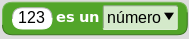
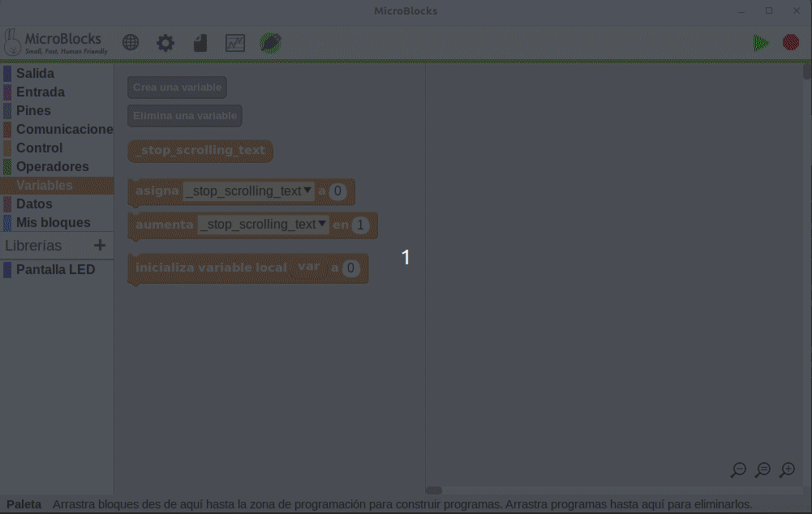
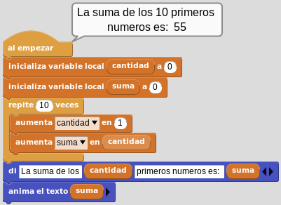
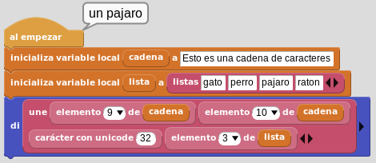

# <FONT COLOR=#8B008B>MicroBlocks</font>
De manera muy resumida lo que haremos en esta sección es:

*  Describir los bloques y conceptos relacionados.
* Incluiremos esquemas si resultan necesarios.

## <FONT COLOR=#007575>**Comentarios**</font>
En MicroBlocks los comentarios son tratados desde un único bloque que podemos encontrar en el menú 'Control'. Es un bloque no hace nada. Se utiliza para añadir notas y documentación a los scripts.

<center>

  
*Comentarios*

</center>

La ventana de entrada de texto se autodimensiona según introducimos texto y se pueden añadir líneas pulsando la tecla enter.

## <FONT COLOR=#007575>**Control**</font>
En este grupo tenemos acceso a los bloques de control de la micro:bit.

* **al empezar**. Los bloques debajo de este se ejecutan cuando se enciende la placa o cuando se hace clic en el icono verde EJECUTAR que tiene forma de flecha. Es uno de los bloques denominados sombrero.

<center>

  
*Bloque 'al empezar'*

</center>

* **por siempre**. Se trata del bloque de la imagen y es un bloque que se ejecuta de manera indefinida.

<center>

  
*Bloque 'por siempre'*

</center>

* **espera xx milisegundos**. Espera el número de milisegundos indicado antes de continuar.

<center>

  
*Bloque 'espera xx milisegundos'*

</center>

## <FONT COLOR=#007575>**Pantalla LED**</font>
Libreria con los bloques de control de la pantalla LED.

* **limpia pantalla**. Apaga todos los LEDs.

<center>

  
*Bloque 'limpia pantalla'*

</center>

* **pantalla**. Muestra una imagen de la pantalla que permite cambiar el estado de cada LED haciendo clic sobre el mismo.

<center>

  
*Bloque 'pantalla'*

</center>

* **anima el texto**. Muestra el texto introducido mediante desplazamiento caracter a caracter con el retardo en milisegundos que establezcamos.

<center>

  
*Bloque 'anima el texto'*

</center>

* **enciende x,y**. Enciende el LED indicado en la coordenada x,y. La coordenadas x es la horizontal y la y es la vertical. La coordenada 1,1 es la esquina superior ezquierda, la 1,5 es la derecha, la 5,1 es la inferior izquierda y la 5,5 la inferior derecha.

<center>

  
*Bloque 'enciende x,y'*

</center>

## <FONT COLOR=#007575>**Operadores**</font>
Esta entrada se crea porque en MicroBlocks, en el menú específico, aparecen algunos operadores especiales. Las descripciones siguiente son las obtenidas de [MicroBlocks Wiki](https://wiki.microblocks.fun/reference_manual/operators).

Dentro del grupo de bloques estándar tenemos los que se ven en la imagen.

<center>

  
*Bloques estándar*

</center>

*   Devuelve el resto de la división entre los dos números introducidos, ambos inclusive.
*  Devuelve un número aleatorio (al azar) entre el primer y el segundo valor indicado.

En la imagen vemos un ejemplo donde se averigua si un número generado al azar es par o impar.
  
A la variable ```num_aleatorio``` se le asigna un número aleatorio del 1 al 15. La operación ```módulo``` se utiliza para comprobar si el resto es 0 y así saber si el número es par. Si el resto de la operación ```num_aleatorio``` dividido por 2 da como resultado 0, el número es par, en caso contrario es impar.

<center>

  
*Par o impar*

</center>

Con este ejemplo comprobamos que una vez conectada la micro:bit (si no el programa nos indica que no lo está y no funcionará), el bloque ```di``` muestra como retorno un mensaje que aparece asociado al bloque ```al empezar``` en la pantalla del ordenador. Esta es la forma de trabajar de MicroBlocks y hace que el código se compruebe de manera instantánea siempre que los bloques estén acoplados a ```al empezar```.

[Descargar el programa](../ejemplos/par_impar.ubp)

*   Devuelve ```True``` si la expesión de entrada del lado izquierdo coincide con la selección del menú de tipos de datos realizada en el lado derecho. Los tipos de datos son importantes a la hora de programar. Aunque un entorno como MicroBlocks facilita las cosas a los usuarios principiantes al encargarse de las conversiones de tipos de datos, todavía es posible engañarse visualmente al comparar variables cuyos valores parecen iguales. Este bloque pertenece al grupo de condicionales, pero se describe ahora porque se utiliza en el ejemplo siguiente.

<center>

  
*Número o cadena*

</center>

[Descargar el programa](../ejemplos/num_cad.ubp)

Desplegando la sección 'Avanzados' vemos algunos bloques que representan operaciones bit a bit. Los operadores bit a bit (bitwise) trabajan sobre representaciones binarias de datos y su utilidad está en cambiar bits individuales en un operando. Los dos operandos asociados al operador bit a bit deben ser enteros. En la imagen vemos los bloques que aparecen en avanzados.

<center>

  
*Bloques de operadores avanzados*

</center>

*  Permite modificar el rango de un valor o variable desde un rango origen a un rango destino. Esta función es especialmente útil para adaptar los valores leídos de sensores o para adaptar valores a aplicar en un actuador.
*  Convierte una cadena Hexadecimal en un número decimal. Por ejemplo, 5A hex. = 90 dec.
*   El operador AND compara dos bits y genera un resultado igual a 1 si ambos bits son 1; en caso contrario, devuelve 0. Números de mas de un bit son comparados bit a bit. Un ejemplo de aplicación lo vemos en la imagen siguiente.

<center>

  
*bitwise AND*

</center>

La tabla siguiente muestra la forma de obtener el resultado de forma teórica.

<center>

  

</center>

*   El operador OR compara dos bits y devuelve 1 si uno o ambos bits son 1 y da 0 si ambos bits son 0. Bitwise OR compara todas las posiciones de bits de ambos números e informa de aquellas en las que cualquiera de los dos está a 1.

Un ejemplo de aplicación lo vemos en la imagen siguiente.

<center>

  
*bitwise OR*

</center>

La tabla siguiente muestra la forma de obtener el resultado de forma teórica.

<center>

  

</center>

*   El operador EXCLUSIVE-OR compara dos bits y genera un resultado de 1 si los bits son complementarios (el bit se establece en un operando pero no en ambos); en caso contrario, devuelve 0. Otra forma de pensar en la operación XOR es que invertirá las posiciones de los bits en las que el segundo operando tenga un 1. Todas las demás se copiarán igual.

Un ejemplo de aplicación lo vemos en la imagen siguiente.

<center>

  
*bitwise XOR*

</center>

La tabla siguiente muestra la forma de obtener el resultado de forma teórica.

<center>

  

</center>

*   El operador NOT se utiliza para invertir (BIT FLIP) todos los bits del operando Cuando el bit de posición más alta de un número se convierte en 1, ese número se considera un número negativo. La representación informática real de un número entero con signo en MicroBlocks es de 31 bits. El bit de mayor peso es un bit de signo. Esto permite números en el rango de -1073741824 a 1073741823. Cuando el bit de signo es 0, el número es positivo; y cuando es 1, el número es negativo.

Un ejemplo de aplicación lo vemos en la imagen siguiente.

<center>

  
*bitwise NOT*

</center>

La explicación es sencilla, el número 3 (0011) se convierte al binario 1100 y como el bit de mayor peso es 1 indica que es negativo y el número es 4, por lo tanto el resultado es -4.

*  El valor del operando izquierdo se desplaza hacia la izquierda el número de bits especificado por el operando derecho. Los bits se desplazan hacia la izquierda, el bit situado más a la izquierda se descarta y al bit situado más a la derecha se le asigna el valor 0. Cada posición de bit desplazada a la izquierda equivale en binario a multiplicar por 2. En la imagen siguiente vemos el funcionamiento del desplazamiento a la izquierda a nivel de bit.

<center>

  
*bitwise desplazamiento izquierda*

</center>

*  El valor del operando izquierdo se desplaza hacia la derecha el número de bits especificado por el operando derecho. Los bits se desplazan hacia la derecha, el bit situado más a la derecha se descarta y al bit situado más a la izquierda se le asigna una copia del bit de signo. Esto se denomina desplazamiento aritmético. Por cada posición de bit desplazada a la derecha, esta operación es el equivalente binario de dividir por 2. En la imagen siguiente vemos el funcionamiento del desplazamiento a la derecha a nivel de bit.

<center>

  
*bitwise desplazamiento izquierda*

</center>

## <FONT COLOR=#007575>Variables</font>
En MicroBlocks se contemplan dos tipos de variables, las globales y las locales. Cuando hablamos en estos términos hablamos de ámbito (scope) de las variables y determina la zona donde se define la variable, que son global y local.

Las variables locales son las definidas dentro de una función y solamente está disponible para el código que se ejecuta dentro de la función.

Las variables globales se definen en cualquier punto del programa, normalmente al principio, y pueden ser llamadas desde cualquier sitio del programa, incluso desde las funciones.

*  Este bloque es en realidad un botón que crea una nueva variable global. Si existe una variable con el mismo nombre, se creará una nueva con el mismo nombre y el número 2 añadido. Cuando creamos una variable se nos pide el nombre de la misma en una ventana emergente y una vez creada aparecerá un nuevo bloque para acceder al valor de la variable creada. Además esta nueva variable estará disponible para su selección en dos de los bloques que explicaremos después.
*   Este bloque es en realidad un botón que sirve para eliminar una variable previamente creada.

En la animación siguiente vemos el proceso de creación y eliminación de variables.

<center>

  
*Creación y eliminación de variables*

</center>

La opción de mostrar el nombre de las variables mostrada desde el bloque se puede utilizar para añadir variables mientras se edita el código del programa, sin pasar a las opciones de la categoría variables.

*   Este bloque asigna el valor a cualquier variable, global o local, en la cantidad especificada en el área de entrada. La cantidad que se asigna puede ser un número positivo o negativo. Para mostrar los nombres de las variables locales en el menú de selección, este bloque debe estar físicamente unido a la secuencia de bloques en la que se utiliza el bloque 'Inicializar local' que veremos a continuación.
*   Este bloque suma algebraicamente (cambia) el valor de cualquier variable, global o local, en la cantidad especificada en el área de entrada. La cantidad de cambio puede ser un número positivo o negativo.
*   Este bloque se utiliza para crear e inicializar variables locales. El nombre predeterminado de la variable 'var' puede cambiarse por cualquier otro haciendo clic en el nombre y escribiendo un nuevo nombre en el cuadro de diálogo que se abre. Despés, si es necesario cambiar el valor de la variable local, se puede utilizar el bloque 'asigna valor a' de la categoría variables. En la animación siguiente vemos este proceso y la disponibilidad o no de la variable local.

<center>

  
*Inicializa variable local*

</center>

Una variable global tiene:

* **Alcance global**: Una variable global puede utilizarse en cualquier script que no tenga una variable local del mismo nombre que la anule.
* **Tiempo de vida largo**: Una variable global es creada explícitamente y vive hasta que es explícitamente borrada. Conserva su valor cuando los scripts se inician y detienen e incluso cuando no hay scripts en ejecución. Sin embargo, al hacer clic en el botón "Detener", todas las variables globales se borran e inicializan con el valor cero. Las variables globales también se inicializan a cero cuando se crean por primera vez y cuando se carga un proyecto.

Por el contrario, una **variable local** tiene:

* **Ámbito local**: Una variable local sólo puede utilizarse en el script en el que aparece. Si varios scripts utilizan variables locales con el mismo nombre, esas variables son independientes entre sí. Aunque esta práctica se desaconseja porque puede inducir a errores.
* **Tiempo de vida limitado**: Una variable local de un script se crea cuando se inicia el script y se elimina cuando éste finaliza. Se crea una nueva variable local cada vez que se inicia un script (incluyendo un script de función), y las variables locales de cada invocación de script son independientes entre sí.
* **Precedencia sobre las globales**: Si una variable local tiene el mismo nombre que una variable global, la variable local prevalece sobre la global en el script en el que aparece la variable local. Una variable es local en todo el script sin importar en qué parte del script aparezca "inicializar var local a", aunque es una buena práctica de codificación que "inicializar var local a" preceda a cualquier otra referencia a esa variable.

Un ejemplo comentado de aplicación lo vemos en la imagen siguiente.

<center>

  
*Variables*

</center>

[Descargar el programa](../ejemplos/variables.ubp)

## <FONT COLOR=#007575>Bucles</font>
En el caso de MicroBlocks los bucles, condicionales y funciones están todos englobados en la categoría 'Control'. Vamos a ver algunos de ellos en esta ocasión y los que no veamos en esta actividad se irán viendo cuando los necesitemos.

*   Los bloques con forma de sombrero forman parte de un grupo de bloques de control que comienzan a ejecutarse cuando se pulsa el icono verde ```Inicia```. Este bloque se activa cuando se cumple la condición de inicio del programa.
*   Los bloques con forma de "C" son un grupo de bloques de control que ejecutan el código colocado en su interior siempre que se cumplan las condiciones descritas en sus subtítulos. Estos son los bloques de tipo bucle. Este en particular ejecutará los bloques en su interior indefinidamente.
*   Este bloque C ejecuta el código colocado en su interior el número especificado de veces. En el ejemplo siguiente veremos tanto en el programa como en la pantalla la suma de los 10 primero números naturales.

<center>

  
*Suma de los 10 primeros números*

</center>

[Descargar el programa](../ejemplos/suma_10__primeros_numeros.ubp)

*   Este bloque estambién de tipo C y pertenece al grupo de los bucles. Funciona de dos formas distintas en función del tipo de entrada especificado.

- Si la **entrada es un número**, los bloques interiores se ejecutarán tantas veces como el número. En cada iteración del bucle, empezando por uno, el parámetro o variable de control es 'i' por defecto y se incrementará en uno. Este valor se puede utilizar en el código del programa como se crea conveniente.
- El nombre del parámetro de control puede cambiarse por otro haciendo clic en la 'i' y escribiendo un nuevo nombre.
- Si la **entrada es una lista**, los bloques colocados dentro se ejecutarán tantas veces como elementos tenga la lista. En cada iteración, el parámetro de control 'i' tomará el valor de cada elemento de la lista de manera secuencia. En el ejemplo siguiente vemos una animación de un sencillo programa de como hacer un contador con los 5 primeros números y hacer que se muestre en el ordenador y en la pantalla de la micro:bit.

<center>

  
*Mostrar los 5 primeros números*

</center>

[Descargar el programa](../ejemplos/muestra_5_primeros_numeros.ubp)

*   Este bloque pausa el flujo de ejecución del programa por el tiempo especificado en milisegundos. Se utiliza para pausar y reanudar la ejecución de código de forma controlada.
*   Este bloque pausa el flujo de ejecución del programa por el tiempo especificado en microsegundos. Se utiliza para pausar y reanudar la ejecución de código de forma controlada.
*   Emite el mensaje especificado. Véase en conjunto a . Este bloque envía el contenido del mensaje especificado. Todos los bloques de mensajes ```al recibir``` con el mismo mensaje en su contenido recibirán el mensaje y actuarán ejecutando su contenido.
*   Ejecuta cuando se emita el mensaje especificado. Este bloque y su par funcional  se suelen utilizar juntos para conseguir un medio de comunicación dentro del programa. Cualquier mensaje enviado con el comando ```envía``` es detectado y recibido por este bloque. Así, los bloques colocados bajo este bloque se ejecutarán al recibir el mensaje correspondiente. Los mensajes pueden ser cadenas o números. Además, el bloque  contiene el último mensaje emitido y recibido.
*   Devuelve el último mensaje enviado en todo el programa, cronológicamente hablando. Nótese que **NO** es el último mensaje recibido por una secuencia de bloques concreta del programa, y es independiente de la ejecución del bloque ```al recibir```. No hay colas de mensajes en el sistema. Si no hay ningún ```al recibir``` en espera cuando se envía un mensaje, se perderá y será sobrescrito por el siguiente mensaje.

En el ejemplo siguiente vemos de forma sencilla el funcionamiento de estos tres últimos bloques.

<center>

  
*Di el último mensaje*

</center>

[Descargar el programa](../ejemplos/ultimo_mensaje.ubp)

## <FONT COLOR=#007575>Listas</font>
Los bloques para trabajar con listas están en el menú 'Datos' y sus bloques los vemos en la imagen siguiente.

<center>

  
*Bloques para Listas. Datos*

</center>

*  Devuelve una lista corta que contiene algunos elementos en inglés. Con las flechas podemos añadir o eliminar elementos a la lista aunquw a partir del cuarto se repite siempre el mismo. Para crear una lista vacía () basta con eliminar el único elemento existente cuando se crea una nueva.
*  Une (concatena) cadenas, listas o matrices de bytes y devuelve el resultado.
*  Devuelve el carácter [Unicode](https://en.wikipedia.org/wiki/List_of_Unicode_characters) del número dado.
*  Devuelve el enésimo elemento de una lista, cadena o matriz de bytes.
*   Combina los elementos de una lista en una cadena, opcionalmente se puede usar un carácter delimitador.
*   Añade un elemento al final de una lista.

En el ejemplo siguiente vemos el uso de estos bloques. Comenzamos por crear una cadena de caracteres de la que vamos a extraer la palabra un mediante la unión de los elementos 9 y 10 de la cadena. Se crea una lista con cuatros animales y finalmente se muestra la palabra 'un' seguida de la posición 3 de la lista creada.

<center>

  
*Un pajaro*

</center>

[Descargar el programa](../ejemplos/un_pajaro.ubp)

En este otro ejemplo vemos como se generan los caracteres de latín básico comenzando por el espacio en blanco (32), diferentes símbolos, números, letras mayúsculas y letras minúsculas.

<center>

  
*Caracteres Unicode de Latín básico*

</center>

[Descargar el programa](../ejemplos/unicode.ubp)

*  Devuelve el número de elementos de una lista, cadena o matriz de bytes.
*  Sustituye el enésimo elemento de una lista por el valor dado. También puede sustituir todos los elementos por un valor.
*  Elimina el elemento N de una lista. La lista resultante se reduce de tamaño. También puede eliminar todos los elementos.

A continuación vemos un ejemplo en el que se demuestra la funcionalidad de estos tres bloques.

<center>

  
*Sustituir, eliminar y tamaño*

</center>

[Descargar el programa](../ejemplos/sustituir_eliminar_long.ubp)

*  Devuelve la posición de la primera coincidencia de una subcadena dentro de una cadena o un elemento de una lista. Devuelve -1 si no encuentra coincidencias.

En el ejemplo las variables locales ```cadena``` y ```animales``` se inicializan como de tipo string y list respectivamente. El primer conjunto de resultados opera sobre la cadena, buscando la posición de la primera apariciones de "es". La primera coincidencia se encuentra en el carácter número uno. La segunda búsqueda se inicia en el carácter número tres, y localiza el objetivo de la búsqueda en el carácter número seis. La búsqueda de "perro" en la lista 'animales' la encuentra en el elemento número dos de la lista. La segunda búsqueda de "perro" en la lista 'animales' comienza en el elemento número tres y devuelve -1 porque no lo encuentra. No hay ningún "raton" en la lista, por lo que la búsqueda devuelve -1.

<center>

  
*Buscar*

</center>

[Descargar el programa](../ejemplos/buscar.ubp)

*  Copia una cadena desde/hasta el caracter especificado, o una desde/hasta el elemento indicado. Como ya sabemos para mostrar el parámetro hasta hay que hacer clic en el triángulo negro.

<center>

  
*Copiar*

</center>

[Descargar el programa](../ejemplos/copiar.ubp)

*  Devuelve una lista separando la cadena especificada por el delimitador opcional. Si no se especifica ningún delimitador, la cadena se divide por cada carácter.

En la imagen vemos una cadena delimitada por comas que separa los caracteres mediante el delimitador coma en una lista de tres elementos.

<center>


</center>

A continuación vemos una cadena que incluye un carácter retorno de línea después del ABC y DEF que se separa mediante el caracter unicode de nueva línea (return) en una lista de tres elementos.

<center>


</center>

En este otro caso separamos la URL de la descarga de MicroBlocks en partes mediante el delimitador /.

<center>


</center>

*   Devuelve el valor Unicode del carácter enésimo de la cadena introducida. El número de caracteres introducido debe estar comprendido entre uno y la longitud de la cadena. Este bloque es el opuesto de .

<center>


</center>

*  Crea una nueva lista del número de elementos especificado. Hay que controlar la disponibilidad de memoria. Los elementos de la lista creada se pueden inicializar a cualquier valor utilizando la opción de bloque con todos.
*  Crea una matriz del número de elementos especificado en función de la disponibilidad de memoria. Cada elemento es de tamaño byte y se le pueden asignar valores en el rango de 0-255 (0-FF).
*  Devuelve una cadena que indica el número de palabras de 32 bits de memoria dinámica disponibles para asignar nuevos objetos (cadenas, listas o matrices de bytes). Al pulsar el botón de parada se libera toda la memoria. Justo después de pulsar el botón de parada, este bloque informa del total de memoria dinámica disponible en un dispositivo determinado. Los dispositivos tienen diferentes cantidades de memoria dinámica, basadas en la cantidad de RAM proporcionada por el hardware. Por ejemplo, la micro:bit v2 tiene mucha más RAM que la micro:bit original.

Un ejemplo de uso.

<center>

  
*Copiar*

</center>

[Descargar el programa](../ejemplos/nueva_lista_mem.ubp)

*   Convierte un byte, una lista o una cadena especificada en una matriz de bytes. Cada elemento es el valor unicode de las letras de la cadena en el rango de 0-255 (0-FF).

## <FONT COLOR=#007575>**Operadores**</font>   
Los operadores aún no vistos son:

<center>


*Operadores aritméticos, de comparación y booleanos*

</center>

Los operadores aritméticos y de comparación no requieren de mayor explicación por lo que nos vamos a centrar en los booleanos.

*  Operador booleano ```True``` o ```False```. Devuelve verdadero o falso en función de la posición del selector, o de la evaluación binaria de la expresión utilizada como entrada. Este bloque se usa dentro de muchos otros bloques, donde se utiliza para controlar el flujo de las ejecuciones y eventos.

El bloque ```if``` es un buen ejemplo para demostrar el uso del bloque verdadero/falso.

<center>


*Uso sencillo del operador ```True/False```*

</center>

[Descargar el programa](../ejemplos/verdadero_falso.ubp)

El código del ejemplo se ejecuta de dos maneras diferentes siempre dentro de un bucle infinito en el que se genera un número aleatorio que puede valer 1, 2 o 3:

* La primera es la condición de la rama ```IF``` que será verdadera si el número generado es 1.
* La segunda es la rama ```ELSE IF``` que se evalúa si la condición del ```IF``` no es verdadera y se pone a verdadero, ejecutando su código.
* La tercera es la condición ```ELSE``` a la que nunca se llega porque si el número vale 1 se ejecuta el ```IF``` y si no se ejecuta el ```ELSE IF``` que siempre es cierto. Es decir, aunque se genere ```variable = 3``` la condición ```ELSE``` no se ejecuta.

*  Invierte el valor lógico asociado a la expresión sobre la que opera. Tal y como se muestra, ```NOT``` devolverá ```FALSE``` si el deslizador se establece en ```TRUE```, y ```TRUE``` si se establece en ```FALSE```.

En el ejemplo siguiente, una variable llamada ```cadena``` se inicializa como "MicroBlocks es genial", y una variable llamada ```expresion``` se inicializa en ```TRUE``` de una forma peculiar, diciendo que algo es igual a si mismo. Cuando se aplica ```NOT``` al resultado de la expresión de igualdad, se cambia a ```FALSE```.

<center>


*Uso sencillo del operador ```NOT```*

</center>

[Descargar el programa](../ejemplos/not.ubp)

*   Devuelve verdadero sólo si todas sus entradas son verdadero y devuelve falso en caso contrario. Como ambas condiciones tienen que ser verdaderas para obtener un resultado verdadero, si se detecta un falso en la primera condición, no es necesario evaluar la segunda; se devuelve falso inmediatamente.

En el ejemplo tenemos dos variables ```salir``` y ```llueve``` que se inicializan a verdadero. Se muestran una serie de mensajes y al final se evalúa si "necesito un paraguas" comprobando si es voy a salir y si llueve. Ambas condiciones tienen que ser verdaderas para que necesitemos un paraguas. Podemos cambiar el estado de las variables y comprobar lo que ocurre.

<center>


*Uso sencillo del operador ```AND```*

</center>

[Descargar el programa](../ejemplos/and.ubp)

*   Devuelve verdadero si uno o ambos operandos son verdaderos y devuelve falso en caso contrario. Similar a ```AND``` pero opuesto a él, aquí sólo una de las dos condiciones tiene que ser verdadera para un resultado verdadero. Por lo tanto, si la primera condición es verdadera, no es necesario comprobar la segunda.

En el ejemplo estamos generando aleatoriamente dos números en el rango de 1 a 5. A continuación, comprobamos si alguno de los dos números es igual al número que estamos buscando (3). El bloque ```OR``` se utiliza para verificar el resultado de la comparación.

<center>


*Uso sencillo del operador ```OR```*

</center>

[Descargar el programa](../ejemplos/or.ubp)

Cada vez que pulsemos en 'Iniciar' se genera un nuevo resultado.

## <FONT COLOR=#007575>**Bloques de control**</font>

*   Los bloques en este bloque de sombrero se ejecutan cuando se pulsan los botones A, B, o A+B. Se dispara una vez por cada pulsación de botón. Si se mantiene pulsado el botón, no se vuelve a disparar hasta que se suelta el botón y se vuelve a pulsar. Por ejemplo, cuando se pulsa el botón A aparece en pantalla una A.

<center>


*cuando se pulsa el botón*

</center>

*   El bloque ```IF``` comprueba la condición booleana y ejecuta los bloques de una sola vez si la condición booleana se evalúa como verdadera. El triángulo negro permite la expansión del bloque ```IF``` con múltiples condiciones ```ELSE IF``` añadidas. En caso de que las ramas ```IF``` o ```ELSE IF``` anteriores no sean verdaderas, entonces se evalúan y ejecutan sucesivamente cada una de las siguientes ```ELSE IF```.

En el ejemplo, a la variable ```aleatorio``` se le asigna un número al azar entre el 1 y el 10. La operación MOD se utiliza para sondear el estado par/impar del número. Si el resto de la operación num dividido por 2 da como resultado 0, el número es par, en caso contrario es impar.

<center>


*Sentencia ```IF```*

</center>

[Descargar el programa](../ejemplos/if_else.ubp)

Cada vez que pulsemos en 'Iniciar' se genera un nuevo resultado.

*   El bloque 'cuando' comprueba repetidamente una condición booleana. Cuando la condición se convierte en verdadera, se ejecutan los bloques bajo el sombrero. Si la condición sigue siendo verdadera al final de la ejecución, entonces los bloques se ejecutarán de nuevo, y ese proceso se repite hasta que la condición se convierte en falsa.

Nota: El sombrero 'cuando' incluye una espera de 10 milisegundos entre ciclos. Esto es útil para eliminar ruido en las entradas, por ejemplo rebotes en los botones, pero limita el rendimiento a un máximo de 100 iteraciones/segundo.

Vamos a ver el mismo ejemplo que en el bloque ```IF``` pero utilizando este bloque. Los tres bloques del tipo ```WHEN``` empiezan a funcionar simultáneamente cuando se pulsa el icono ```START```. El bloque 'por siempre' debajo de 'al empezar' genera un número aleatorio cada segundo. Y de forma simultanea los otros dos bloques evaluan continuamente sus condiciones mostrando el resultado que corresponde a cada uno.

<center>


*Bloque 'cuando'*

</center>

[Descargar el programa](../ejemplos/cuando.ubp)

*   Este bloque de control pausa la ejecución del programa y espera hasta que la condición booleana especificada se convierta en verdadera. Se puede utilizar para sincronizar bloques de código que se ejecutan en paralelo, basándose en los eventos monitorizados.

En este ejemplo, el nivel de luz ambiental se controla mediante el sensor de luz integrado. El sensor de luz tiene un rango de 0-255, siendo 0 oscuridad total y 255 claridad máxima. Cuando se inicia el programa, ambos bloques 'cuando se pulse el boton' comienzan a ejecutarse y a comprobar el estado del botón.

Al pulsar el botón A, se inicia la monitorización de la luz y el programa espera hasta que los sensores de la micro:bit informen de un nivel de luz < 75. Cuando esa condición se cumple, se emite una alerta para avisar de que hay que encender las luces.

El botón B está programado para detener el proceso de monitorización. Al pulsarlo, detiene la ejecución de esa rama del programa.

<center>


*Bloque 'cuando se pulsa el boton'*

</center>

[Descargar el programa](../ejemplos/cuando_pulsa_boton.ubp)

El bloque 'nivel de luz' se encuentra en la libreria 'Sensores básicos' y el bloque 'deten las otras tareas' se explica un poco mas abajo.

*   El bloque ```RETURN``` se utiliza para devolver el valor especificado en su área de entrada. El valor retornado puede ser cualquier tipo de dato. Aunque es posible utilizar el bloque ```RETURN``` en cualquier parte de un programa para mostrar un valor, de forma similar al bloque ```di```, su uso correcto y más común es en una función (o bloque personalizado) para devolver un valor como resultado del proceso realizado. Hay que tener en cuenta que los bloques colocados después del bloque ```RETURN``` no se ejecutarán.

*   Este bloque tipo C es un bucle que se utiliza para ejecutar los bloques colocados dentro de él, hasta que la condición booleana especificada se convierte en verdadera. En ese momento, se ejecutará el siguiente bloque después del bloque en forma de C.

En el ejemplo vemos como se monitoriza si se ha pulsado el botón A enviando un mensaje

<center>


*Bloque 'repetir hasta que'*

</center>

*   Este bloque, y su par relacionado , se utilizan para controlar el hilo de ejecución del programa. Este bloque detiene la ejecución de todos los bloques de los que forma parte, o que están bajo el mismo bloque sombrero. Una vez ejecutado este bloque en un grupo de bloques, no se ejecutará nada más en ese grupo.

En el ejemplo, el grupo de bloques de la derecha está en un bucle continuo que cuenta hacia atrás y decrementa su variable local ```numero```. El grupo de bloques de la izquierda también está en un bucle continuo, contando hacia abajo y decrementando su variable local ```numero```. Cuando la cuenta atrás alcanza el valor 7 se cumple la condición del ```else if``` y se detiene la cuenta del bloque derecho, mientras que la secuencia del bloque izquierdo continua su ejecución hasta que se cumpla la condición del ```if``` que será cuando se alcance el número 2, momento en que se detiene esta tarea.

Podemos comprobar como el último bloque ```di``` de la secuencia de la izquierda **NUNCA** se ejecuta porque una vez que el bloque 'deten esta tarea' se ejecuta, todas las actividades de este bloque izquierdo terminan.

<center>


*Bloques 'deten esta tarea' y 'deten las otras tareas'*

</center>

Podemos observar como desaparece el marco verde de cada bloque cuando su tarea finaliza indicando precisamente eso, que el bloque no se está ejecutando.

[Descargar el programa](../ejemplos/deten_tareas.ubp)

## <FONT COLOR=#007575>**Bloques de 'Entrada' para los botones**</font>

*  y   Devuelve el estado del botón A o B. ```true``` = pulsado y ```false``` = no pulsado.
*  equivalente al bloque  cuando lo configuramos con el pin 26, que es el correspondiente al logotipo .  Devuelve el estado del logo. ```true``` si lo tocamos (equivale a pulsador A o B pulsado) y ```false``` cuando no lo tocamos. Estos bloques están disponibles dentro la 'Libreria' 'Sensores[ ]' y aparece como 'Touch (microbit)'. El bloque para configurar el número de pin tiene su sentido en la existencia de sensores táctiles en el borde de placa, como veremos mas adelante.

En el ejemplo vemos como chequear el estado de los botones mediante la sentencia ```IF```.

<center>


*Bloques para chequear el estado de los botones*

</center>

[Descargar el programa](../ejemplos/chequeo_botones.ubp)

## <FONT COLOR=#007575>**Graficado de datos**</font>
En MicroBlocks es relativamente sencillo trabajar los datos de forma gráfica y para ello disponemos de un bloque para indicar el dato que queremos ver de manera gráfica y un icono en el menú que abre la ventana flotante 'Gráfico de datos'.

<center>

  
*Bloque e icono para mostrar 'Gráfico de datos'*

</center>

<a name="item0"></a>

[Bloque](#item1)
<br> [Panel gráfico](#item2)</br><br>
[Opciones del panel gráfico](#item3)</br>

<a name="item1"></a>

<FONT COLOR=#AA0000>Bloque</font>

Está disponible en el menú 'Salida'.

* . Graficará el valor introducido, en el panel de visualización de gráficos de datos. Se puede graficar cualquier tipo de dato: números, valores de pines digitales y analógicos, salidas de sensores, etc. Si tenemos que representar gráficamente más de un dato, hacemos clic en el triángulo negro para mostrar campos de datos adicionales. Se pueden graficar hasta seis valores simultáneos con diferentes colores.

La representación gráfica sólo es posible en el IDE. Por lo tanto, sólo es posible realizar gráficos mientras el microdispositivo está conectado al ordenador. Si intentamos realizar un gráfico mientras no está conectado al ordenador, aparecerá el mensaje "Placa no conectada".

[Volver](#item0)
<a name="item2"></a>

<FONT COLOR=#AA0000>Panel gráfico</font>

Se activa desde el icono y tiene el siguiente aspecto:

<center>

  
*Panel 'Gráfico de datos'*

</center>

El panel **Gráficos de datos** muestra los valores utilizados con el bloque de gráficos. El eje y del panel puede escalarse utilizando los controles de zoom del propio panel, y el eje x se desplazará lateralmente a medida que se grafiquen más datos.

La ventana de visualización del gráfico se puede redimensionar con el control situado en la esquina inferior derecha y puede colocarse en cualquier lugar de la ventana del IDE.

Tras el registro de cualquier dato, la ventana de visualización de gráficos puede cerrarse y abrirse, si es necesario, sin que se pierda ningún dato ni la imagen visualizada, aunque si pierde la reconfiguración realizada en la misma, como la posición del cero, el tamaño, etc. Además, es posible desconectar y volver a conectar el dispositivo en uso, sin perder los datos del gráfico.

En la animación vemos como funciona lo indicado. El escalado con la lupa del menos amplia el rango de valores del eje y, con la lupa del mas lo disminuye y la lupa del igual restaura la situación inicial tras el redimensionado de la ventana.

<center>

  
*Funcionamiento de 'Gráfico de datos'*

</center>

[Volver](#item0)
<a name="item3"></a>

<FONT COLOR=#AA0000>Opciones del panel gráfico</font>

Se accede haciendo clic con el botón derecho del ratón en cualquier zona del panel. Si tenemos el cursor del ratón sobre la zona de las lupas no funcionará.

<center>

  
*Opciones de 'Gráfico de datos'*

</center>

El menú de opciones del gráfico permite controlar la visualización de los ejes, así como la importación/exportación de datos y el ajuste de la frecuencia de muestreo de datos.

* **limpiar gráfico**. Borra cualquier gráfico de la ventana de visualización de datos.
* **cero abajo**. Sitúa el punto de origen del eje y en la parte inferior del área de visualización del gráfico.
* **exportar datos a archivo CSV**. Permite guardar los datos del gráfico en formato CSV. Se exportan los últimos diez mil (10000) valores.
* **importar datos desde archivo CSV**. Permite cargar datos CSV desde el ordenador en el que se está ejecutando MicroBlocks. Los datos importados se grafican y se muestran en el 'Gráfico de datos'. Es posible importar 10000 valores. Si tenemos mas de un dato para graficar, estos no se exportan individualmente sino todos juntos eparados por comas.
* **copiar datos del gráfico al portapapeles**. Se trata de una función avanzada que permite copiar en el portapapeles los últimos 10000 valores utilizados con el bloque gráfico.
* **ajustar latencia del puerto serie**. Se trata de otro función avanzada que permite establecer la frecuencia de muestreo de datos o latencia entre 1 y 20ms. Los números más bajos dan como resultado frecuencias de muestreo más altas.

Los archivos CSV (del inglés comma-separated values) son un tipo de documento no estandarizado que tiene la idea básica de separar los campos de datos por una coma, de ahí su nombre [Valores separados por comas](https://es.wikipedia.org/wiki/Valores_separados_por_comas)

Vamos a ver un ejemplo de uso en el que se muestran de forma gráfica una serie de números aleatorio entre 1 y 100. El programa y el gráfico son:

<center>

  
*Ejemplo de 'Gráfico de datos'*

</center>

[Descargar el programa](../ejemplos/grafico_aleatorios.ubp)

## <FONT COLOR=#007575>**Pines**</font>
En el menú 'Pines' disponemos de seis bloques que vamos a describir a continuación.

* . Devuelve el valor (verdadero o falso) del pin digital indicado. Podemos acceder a la configuración pullup 'true/false' haciendo clic en el triángulo negro del extremo derecho, que se expande a  sin pullup o bien  con pullup. La configuración pullup a ```true``` fuerza la señal alta en caso de fluctuaciones de tensión en el pin.

Vamos a ver un ejemplo de uso del bloque. El pin digital P0 lo leemos continuamente y los resultados se muestran y grafican mientras se va mostrando si el pin está en estado cero (false) o uno (true). El pullup está activado por lo que el estado normal de la línea es true o alto. El programa es:

<center>

  
*Ejemplo de uso del bloque 'lectura digital'*

</center>

[Descargar el programa](../ejemplos/func_B_lect_digit.ubp)

En la animación vemos el programa en funcionamiento y podemos observar los cambios de estado tanto en modo texto como en modo gráfico.

<center>

  
*Ejemplo de uso del bloque 'lectura digital'*

</center>

* . Devuelve el valor (0 - 1023) del pin analógico indicado. Devuelve el valor del pin analógico especificado como un número en el rango 0-1023. Se puede acceder a la configuración pullup true/false haciendo clic en el triángulo negro del extremo derecho. El ajuste pullup fuerza la señal a alto en caso de fluctuaciones de voltaje en el pin.

Reutilizamos el ejemplo anterior cambiando el bloque por el de lectura analógica. El pin analógico 0 se lee continuamente y los resultados se muestran y se representan gráficamente. El pin 0 no está conectado a nada durante la prueba actuando como antena de la entrada analógica. El Pullup NO está habilitado, lo que significa que el estado de la señal de la línea fluctúa constantemente.

<center>

  
*Ejemplo de uso del bloque 'lectura analógica'*

</center>

[Descargar el programa](../ejemplos/func_B_lect_analog.ubp)

En la animación vemos el programa en funcionamiento y podemos observar los cambios de estado tanto en modo texto como en modo gráfico.

<center>

  
*Ejemplo de uso del bloque 'lectura analógica'*

</center>

* . Establece el valor (verdadero o falso) del pin digital indicado. Establece el estado del pin digital especificado como verdadero o falso. En un dispositivo de 3.3V, un valor alto pondrá 3.3V, y un valor bajo pondrá 0V en el pin.

Se programan dos bucles, uno que se repite cinco veces para cambiar P0 entre 0 y 1 y el otro que se repite indefinidamente leyendo el estado del pin 1 y se representa graficamente. La lectura se hace en P1 porque se hacemos la lectura en P0 mientras está cambiando, podría afectar a su estado. El circuito a montar es simplemente conectar con un cable P0 y P1.

<center>

  
*Circuito para probar 'pon pin digital'*

</center>

El programa es el siguiente:

<center>

  
*Ejemplo de uso del bloque 'pon pin digital'*

</center>

[Descargar el programa](../ejemplos/func_B_pon_pin.ubp)

En la animación vemos el programa en funcionamiento y podemos observar los cambios de estado tanto en modo texto como en modo gráfico.

<center>

  
*Ejemplo de uso del bloque 'lectura analógica'*

</center>

* . Establece el valor (0 - 1023) del pin analógico indicado. Genera PWM en el pin indicado con valores de 0 a 1023. El PWM funciona encendiendo y apagando el pin rápidamente. La potencia se controla variando el ciclo de trabajo o duty cycle, que es el porcentaje de tiempo durante cada ciclo que el pin está en alto. Un valor de 0 significa que el pin está apagado, mientras que un valor de 1023 significa que está a plena potencia (es decir, el pin está encendido el 100% del tiempo). Un valor de 512 da como resultado un ciclo de trabajo del 50%; que indica que el pin está encendido la mitad del tiempo y apagado la otra mitad.

Cuando veamos algún dispositivo analógico será el momento de ver algún ejemplo de uso de este bloque. Por ahora podemos ver este [video](https://wiki.microblocks.fun/reference_manual/pins/microbit_pwmloop.mp4) de la documentación oficial en el que se aprecia como se controla con PWM la velocidad de giro de un ventilador a partir de las variaciones que hagamos en un potenciómetro.

* . Devuelve el número total de pines analógicos soportados por el dispositivo.
* . Devuelve el número total de pines digitales soportados por el dispositivo.

El programa siguiente muestra el tipo de dispositivo conectado y el tipo y número de pines de que dispone.

<center>

  
*Ejemplo de uso de los bloques 'pines analógicos y pines digitales'*

</center>

## <FONT COLOR=#007575>**Libreria NeoPixeles**</font>
Los NeoPixels son pequeños módulos LED que combinan LEDs rojos, verdes y azules montados en un solo encapsulado con un chip controlador. Los NeoPixels pueden ser controlados individualmente por una sola línea de datos desde un dispositivo microcontrolado para crear diferentes colores y patrones. Un solo pin del microcontrolador puede controlar docenas (o incluso cientos) de NeoPixels. Los NeoPixels se encuentran en muchas configuraciones diferentes, como son anillos, barras, matrices y tiras flexibles.

* . Configura el pin de conexión de los Neopixels. Este bloque configura un dispositivo NeoPixel especificando cuántos LEDs hay en el dispositivo y qué pin se utilizará para controlarlos. El bloque debe ejecutarse antes de hacer nada con cualquiera de los otros bloques NeoPixel.

El bloque se expande a  para el trabajo con Neopixels blancos.

* . Establece los colores de los diez primeros NeoPixels. Es especialmente útil cuando se utiliza con placas o tiras con este número de LEDs. La secuencia de numeración (1-10) es de izquierda a derecha y de arriba a abajo. La configuración del color se hace desde la paleta que se muestra sin poder establecer mayor precisión. La paleta muestra los valores RGB en decimal.

<center>


</center>

* . Apaga todos los LEDs. Los pone a color negro.
* . Pone todos los LEDs con el color indicado.
* . Pone el número de LED especificado del color indicado. Los LEDs se numeran secuencialmente comenzando por uno.
* . Desplaza la secuencia de colores NeoPixel el número de NeoPixels indicado. Los colores al final de la secuencia se desplazan y se insertan al principio de la secuencia. Si los NeoPixels forman un círculo, los colores giran alrededor del círculo. El argumento determina el número de posiciones que se desplazan los colores. Un valor negativo hará que los NeoPixels roten en la dirección opuesta.
* . Devuelve un color definido especificando los valores de rojo (R), verde (G) y azul (B) entre 0 y255. El bloque puede utilizarse en cualquier bloque que reciba una entrada de color. Los valores inferiores a 40 pueden provocar que el LED no se encienda nada.
* . Devuelve un color aleatorio. El bloque puede utilizarse en cualquier bloque que reciba una entrada de color.

## <FONT COLOR=#007575>**Sonidos**</font>

<a name="item0Ton"></a>

[Tonos](#item1Ton)
<br> [Politonos](#item2Ton)</br>

En MicroBlocks tenemos tres opciones de reproducción de sonidos o música, un conjunto de librerías englobadas bajo el seudónimo "Sonido", una librería de "Politonos" y otra librería de "Tonos". En "Sonido" nos encontraremos bloques "MultiTone", opciones para reproducir mp3 o WAV, radio AM, etc. No veremos estas librerías por el momento y nos centraremos en "Tonos" y "Politonos".

[Volver](#item0Ton)
<a name="item1Ton"></a>

<FONT COLOR=#AA0000>Tonos</font>

Añadimos la libreria "**Tonos**" a nuestro entorno y nos encontramos con los siguientes bloques:

* . Reproduce la nota y la octava y por el tiempo indicados.
* . Reproduce la nota indicada por el número de tecla en el teclado del piano (0-127) donde el Do central es 60. Este bloque es útil cuando se realizan transformaciones matemáticas de la música. MIDI es la abreviatura de "Musical Instrument Digital Interface", que se traduce como "Interfaz digital de instrumentos musicales", y es un estándar de la industria para controlar sintetizadores, cajas de ritmos y otros dispositivos musicales electrónicos.
* . Reproduce la nota especificada en Hertz (Hz) durante el tiempo indicado.
* . Reproduce el tono indicado en Hz.
* . Detiene la reproducción del tono actual.
* . Especifica el pin al que está conectado un zumbador piezoeléctrico o unos auriculares. En placas con altavoces integrados, se utilizará el altavoz integrado si se omite este bloque.

[Volver](#item0Ton)
<a name="item2Ton"></a>

<FONT COLOR=#AA0000>Politonos</font>

El formato [RTTTL](https://en.wikipedia.org/wiki/Ring_Tone_Text_Transfer_Language) (del inglés, Ring Tone Text Transfer Language) fue desarrollado por Nokia para codificar tonos de llamada a teléfonos móviles. El formato RTTTL es una cadena dividida en tres secciones: encabezado (nombre o título), valor predeterminado y datos. Por ejemplo, la siguiente cadena de texto se corresponde con la Intro de Donkey Kong:

*d=4,o=5,b=140:8a#,8p,8d6,16p,16f.6,16g.6,16f.6,8a#,8p,8d6,16p,16f.6,16g.6,<br>16f.6,8a#,8p,8d6,16p,16f.6,16g.6,16f.6,8a#,8p,8d6,16p,16f.6,16g.6,16f.6*</br>

Añadimos la libreria "**Politonos**" a nuestro entorno y nos encontramos con los siguientes bloques:

* . Reproduzca la cadena de tono de llamada indicada.
* . Devuelve el nombre del tono de llamada que se está reproduciendo actualmente.

Para reproducir una melodia simplemente la copiamos en el bloque ```toca el politono```.

Existen páginas de donde se pueden descargar tonos, o incluso podemos hacerlo nosotros mismos. A continuación ponemos algunos enlaces:

* [RTTTL Ringtone Downloads](https://picaxe.com/rtttl-ringtones-for-tune-command/) de Picaxe.
* Colecciones de [ArcadeTones](http://arcadetones.emuunlim.com/) clasificados por temas.
* Archivo [NokringTunes.txt](http://microblocks.fun/mbtest/NokringTunes.txt) que contiene más de once mil melodías en formato Nokring. 

Una vez descargado lo abrimos y buscamos la melodia para copiar y pegar en el bloque.
